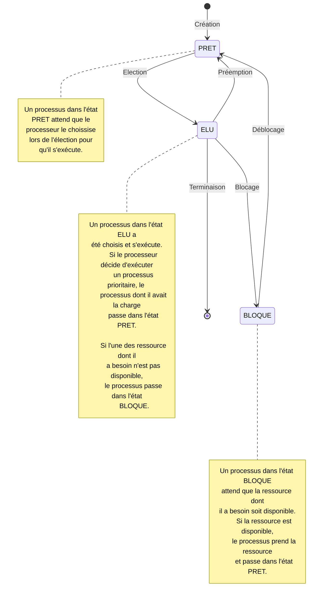
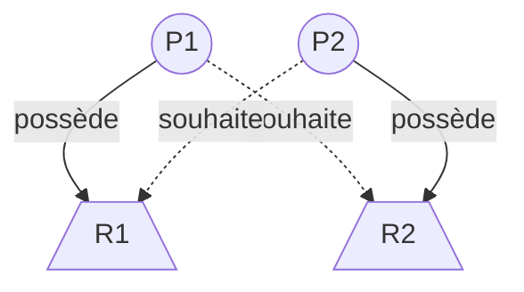

# Gestion des processus et des ressources par un système d'exploitation

Petit rappel sur la définition d'un système d'exploitation : [Systèmes d'exploitation](./../../première/Architecture_des_machines/Systèmes_d_exploitation.md).

Cette leçon décrit le fonctionnement de la gestion du processeur par un système d'exploitation et répond à la question : Quel programme exécuter ?

## I. Processus et ressources

### a) Définitions

Un *programme* est statique: c’est un fichier contenant une suite d’instructions qui lorsqu’elles sont exécutées modifient l’état du processeur et de la mémoire afin de réaliser une tâche donnée.

Un *processus* est dynamique : Il s'agit d'un programme en cours d'exécution. Il incarne l'état du programme dans le temps.

Nous caractérisons un processus par :

- Un identifiant appelé *PID*.

- Un état : l'état dans lequel se trouve le processus.

- Un espace mémoire : l'espace mémoire alloué necéssaire à l'exécution du processus.

- Une durée d'exécution : le temps necéssaire à l'exécution du processus.

- Un ensemble de ressources : les ressources dont a besoin le processus.

Une *ressource* est une entité matérielle ou logicielle dont a besoin un processus pour s'exécuter.

Une ressource est soit libre soit occupée par un processus, elle possède un certain nombre de point d'accès.

### b) Etats d'un processus



### c) Visualisation des processus

Nous visualisons facilement les processus actuels en exécutant la commande `ps` dans le terminal :

```bash
    PID TTY          TIME CMD
  11737 pts/1    00:00:00 bash
  13000 pts/1    00:00:00 ps
```

Nous remarquons que la commande `ps` est elle-même un programme en cours d'exécution. (Ainsi que `bash` pour le terminal)

Nous pouvons afficher plus d'informations des processus et en temps réel avec la commande `top` comme :

- `USER` : L’utilisateur qui exécute le processus.

- `%CPU` : L’utilisation en pourcentage du processeur du processus.

- `%MEM` : Le pourcentage de la taille en mémoire utilisée par le processus.

- `STAT` : Le code d’état du processus (`Z` pour Zombie, `S` pour Dormant et `R` pour en cours d’exécution).

Un processus peut créer un autre processus, le *PPID* décrit alors l'identifiant du processus père.

La commande `pstree` permet de visualiser sous forme d'arbre tous les processus engendrés par leur prédécésseur.

Le processus `init` est le premier programme lancé par la machine et a comme PID : $1$.

##### Application 1

a) Sur le terminal de votre ordinateur, lancer la commande `ps` et décrire la réponse.

b) Sur le terminal de votre ordinateur, lancer la commande `top` et décrire la réponse.

c) Sur le terminal de votre ordinateur, lancer la commande `pstree` et décrire la réponse.

## II. Politiques d'ordonnancement

Une *politique d'ordonnancement* est l'ordre, décidé par le processeur, par lequel les processus seront exécutés.

Voici, pour illustrer les différentes politiques, un exemple d'ensemble de trois processus :

| PID | Durée d'exécution | Instant d'arrivée | Priorité |
| :---: | :---: | :---: |:---: |
| $1$ | $4$ | $t0$ | $0$ |
| $2$ | $2$ | $t2$ | $1$ |
| $3$ | $3$ | $t4$ | $2$ |

### a) Premier arrivé, premier servi

La politique du premier arrivé, premier servi est comme son nom l'indique un ordre d'exécution des processus selon leur ordre d'arrivée dans la file d'attente :

| PID du processus aloué au processeur | Instant |
| :---: | :---: |
| $1$ | $t0$ |
| $1$ | $t1$ |
| $1$ | $t2$ |
| $1$ | $t3$ |
| $2$ | $t4$ |
| $2$ | $t5$ |
| $3$ | $t6$ |
| $3$ | $t7$ |
| $3$ | $t8$ |

### b) Par tourniquet

La politique par tourniquet (*Round-Robin* en anglais) est un ordre d'exécution qui utilise une seconde unité de temps appelée *quantum de temps*.

Cette politique consiste à exécuter les processus dans leur ordre d'arrivée uniquement le temps du quantum. Si le processus ne s'est pas terminé, il rejoint la file d'attente.

Avec quantum $= 3$ :

| PID du processus aloué au processeur | Instant |
| :---: | :---: |
| $1$ | $t0$ |
| $1$ | $t1$ |
| $1$ | $t2$ |
| $2$ | $t3$ |
| $2$ | $t4$ |
| $1$ | $t5$ |
| $3$ | $t6$ |
| $3$ | $t7$ |
| $3$ | $t8$ |

### c) Par priorité préemptive

La politique d'ordonnancement par priorité préemptive est un ordre d'exécution des processus en fonction de leur ordre d'arrivé et de leur priorité (plus la priorité d'un processus est grande, plus il est prioritaire) :

| PID du processus aloué au processeur | Instant |
| :---: | :---: |
| $1$ | $t0$ |
| $1$ | $t1$ |
| $2$ | $t2$ |
| $2$ | $t3$ |
| $3$ | $t4$ |
| $3$ | $t5$ |
| $3$ | $t6$ |
| $1$ | $t7$ |
| $1$ | $t8$ |

##### Application 2

| PID | Durée d'exécution | Instant d'arrivée | Priorité |
| :---: | :---: | :---: |:---: |
| $1$ | $2$ | $t0$ | $1$ |
| $2$ | $5$ | $t1$ | $3$ |
| $3$ | $3$ | $t2$ | $2$ |

D'après le tableau ci-dessus, donner pour chacune des trois politiques l'ordonnancement des processus.

## III. Interblocage

L'une des missions du système d'exploitation est le partage des ressources par les processus. Une telle gestion peut engendrer quelques problèmes comme l'exclusion mutuelle ou l'interblocage (*Deadlock* en anglais).

L'*interblocage*  est un phénomène qui survient lorsque deux processus possèdent une ressource chacun et attendent mutuellement la disponibilité de l'autre pour se terminer.



##### Application 3

[Activité : Panique à la boulangerie](./Activité_panique_à_la_boulangerie.md)
____________

[Feuille d'exercice](./Exercices/Exercices_gestion_des_processus_et_des_ressources.md)

____________

[Sommaire](./../README.md)