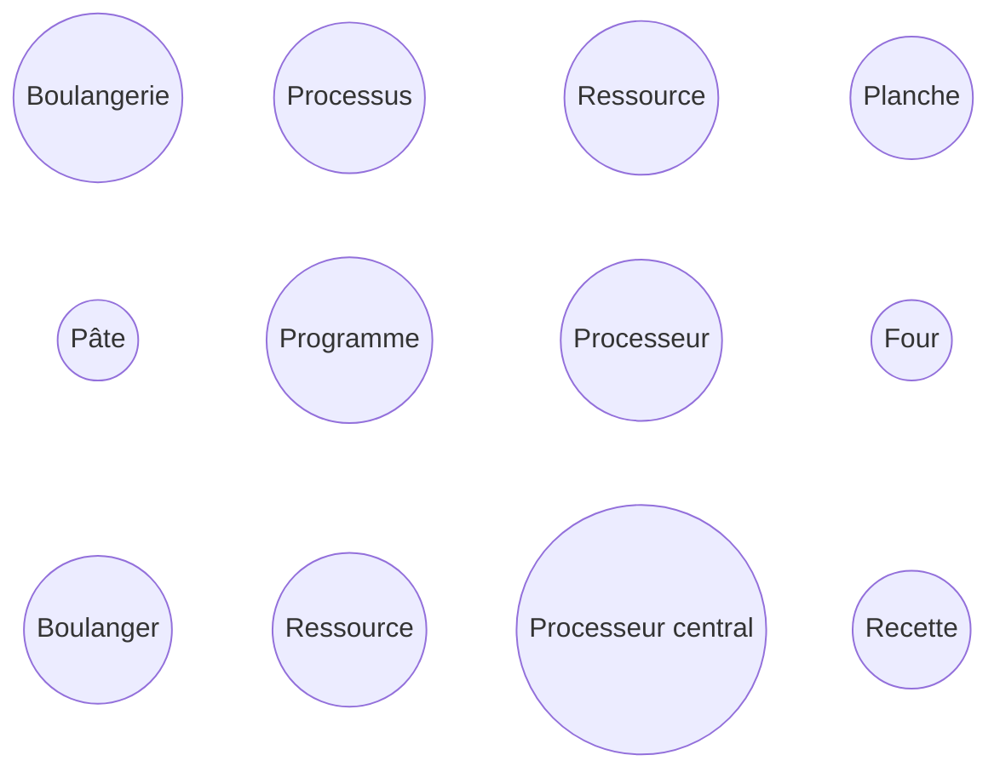

# Activité : Problème du boulanger

Nature : Débranchée.

Matériel : Aucun.

Prérequis : [Gestion des processus et des ressources](./Gestion_des_processus_et_des_ressources.md).

À faire : Seul.

## I. Objectif

L'objectif est de repérer quelle situation pourrait mener à un interblocage.

## II. Contexte

Dans une boulangerie, tous les boulangers sont tombés malades sauf un.

Seul, il va devoir préparer les pains avant l'ouverture de la boutique aux clients. Pour cela, il devra suivre la recette qui lui demande de faire cuire la pâte à pain pendant un certain temps dans le four.

Pour poser et reprendre la pâte du four, le boulanger se sert d'une planche.

Parce qu'un malheur n'arrive jamais seul, le boulanger s'aperçoit qu'un seul four fonctionne et qu'une seule planche est en bon état.

Avec l'expérience, le boulanger sait qu'un four ne peut cuire qu'une seule pâte à la fois que que sa planche ne peut porter qu'une seule pâte.

## III. Travail à faire

a) La gestion de la cuisson des pâtes peut être assimilée à la gestion des processus dans un ordinateur. Relier chaque élément de la boulangerie avec son correspondant informatique :



b) Dans chacune des situations suivantes, expliquer pourquoi il y a ou pas interblocage :

1. Situation n°1:
```
Le boulanger prépare une première pâte.
Le boulanger pose la première pâte sur la planche.
Le boulanger dépose la première pâte au four.
Le boulanger prépare la seconde pâte.
Le boulanger retire la première pâte du four à l'aide de la planche.
Le boulanger pose la seconde pâte sur la planche.
Le boulanger dépose la seconde pâte au four.
Le boulanger retire la seconde pâte du four à l'aide de la planche.
```

2. Situation n°2:
```
Le boulanger prépare une première pâte.
Le boulanger prépare une seconde pâte.
Le boulanger pose la première pâte sur la planche.
Le boulanger dépose la première pâte au four.
Le boulanger pose la seconde pâte sur la planche.
Le boulanger dépose la seconde pâte au four.
Le boulanger retire la première pâte du four à l'aide de la planche.
Le boulanger retire la seconde pâte du four à l'aide de la planche.
```

3. Situation n°3:
```
Le boulanger prépare une première pâte.
Le boulanger prépare une seconde pâte.
Le boulanger pose la première pâte sur la planche.
Le boulanger dépose la première pâte au four.
Le boulanger pose la seconde pâte sur la planche.
Le boulanger retire la première pâte du four à l'aide de la planche.
Le boulanger dépose la seconde pâte au four.
Le boulanger retire la seconde pâte du four à l'aide de la planche.
```

c) Dans les situations avec interblocage, modifier l'ordre des instructions pour qu'il n'y ait plus d'interblocage.
 
________________

[Sommaire](./../../README.md)

___________

<p xmlns:cc="http://creativecommons.org/ns#" xmlns:dct="http://purl.org/dc/terms/"><a property="dct:title" rel="cc:attributionURL" href="https://github.com/boddaert/nsi">Cours NSI</a> by <a rel="cc:attributionURL dct:creator" property="cc:attributionName" href="https://github.com/boddaert">Théo Boddaert</a> is licensed under <a href="https://creativecommons.org/licenses/by/4.0/?ref=chooser-v1" target="_blank" rel="license noopener noreferrer" style="display:inline-block;">CC BY 4.0</a>    </p> 