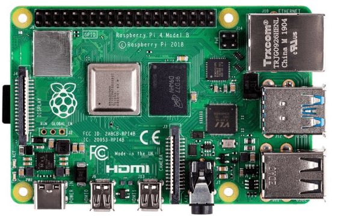
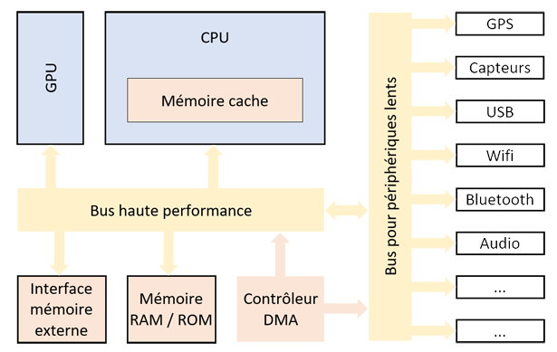

# Systèmes sur puce

## I. Définitions

Les *systèmes sur puce* (*System on Chip* en anglais) ou *microcontrôleurs* sont des systèmes rassemblant sur une même puce tous les principaux composants d'un ordinateur :

Nous y trouvons des microprocesseurs, des zones de mémoire, des périphériques d'entrées/sorties, etc...

Ces systèmes sont utilisés dans toutes les machines informatiques embarquées miniatures comme les téléphones intelligents, les tablettes, les assistants vocaux, montres connectées, etc...

## II. Architecture

À la différence que les programmes ne soient pas situés à l'intérieur de la mémoire, l'architecture des systèmes sur puce est sensiblement la même que celle de John Von Neumann (cf [Modèle de Von Neumann](./../../première/Architecture_des_machines/Modèle_Von_Neumann.md)):

Les systèmes sur puce disposent bien sûr d'une unité centrale de calcul (*CPU* pour *Central Processing Unit*).

Ils disposent également de différents niveaux de mémoire (mémoire cache, mémoire *ROM* pour *Read-Only Memory* et mémoire *RAM* pour *Random Acess Memory*) et éventuellement d'un accès rapide à une mémoire externe.

Ils peuvent disposer d'une unité de traitement graphique (*GPU* pour *Graphic Processor Unit*).

Lorsqu'il est présent, le contrôleur *DMA* (pour *Direct Memory Acces*) permet un transfert des données de ou vers un périphérique, sans solliciter le processeur.

## III. Avantages et inconvénients

### a) Avantages

- La taille est réduite.

- La consommation d'énergie est réduite car les distances sont raccourcies.

- Le dispositif chauffe moins, donc les techniques de refroidissement sont simplifiées.

- Les différents éléments s'intègrent mieux les uns avec les autres car ils sont conçu conjointement.

- La sécurité est normalement améliorée car les différents éléments sont conçus conjointement.

### b) Inconvénients

- Si un élément tombe en panne, il faut tout changer.

- La conception est souvent plus complexe.

##### Application 1

a) Rechercher sur votre téléphone le nom du système sur puce utilisé.

b) Rechercher sur internet les caractéristiques embarquées de ce système.

____________

[Sommaire](./../README.md)