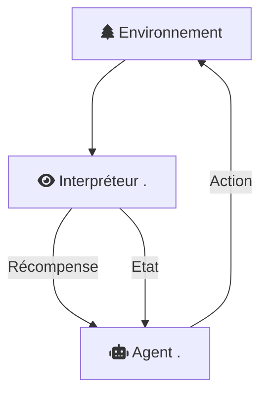
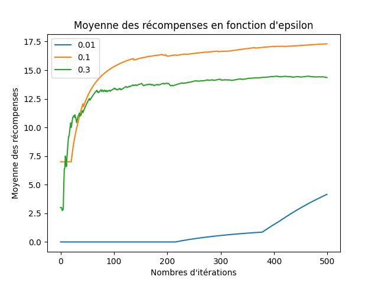
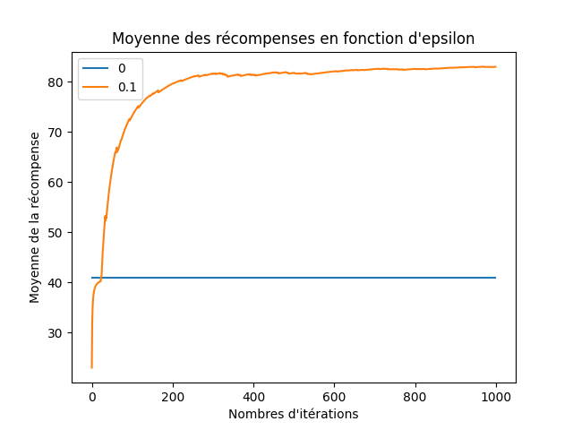
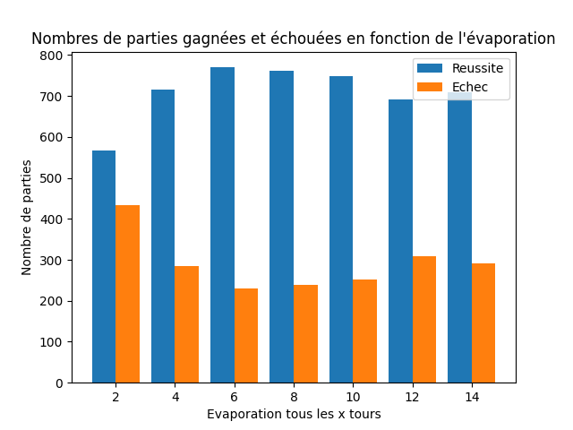
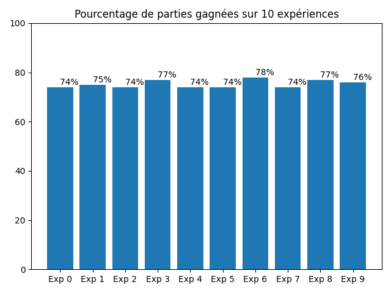
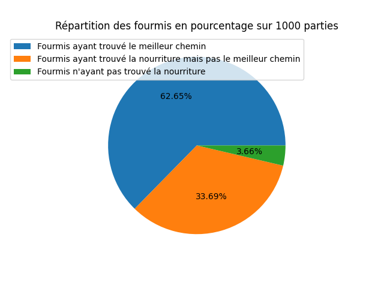
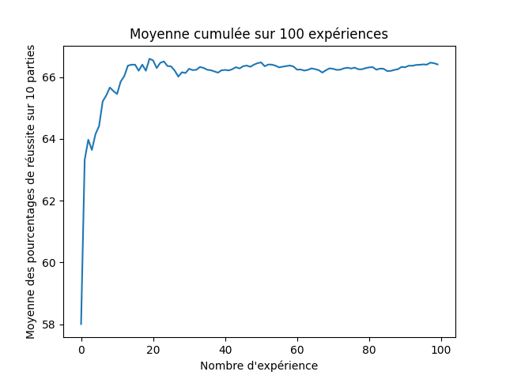

# État de l'art

## Interface agent - environnement

### Processus de décision de Markov

En apprentissage par renforcement, l'algorithme s'appuie sur le processus de décision markovien.

C'est un processus utilisé dans les problèmes d'optimisation qui fut introduit en 1957 par Bellman. Ronald A. Howard complète les travaux avec son livre sorti en 1960 : [@DynamicProgrammingandMarkovProcesses].

Ce processus permet à l'algorithme d'apprentissage par renforcement de prendre les décisions optimales après un certain nombre d'essais.

Il est décrit dans le très célèbre [@ReinforcementLearningAnIntroduction] de Richard S. Sutton et Andrew G. Barto.

Dans un processus de décision markovien, plusieurs entités entrent en jeu :



L'agent ou l'agent IA est l'objet du modèle qui va prendre les décisions : c'est l'objet sur lequel repose l'intelligence artificielle de notre algorithme.

Cet agent prend des décisions, il possède un ensemble fini d'actions $A$, où $a \in A$ est une action qui peut être choisie par l'agent.

Ce qu'on appelle environnement est le milieu dans lequel l'agent évolue. L'environnement possède un ensemble fini d'états $S$, et son état change à chaque fois que l'agent choisit une action.

Chaque action est décrite par une fonction de transitions d'états $T(s,a,s')$ où $s$ est l'état actuel de l'environnement, $a$ est l'action choisie par l'agent et $s'$ est le nouvel état de l'environnement une fois l'action $a$ effectuée sur celui-ci.

L'interpréteur est l'objet du modèle qui va nous permettre de savoir si le nouvel état de l'environnement est satisfaisant ou non. Pour cela, il va interpréter l'état $s'$, et en conséquence, attribuer une récompense à l'agent.

La récompense que recoit l'agent est donnée par la fonction $R(s,a,s')$.

La récompense est positive si l'action choisie $a$ est satisfaisante, négative si elle ne l'est pas.

L'interpréteur va également envoyer à l'agent le nouvel état $s'$ pour qu'il associe la récompense reçue avec l'état de l'environnement.

L'objectif de l'agent va être de recevoir les récompenses maximales. Pour atteindre cet objectif, il va devoir choisir l'action $a$ la plus satisfaisante.

On appelle alors renforcement d'une action le choix d'une action donnant une récompense maximale.

### Exemple d'application du processus de décision

Prenons le cas des voitures autonomes. L'objectif est, à partir d'un algorithme d'apprentissage par renforcement s'appuyant sur le processus de décision de Markov, de ne pas sortir la voiture de la route.

L'agent IA contôle la direction de la voiture. Cet agent peut choisir les actions :

- Tourner à droite

- Tourner à gauche

L'environnement est simplement la route sur laquelle est la voiture. Il possède les états suivants :

- La voiture est sur la route

- La voiture n'est pas sur la route

L'interpréteur est une caméra et permet de nous dire si la voiture est sur la route ou non.

Pendant l'entraînement, l'agent décide de tourner à droite. À l'issue de son action, la voiture est sortie de la route : cet état est interprété par la caméra qui décide d'infliger une punition à l'agent.

Plus tard, l'agent tourne à gauche, et la voiture est restée sur la route. Pour cette action, l'interpréteur donne à l'agent une récompense.

L'agent apprend au fur et à mesure de ses réussites et de ses échecs. Après un certain nombre d'essais, l'agent parvient à prendre les bonnes décisions et à rester sur la route.

La vidéo [Leaning to drive with reinforcement learning algorithm](https://www.youtube.com/watch?v=eRwTbRtnT1I) illustre l'expérience de l'entraînement d'une voiture autonome qui apprend à conduire.

### Trajectoire

Le processus de décision markovien a nécessairement besoin d'un certain nombre d'essais avant de choisir les décisions optimales. Il fonctionne alors dans le temps.

Une trajectoire est une séquence d'états-actions-récompenses dans le temps.

À chaque pas de temps $t$, l'état actuel de l'environnement est $s_t$, l'agent choisit une action $a_t$ et reçoit de l'interpréteur l'état $s_{t+1}$ et une récompense $r_{t+1}$.

### Gain

On appelle gain la somme totale des récompenses obtenues jusqu'à un état terminal.

Comme le processus a besoin de temps avant d'être optimal, la moyenne du gain à l'instant $t$ est inférieure à la moyenne du gain à $t+1$.

Les algorithmes d'apprentissage par renforcement fonctionnent plutôt à long terme qu'à court terme.

## Exploration ou exploitation

Au départ, l'agent ne connaît pas les récompenses associées à ses actions, il va devoir choisir entre 
- Découvrir une récompense pour une action dans l'espoir qu'elle sera satisfaisante. On appelle ce choix : l'exploration.

- Choisir l'action qui lui donne à l'intant $t$ la meilleure récompense sans savoir que ce choix est bien optimal sur le long terme. On appelle ce choix : l'exploitation.

### Dilemme du chercheur d'or

Le "dilemme du chercheur d'or" est un problème de sociologie qui est apparu pour la première fois dans l'article [@ExplorationandExploitation].

Le problème est le suivant :

En 1849, sur une montagne de Californie,  James Marshall trouve par hasard au bord d'une rivière quelques pépites d'or et provoque, malgré lui, la ruée vers l'or.

Des chercheurs d'or de tous horizons décident de venir chercher leur part du butin.

Parmi ces chercheurs, on distingue deux types de choix :

- Exploiter la rivière : le chercheur ne prend aucun risque mais obtient peu de pépites puisque beaucoup de chercheurs s'y trouvent et doivent donc se partager la rivière entre eux.

- Explorer la montagne : le chercheur prend le risque de ne rien trouver du tout mais peut être le premier à trouver un filon qu'il pourra exploiter tout seul.

Quel est le meilleur choix pour gagner le plus d'or possible ?

Dans le cas d'un seul chercheur, il est préférable de choisir exploitateur. C'est-à-dire, exploiter la rivière suffisamment pour vivre au jour le jour sans prendre de risques.

Mais dans le cas d'une communauté, si l'on récupère tout l'or amassé par tous les chercheurs de la communauté, on se rend compte que :

- Premièrement, si tous mes chercheurs sont exploitateurs, ils découvrent un seul gisement et l'exploitent à fond. Dans cette circonstance, le rendement n'est pas maximal puisque tous mes chercheurs sont sur le même gisement.

- Deuxièmement, si tous mes chercheurs sont explorateurs, ils découvrent plusieurs gisements mais ne les exploitent pas. Ici aussi, le rendement n'est pas maximal.

Mais lorsque ma communauté contient des exploitateurs et des explorateurs, le rendement a plus de chances d'être maximal. Les explorateurs partent à l'aventure et découvrent des gisements, et les exploitateurs récoltent l'or sur les filons qui ont été découverts.

### Explorer selon une probabilité $\epsilon$

Ma communauté contient donc des explorateurs et des exploitateurs. Il faut désormais réfléchir à la proportion de chacun de ces deux groupes.

Quels sont les pourcentages d'exploitateurs et d'explorateurs pour que le gain soit maximal ?

Imaginons que ma communauté soit réduite à une seule personne, qui, pour 500 itérations, peut choisir entre explorer et exploiter. Ce chercheur décide d'explorer selon une probabilité $\epsilon$.

Mon chercheur ne connaît pas à l'avance les valeurs de mes filons.

S'il explore, il récupère l'or d'un filon aléatoire. Si le filon n'était pas connu, le chercheur connaît désormais la valeur de ce filon.

Au contraire, s'il exploite, il récupère l'or du filon qui donne le meilleur rendement.

Le programme \ref{dilemme_exploration_exploitation} décrit le problème et la représentation des solutions possibles de celui-ci. Le graphique suivant montre que pour 3 probabilités $\epsilon$ différentes, les courbes indiquant la moyenne des récompenses perçues à la *i-ème* itération ne sont pas les mêmes :

{width=70%}

Pour une probabilité $\epsilon = 0.01$, mon chercheur n'explore pas assez et ne connaît donc pas assez rapidement dans le temps quels sont les filons les plus rentables.

Pour une probabilité $\epsilon = 0.3$, mon chercheur trouve très rapidement les bons filons. Mais à long terme, la moyenne des récompenses ne croît plus puisqu'il explore trop souvent et n'exploite pas assez.

Lorsque mon chercheur explore avec une probabilité $\epsilon = 0.1$, on remarque qu'à long terme, elle représente la probabilité la plus optimale parmi les trois.

### Estimations des actions

Reprenons l'exemple précédent et imaginons que mon chercheur fait une estimation de la valeur de l'or sur chacun des filons.

Si le chercheur décide d'explorer toujours selon une probabilité $\epsilon$, il améliore l'estimation du filon sur lequel il explore. L'estimation converge alors vers la vraie valeur du filon.

Plus ce filon d'or sera choisi lors de l'exploration, plus l'estimation convergera vers la vraie valeur.

Le graphique ci-dessous, donné par le programme \ref{exploration_exploitation_estimations},  affiche la moyenne des récompenses obtenues par le chercheur avec les probabilités $\epsilon = 0$ et $\epsilon = 0.1$ :

{width=70%}

Lorsque la probabilité est de $0$, le chercheur n'explore jamais, il ne fait qu'exploiter le filon dont l'estimation qu'il a réalisée est la plus élevée. Il n'améliore jamais ses estimations.

On appelle ce genre d'action une action gloutonne.

Si la probabilité est $\epsilon = 0.1$, le chercheur améliore au fur et à mesure ses estimations et pourrait, à long terme, découvrir un filon dont l'estimation était éronnée et dont la récompense réelle est plus élevée, et ainsi choisir l'action la plus optimale.

### Sélection d'action à limite de confiance supérieure

Dès lors que des estimations ont été créées, il est encore possible d'améliorer le choix de l'action.

Considérons, à un instant $t$, que l'action la plus optimale est $a$ et $a'$ une autre action dont la valeur est proche de celle de $a$ et dont l'incertitude est grande. En d'autres termes, considérons que lorsque l'action $a'$ a été très peu souvent choisie et donc que son estimation n'a pas été améliorée.

Dans ce cas, il est préférable de choisir $a'$ plutôt que $a$ car l'action $a'$ a le potentiel d'être l'action la plus optimale si son estimation est améliorée.

## Algorithme de colonies de fourmis

### Origine de l'algorithme

Il a été proposé pour la première fois dans les années 1990 dans l'article de recherche [@DistributedOptimizationbyAntColonies].

L'algorithme de colonies de fourmis est un algorithme permettant de résoudre le problème de recherche de chemin de poids minimal dans un graphe.

L'idée provient de l'observation du comportement des fourmis lorsqu'elles cherchent un chemin entre leur colonie et une source de nourriture.

Les biologistes ont également observé que lorsque plusieurs chemins existaient entre la colonie et la source de nourriture, les fourmis finissaient toujours, à terme, par prendre le chemin le plus court.

Voici le comportement observé des fourmis :

1. Une fourmi parcourt au hasard son environnement.

2. Si elle découvre une source de nourriture, elle revient alors à la colonie en déposant des phéromones d'attirance sur son chemin.

Les fourmis se servent de phéromones pour communiquer entre elles. En l'occurence, une phéromone d'attirance permet d'attirer d'autres fourmis.

3. Les fourmis passant à proximité des phéromones préalablement déposées auront tendance à suivre la piste.

4. Après avoir trouvé la nourriture et en revenant au nid, ces mêmes fourmis vont renforcer la piste en déposant à leurs tours des phéromones.

Par définition, si une fourmi emprunte le chemin le plus court, elle fera plus vite son aller-retour que les fourmis ayant emprunté un chemin plus long.

Le chemin court sera donc de plus en plus renforcé, et donc de plus en plus attractif.

Le chemin long sera oublié et finira par disparaître, les phéromones s'étant évaporées avec le temps.

### L'algorithme colonies de fourmis est un algorithme d'apprentissage par renforcement

L'ensemble des fourmis de la colonie sont les agents IA, et la zone naturelle entre le nid et la nourriture est l'environnement dans lequel les agents évoluent.

Lorsqu'une fourmi décide de prendre un certain chemin jusqu'à la nourriture, elle réalise une action. L'ensemble des actions possibles est l'ensemble des chemins empruntables par les fourmis.

Parmi l'ensemble des chemins possibles, si une fourmi emprunte un chemin déjà utilisé, elle exploite ce chemin. Si elle emprunte un chemin encore jamais utilisé, on dit alors qu'elle explore.

On récompense le chemin emprunté en lui attribuant des phéromones.

On dit alors qu'on renforce le chemin utilisé.

### Modelisation de l'algorithme de colonies de fourmis

Le programme \ref{colonies_fourmis} modélise l'algorithme de colonies de fourmis.

#### Environnement

L'environnement dans lequel l'algorithme de colonies de fourmis prend place peut être modélisé par un graphe représentant les différents chemins possibles menant de la colonie à la source de nourriture.

{width=70%}

Le graphe $G$ est un exemple de représentation sagitalle du graphe sur lequel on va travailler tout au long de ce chapitre.

C'est un graphe connexe non orienté pondéré contenant deux poids : celui qui est présenté sur la figure plus haut illustre le nombre de cases qu'il faut parcourir d'un sommet $u$ à un sommet $v$. Le second poids décrit le nombre de phéromones déposées sur l'arête $(u,v)$ et sont tous initialisés à $1$ au début de l'entrainement.

Le graphe $G$ est représenté en machine par une liste d'adjacence :

```{.python .numberLines caption="Liste d adjacence"}
Colonie :
   {'arrivee': 'B', 'nombre de case': 2, 'pheromones': 1}
   {'arrivee': 'C', 'nombre de case': 3, 'pheromones': 1}
   {'arrivee': 'D', 'nombre de case': 4, 'pheromones': 1}
B :
   {'arrivee': 'Colonie', 'nombre de case': 2, 'pheromones': 1}
   {'arrivee': 'E', 'nombre de case': 3, 'pheromones': 1}
   {'arrivee': 'F', 'nombre de case': 3, 'pheromones': 1}
C :
   {'arrivee': 'Colonie', 'nombre de case': 3, 'pheromones': 1}
   {'arrivee': 'A', 'nombre de case': 4, 'pheromones': 1}
D :
   {'arrivee': 'Colonie', 'nombre de case': 4, 'pheromones': 1}
   {'arrivee': 'A', 'nombre de case': 5, 'pheromones': 1}
E :
   {'arrivee': 'B', 'nombre de case': 3, 'pheromones': 1}
   {'arrivee': 'Nourriture', 'nombre de case': 2, 'pheromones': 1}
F :
   {'arrivee': 'B', 'nombre de case': 3, 'pheromones': 1}
   {'arrivee': 'Nourriture', 'nombre de case': 8, 'pheromones': 1}
A :
   {'arrivee': 'C', 'nombre de case': 4, 'pheromones': 1}
   {'arrivee': 'D', 'nombre de case': 5, 'pheromones': 1}
   {'arrivee': 'Nourriture', 'nombre de case': 5, 'pheromones': 1}
Nourriture :
   {'arrivee': 'A', 'nombre de case': 5, 'pheromones': 1}
   {'arrivee': 'E', 'nombre de case': 2, 'pheromones': 1}
   {'arrivee': 'F', 'nombre de case': 8, 'pheromones': 1}
```

#### Fourmis artificielles

Les fourmis artificielles diffèrent des fourmis réelles. Ces différences sont mises en avant dans la thèse [@AlgorithmesDeFourmisArtificiellesApplicationsALaClassificationEtAOptimisation].

Les fourmis artificielles possèdent une mémoire, ne sont pas totalement aveugles et ne font pas autre chose que ce qu'on leur a demandé.

Dès que la fourmi artificielle trouve la nourriture, elle revient automatiquement vers la colonie.

Une fourmi artificielle se souvient du chemin qu'elle a emprunté et enlève les cycles, c'est pour cela qu'elle est dotée d'une mémoire.

Une fourmi dépose une trace de phéromones sur l'arête $(u,v)$ quand elle arrive au sommet $v$. Elle dépose ses phéromones uniquement après avoir trouvé la nourriture.

La fourmi artificielle possède les attributs suivants :

- Un numéro d'identification

- Un chemin, sans cycles, contenant les sommets qu'elle a traversé

- Un entier signifiant le nombre de cases qu'il lui reste à parcourir pour atteindre le sommet $v$ dans l'arête $(u,v)$

- Un booléen indiquant si elle a trouvé la nourriture

- Un entier représentant le nombre total de cases à parcourir sur le retour

Elle possède également plusieurs méthodes lui permettant :

- D'avancer d'une case

- De revenir vers la colonie d'une case

- De savoir si elle est sur un sommet

- De savoir si elle est sur le sommet de nourriture

- De savoir si elle est sur le sommet de colonie

Une fourmi artificielle sera une instanciation de la classe ``Fourmi`` :

```{.python .numberLines caption="Classe Fourmi"}
class Fourmi:
    def __init__(self,numero : int,s_de_depart : str):
        """
        Constructeur : Initialise une fourmi a partir d'un numero de fourmi et d'un sommet de depart
        """
        self.numero = numero
        self.chemin = [s_de_depart]
        self.nb_cases = 0
        self.nb_cases_retour = 0
        self.retour = False

    def avancer(self):
        """
        Avance d'une case la fourmi
        """
        self.nb_cases -= 1

    def revenir(self):
        """
        Avance d'une case la fourmi lorsqu'elle revient a la colonie
        """
        self.nb_cases_retour -= 1

    def est_sur_sommet(self)->bool:
        """
        :return booleen: Renvoie True si la fourmi est sur un sommet, False sinon
        """
        return self.nb_cases == 0

    def est_sur_nourriture(self)->bool:
        """
        :return booleen: Renvoie True si la fourmi est sur le sommet de nourriture, False sinon
        """
        return self.chemin[-1] == 'Nourriture'

    def est_revenue(self):
        """
        :return booleen: Renvoie True si la fourmi est revenue a la colonie, False sinon
        """
        return self.nb_cases_retour == 0
```

#### Choix du voisin

Lorsqu'une fourmi est arrivée à un sommet $u$, elle va effectuer un choix aléatoire pondéré sur tous les voisins $v$ de $u$ selon la quantité de phéromones déposée sur l'arête $(u,v)$. La fonction [``choix_voisin``](#choix_voisin) permet de réaliser un tel comportement :

```{.python .numberLines caption="Choix du voisin"}
def choix_voisin(model : dict,sommet_courant : str)->str:
    """
    :param model (dict): Graphe G represente par une liste d'adjacence
    :param sommet_courant (str): Un sommet u de G
    :return str: un sommet aleatoire voisin de u
    """
    voisins = model.voisins(sommet_courant)
    voisins_nom = [v["arrivee"] for v in voisins]
    voisins_pheromones = [v["pheromones"] for v in voisins]
    return random.choices(voisins_nom, weights=voisins_pheromones, k=len(voisins_pheromones))[0]
```

#### Renforcement du chemin

Une fois qu'une fourmi est rentrée à la colonie, c'est-à-dire, une fois qu'elle a atteint le sommet $Colonie$ sur son retour, le chemin $Nourriture \rightarrow Colonie$ sera renforcé d'un phéromone.

C'est la fonction [``renforcer_chemin``](#renforcer_chemin) qui effectue cette opération :

```{.python .numberLines caption="Renforcement du chemin"}
def renforcer_chemin(model : dict,chemin : list):
    """
    :param model (dict): Graphe G represente par une liste d'adjacence
    :param chemin (list): Liste contenant tous les sommets que la fourmi a traverse
    """
    for i in range(0,len(chemin)-1):
        iv = model.get_indice_voisin(chemin[i],chemin[i+1])
        model.adj[chemin[i]][iv]["pheromones"] += 1
```

#### Évaporation

L'évaporation des phéromones s'effectue à une fréquence de $x$ tours et est très importante puisqu'elle permet de faire disparaître les chemins plus longs qui auraient été renforcés par quelques exploratrices. La fonction [``evaporation``](#evaporation) permet de faire retirer un phéromone sur toutes les arêtes du graphe :

```{.python .numberLines caption="Frequence d evaporation"}
def evaporation(model : dict):
    """
    :param model (dict): Graphe G represente par une liste d'adjacence
    """
    for k in model.adj :
        for i in range(len(model.adj[k])):
            if model.adj[k][i]["pheromones"] > 1:
                model.adj[k][i]["pheromones"] -= 1
```

#### Algorithme principal

L'algorithme des colonies de fourmis est un algorithme d'apprentissage par renforcement : il fonctionne alors dans le temps. Chaque pas de temps $t$ correspond à un tour de jeu, $n$ étant le nombre total de tours de jeu que l'on s'est fixé.

```{.numberLines caption="Algorithme Colonies de fourmis"}
Procedure colonie_de_fourmis
Entrees : un graphe G

liste_fourmis <- ensemble vide
Pour i allant de 0 a n faire :
    Ajouter Fourmi() a liste_fourmis
    Pour chaques fourmis f de liste_fourmis faire :
        Si f est sur le retour et si f est arrivee a la colonie alors :
            Renforcer le chemin de f
            Enlever f de liste_fourmis
        Sinon si f est arrivee a un sommet s alors :
            Si s est la source de nourriture alors :
                f est sur le retour
                Nombre de cases a parcourir pour f <- Somme w(u,v) avec (u,v) l'ensemble des aretes du chemin de f
            Sinon :
                sommet_suivant <- choix_voisin(G,s)
                Nombre de cases a parcourir pour f <- w(s,sommet_suivant)
                Ajouter sommet_suivant a chemin de f
        Avancer d'une case la fourmi f
    Si i est un tour d'evaporation alors:
        evaporation(G)
```

#### Optimisation des paramètres

Les statistiques suivantes ont été réalisées à partir du graphe $G$.

Plusieurs paramètres dans l'algorithme permettent de varier le pourcentage de réussite comme le nombre de fourmis utilisées et la fréquence d'utilisation de l'évaporation.

Une partie est considérée comme gagnée si les phéromones sont plus nombreuses sur le chemin le plus court.

{width=70%}

Sur ce graphique sont représentées le nombre de parties gagnées et échouées en fonction de la fréquence d'évaporation. On remarque sur ce graphique que le pourcentage de réussite est optimal lorsque l'évaporation s'effectue tous les 6-8 tours.

{width=70%}

Sur ce graphique sont représentées le nombre de parties gagnées et échouées en fonction du nombre de fourmis employées. On remarque sur ce graphique que le pourcentage de réussite est optimal à partir de 300 fourmis utilisées.

#### Statistiques de réussite

Les statistiques suivantes ont été réalisées à partir du graphe $G$ avec $n = 500$ le nombre de fourmis et avec $e = 8$ le nombre de tours séparant chaques évaporations.

{width=70%}

Sur le graphique ci-dessus sont représentés les pourcentages de réussite de 10 expériences. Chaque expérience calcule le pourcentage de réussite de 500 parties (choix arbitraire).

On remarque que le taux de réussite varie entre 70% et 80%.

{width=70%}

Sur la précédente figure est représentée l'état en pourcentage de chaque fourmi pour 1000 parties.

Les 4% de fourmis qui n'ont pas trouvé la nourriture sont celles encore présentes dans le graphe après l'issue de la partie. Ce sont celles qui ont été ajoutées peu avant la fin de la partie.

Les fourmis ayant trouvé la nourriture mais en n'ayant pas emprunté le meilleur chemin représentent 33% du total des fourmis, ce qui peut paraître beaucoup lorsque que sur 1000 parties, il y a environ 75% de réussite.

Cela s'explique par le fait que les fourmis explorent beaucoup en début de partie et trouvent un chemin long.

Avec l'évaporation, les chemins longs disparaissent dans le temps et font qu'une partie soit gagnée.

Cependant, ces chemins sont quand même comptabilisés dans le pourcentage de fourmis n'ayant pas trouvé le chemin le plus court.

{width=70%}

Sur la figure ci-dessus est représentée la moyenne cumulée de 100 expériences.

Chaque expérience est réalisée 100 fois. Pour chaque expérience : on calcule la moyenne du pourcentage de réussite sur 10 parties, c'est-à-dire le pourcentage de fourmis ayant trouvé le meilleur chemin.

La courbe de la figure 8 semble converger vers 66%, ce qui laisse penser que l'algorithme reste fiable dans le temps.

## Reconnaissance de caractères manuscrits

La reconnaissance de caractères manuscrits est souvent utilisée dans les banques afin de vérifier l'authenticité des chèques notamment.

Dans le futur, la reconnaissance de caractères manuscrits pourrait être utilisée pour retrouver l'identité d'une personne à partir de son écriture.

### Présentation du problème

La reconnaissance de caractères manucrits (ou *Handwritten Characters Recognition*) est un problème dérivant du problème de reconnaissance de formes.

C'est l'ensemble des techniques visant à identifier des régularités à partir de données brutes afin de prendre une décision pour classifier le motif.

Il s'agit donc d'un problème de classification.

Soit *F*  l'image d'un caractère quelconque *c*. La reconnaissance de caractères manuscrits (HCR) est capable de reconnaître et de classifier ainsi le caractère : $HCR(F) = c$

Il existe plusieurs problèmes de reconnaissance de caractères dont la reconnaisance en ligne et hors ligne.

Lors de la reconnaissance en ligne, l'utilisateur est directement connecté à un crayon électronique et la reconnaissance s'effectue en direct. L'ordinateur observe le sens d'écriture  et est alors capable de reconnaître le caractère en utilisant des vecteurs le long du tracé.

La reconnaissance hors ligne s'effectue à partir d'une photo du caractère. On ne connaît donc pas le sens d'écriture. La méthode pour reconnaître un caractère décrite dans ce chapitre ne concerne donc que le problème de reconnaissance hors-ligne.

Une résolution au problème de reconnaissance hors ligne a été étudiée dans l'article [@NepaliHandwrittenCharacterRecognition] et utilise les réseaux de neuronnes (ou Neural Networks) ou plus précisément un Perceptron.

### Pré-traitement de l'image

La donnée, l'image du caractère, doit être exploitable pour pouvoir utiliser la méthode de reconnaissance hors-ligne et les réseaux de neurones.

Pour rendre l'image exploitable, il convient d'effectuer plusieurs pré-traitements.

Le premier consiste à corriger les défauts "naturels" de l'image : il faut entre autre corriger l'inclinaison de l'image de sorte que le caractère soit horizontal ou la netteté des tracés.

Le second pré-traitement rend l'image exploitable par la machine.

Ci-dessous est présenté un algorithme de pré-traitement de l'image.

```
Procedure pre_traitement_image
Entrees : une image d'un caractere

Lire l'image
Convertir l'image RGB en image en noir et blanc
Suppression (mettre en blanc) des pixels inutiles a l'aide d'un filtrage
Convertir en image binaire
Inversion du noir et du blanc
Suppression des pixels autour du caractere
Normalisation des dimensions de l'image (36x36 par exemple)
Squelettisation des traces (un pixel en largeur du trace)
```

{width=70%}

### Réseaux de neurones

L'idée du réseau de neurones émerge pour la première fois dans les années 1940 par les neurologues W. McCulloch et W. Pitts puis est récupérée et améliorée par D. Hebb dans son ouvrage [@TheOrganizationofBehevior].

À la suite de cet article, F. Rosenblatt invente le modèle du Perceptron en 1958. C'est le premier système artificiel de réseau de neurones à une couche capable d'apprendre par expérience.

Le Perceptron est fortement inspiré du fonctionnement des neurones biologiques.

#### Neurones biologiques

Le système nerveux est composé de milliards de cellules : c'est un réseau de neurones biologiques où chaque neurone transmet de l'information à d'autres neurones via des impulsions électriques.

L'information est d'abord reçue par des capteurs appelés dendrites dans le corps cellulaire.

Ensuite, elle est acheminée par l'axone pour atteindre les synapses à l'extrémité de la terminaison neuronale afin d'être reconduite à un autre neurone.

{width=70%}

Les neurones biologiques disposent d'un centre de contrôle faisant la somme des informations recueillies par les dendrites.

- Si la somme ne dépasse pas le seuil d'excitation : aucun message nerveux n'est émis.

- Si la somme dépasse le seuil d'excitation : un message nerveux est émis via l'axone au neurone suivant.

#### Réseau de Neurones artificiels

Un réseau de neurones artificiels est un ensemble de neurones connectés entre eux. On distingue trois familles de couche de neurones :

- La famille des entrées (ou *Inputs*) coloriées en vert sur la figure ci-dessous.

- La famille des couches cachées (ou *Hidden Layers*) coloriées en bleu.

- Puis la famille des sorties (ou *Outpouts*) coloriées en jaune.

{width=50%}

Les neurones (sauf ceux des entrées) sont liés avec tous les neurones de la couche précédente. Il n'y a qu'une couche cachée pour le Perceptron, mais il existe des réseaux plus performants à plusieurs couches cachées.

#### Principe de Feed Forward

Dans les réseaux de neurones artificiels, on attribue aux entrées des données. Les données sont transmises d'une couche à une autre en respectant le principe du Feed Forward.

Ci-dessous est représenté le schéma d'un neurone artificiel $j$ :

{width=80%}

Soient $(x_1,x_2, ..., x_n)$, les valeurs attribuées aux précédents neurones de $j$.

Et soient $(w_{1j}, w_{2j}, ..., w_{nj})$ les poids respectifs des vecteurs de poids des neurones prédécésseurs de $j$.

Soit $net_j$ la valeur calculée par la fonction de combinaison du neurone $j$ :

$net_j =\sum_{i=1}^{n}x_i \times w_i$

Le neurone calcule la valeur $net_j$ et il va ensuite pouvoir la modifier selon une fonction d'activation  $\varphi$.

La fonction d'activation est une fonction qui va déterminer si le neurone s'active ou non.

Si la valeur $\varphi(net_j)$ calculée par la fonction d'activation n'est pas supérieure au seuil $\theta_j$, le neurone ne s'active pas et la valeur n'est pas transférée aux prochains neurones.

Si, au contraire, la valeur calculée par la fonction d'activation est supérieure au seul $\theta_j$, le neurone s'active et la valeur est transférée aux prochains neurones.

Le neurone a également la possibilité d'ajouter à l'entrée de la fonction d'activation un biais. Cela permet au neurone d'avoir de l'influence sur la fonction d'activation.

#### Fonction d'erreur

Au début, les valeurs renvoyées par les neurones de sortie ne sont pas celles auquelles on attendait : c'est normal puisque le réseau n'est pas entraîné.

C'est ici qu'intervient le principe d'apprentissage par renforcement : grâce à une fonction d'erreur, le réseau va pouvoir mettre à jour, renforcer les poids des vecteurs de telle façon à ce que les valeurs renvoyées par les neurones de sortie deviennent vraies.

La fonction d'erreur permet de savoir à quel point la valeur de sortie est différente de celle attendue.

Soit $t$ la valeur attendue et $out$ la valeur de sortie. La fonction d'erreur $e$ s'écrit : $e = \frac{1}{2}(t-out)^2$

Ainsi, plus la différence est importante entre $t$ et $out$, plus $e$ est grand.

Lorsqu'il n'y a pas d'erreur, $e$ est proche de $0$. Dans le cas contraire, il faut donc modifier les vecteurs de poids de sorte que $e$ se rapproche de $0$.

Pour cela, le réseau va utiliser ce qu'on appelle la rétro-propagation.

L'idée est d'identifier les vecteurs qui ont une énorme influence sur la valeur de sortie et de les réduire proportionnellement à l'impact qu'ils ont sur $e$.

### Méthode de reconnaissance de caractères utilisant un Perceptron

L'idée est d'utiliser un réseau de neurones simple, le Perceptron, où chaque entrée est définie par un pixel de l'image. On dit, par exemple, que la valeur de l'entrée est 0 si le pixel est noir et 100 si le pixel est blanc.

La sortie du Perceptron est représentée par les valeurs des probabilités de la classification de l'image.

{width=100%}

### Méthode de reconnaissance de caractères utilisant un CNN

En utilisant un Perceptron, il y a autant d'entrées que de pixels dans l'image. Par conséquent, pour une image aux dimensions classiques telles que 1366x768, cela necessiterait plus d'un million d'entrées.

Le Réseau de Neurones Convolutionnels (ou *Convolutional Neural Network*) est une sous-catégorie de réseau de neurones répondant plus efficacement au problème. Il répond même de manière générale à la reconnaissance d'image.

En plus d'un réseau de neurones utilisé comme classifieur, l'architecture d'un CNN dispose en amont d'une partie convolutive.

L'objectif final de la partie convolutive est de déterminer un code CNN de l'image.

Pour cela, il s'agit de découper l'image initiale en plusieurs sous-parties : les sous-parties ainsi crées sont alors appelées cartes de convolutions :

{width=40%}

Plusieurs caractéristiques de chaque carte de convolution sont calculées, puis sont soumises à un filtre (appelé *Max-Pooling*) afin de réduire le nombre de caractéristiques. Le filtre, présenté ci-dessous, consiste simplement à garder uniquement la plus forte caractéristique dans chaque carte de convolution :

{width=70%}

Le code CNN est alors obtenu en concaténant les caractéristiques après filtrage.

C'est ce même code CNN qui sera passé en entrée au réseau de neurones. C'est l'étape de classification de l'image.

### Implémentation avec Torch

Le module ``Torchvision`` est un module Python nous permettant d'utiliser des réseaux de neurones pré-entraînés (il ne s'agit donc plus d'algorithme d'apprentissage par renforcement).

Importation des bibliothèques :

```{.python .numberLines caption="Importation des modules"}
from keras.preprocessing.image import load_img
from keras.preprocessing.image import img_to_array
from keras.applications.vgg16 import preprocess_input
from keras.applications.vgg16 import decode_predictions
from keras.applications.vgg16 import VGG16
```

Entraînement du modèle pré-entrainé VGG16 :

```{.python .numberLines caption="Entrainement du modele"}
model = VGG16()
```

Importation de l'image à prédire :

```{.python .numberLines caption="Importation de l image"}
img = load_img('caractere.jpg', target_size=(224, 224))
```

Pré-traitement de l'image :

```{.python .numberLines caption="Pre traitement"}
def preprocess(image) :
    image = img_to_array(image)
    image = image.reshape((1, image.shape[0], image.shape[1], image.shape[2]))
    image = preprocess_input(image)
    return image
```

Prédiction du modèle :

```{.python .numberLines caption="Prediction du modele"}
def pred_modele(image) :
    image = preprocess(image)
    y_pred = model.predict(image)
    label = decode_predictions(y_pred)
    label = label[0][0]
    return ((label[1], label[2]*100))

print("Prediction image:",pred_modele(img)[0], 'avec une probabilite de',pred_modele(img)[1])
```
