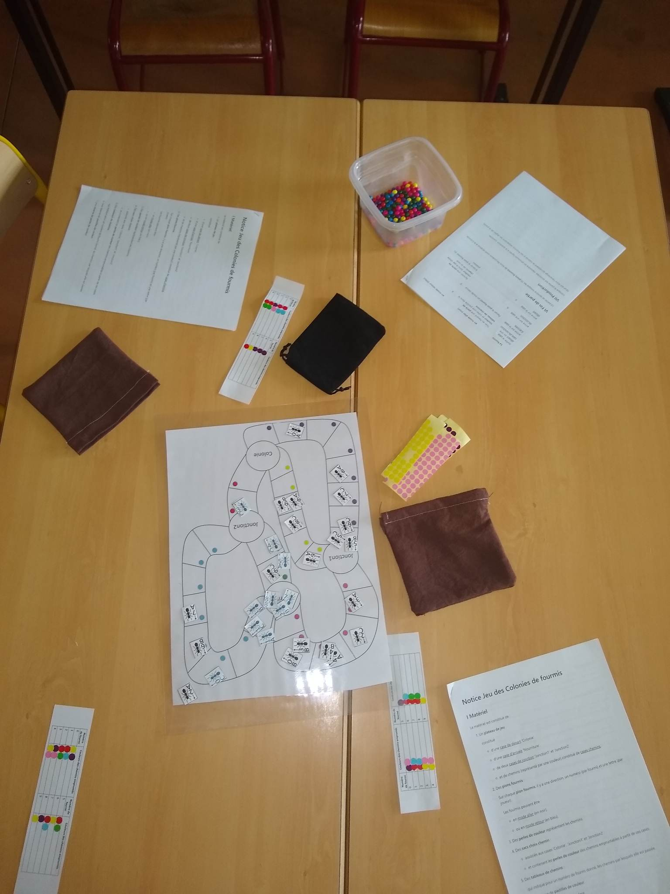
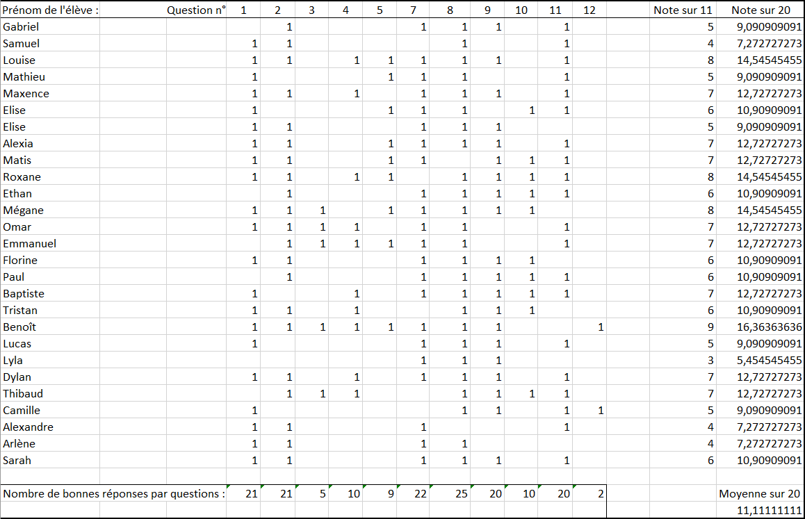
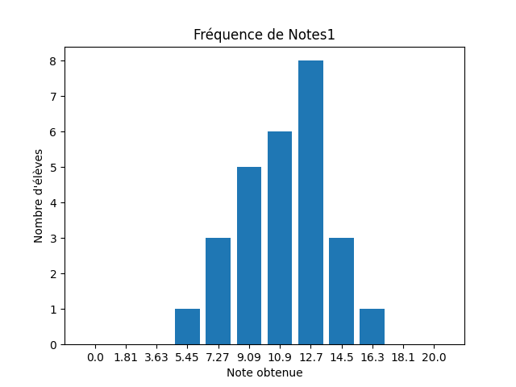
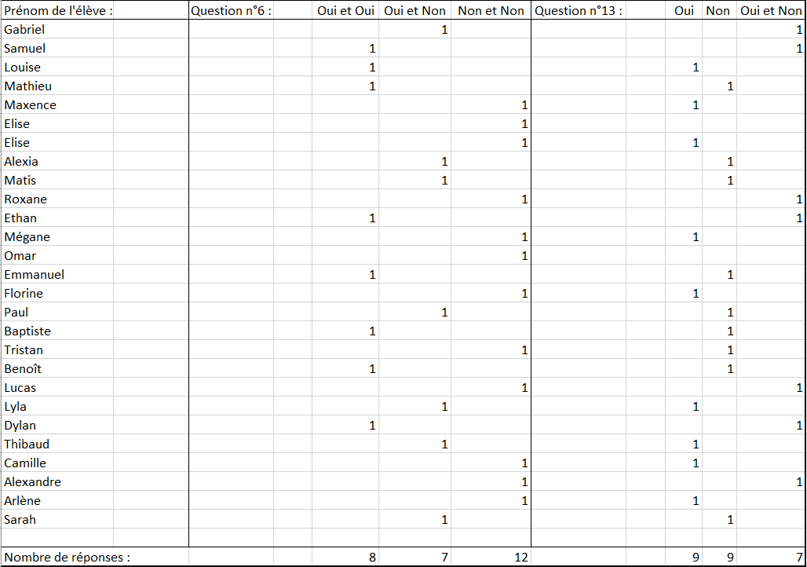
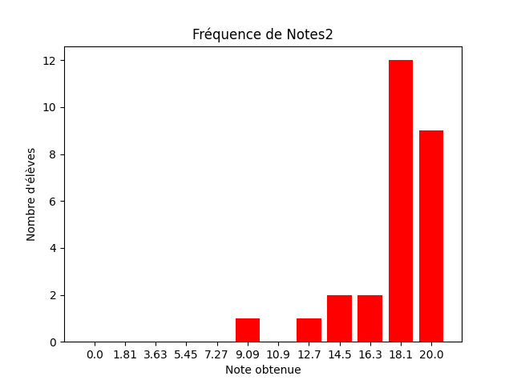

# Résultats et analyse

Ce chapitre est consacré aux résultats et à l'analyse de ceux-ci d'après la séquence pédagogique donnée au chapitre Stratégie et Expérimentation.

Ce chapitre contient une remise en contexte de la situation vécue, des résultats et de leur analyse de l'activité et des réponses obtenues aux deux questionnaires.

## Remise en contexte

Actuellement en stage d’observation et de pratique accompagnée au Lycée Polyvalent Beaupré à Haubourdin, les trente élèves de Seconde de Sciences Numériques et Technologiques ont cours avec Monsieur Willm le mercredi de 10h35 à 12h25.

Pour respecter le taux horaire/semaine en Seconde SNT, les élèves ont cours en classe entière une semaine sur deux et une heure en demi-groupe l'autre semaine.

Tout d'abord, un premier questionnaire leur a été soumis le mercredi 10/05/2023. L'activité s'est réalisée le mercredi 17/05/2023 deux fois d'affilée en demi-groupe pendant une heure. Enfin, le second questionnaire leur a été soumis à l'issue du cours magistral qui s'est déroulé le lundi 22/05/2023 en classe entière.

## Résultats et analyses de l'activité

### Résultats obtenus

Premièrement, l'activité a suscité beaucoup d'intérêt et de curiosité chez les élèves.

C'était l'un des objectifs que je m'étais fixé en choisissant une stratégie pédagogique autour du jeu. Présenter l'activité comme un jeu de société en manipulant à la main plusieurs pièces de matériel comme les pions fourmis, les perles de couleurs et le plateau a été un un bon choix pédagogique, notamment avec des élèves de Seconde.

Ils ont tous participé pleinement au jeu dès le départ même alors que la première consigne était de lire attentivement trois pages de notice.

Voici par exemple une photo du jeu d'un groupe à l'issue de la partie :

{width=70%}

Il n'y a en fait qu'un seul groupe sur les dix où l'activité n'a pas fonctionné. Je reviendrai sur ce point dans la partie sur les difficultés rencontrées.

L'objectif donné aux élèves était de trouver l'avantage qu'obtenait la colonie si ses fourmis suivaient les règles du jeu.

De manière générale, les résultats que j'ai obtenu sont très convaincants.

Premièrement, lors de mon observation sur le travail des élèves en passant dans les groupes, j'ai noté que tous les élèves avaient compris le réel intérêt de l'activité.

Très rapidement, les élèves constataient la chose suivante : le passage d'une fourmi sur un chemin augmentait les chances que la prochaine fourmi emprunte ce chemin. Les élèves ont très vite découvert que les perles de couleurs symbolisaient les phéromones déposées par les fourmis dans la nature.

Néanmoins, l'idée qu'une fourmi revienne plus rapidement à la colonie en empruntant le chemin le plus court est arrivée un peu plus tard. Il a fallu parfois que je pose davantage de questions au groupe d'élèves pour faire émerger cette idée, comme par exemple : _"Prenez-vous plus de temps ou moins de temps si vous effectuez l'aller-retour au lycée en empruntant un chemin plus court ?"_.

La majorité des élèves se sont alors très vite rendus compte que le chemin le plus court serait le plus emprunté à l'issue de la partie.

Voici quelques exemples de productions en réponse à la question située à la fin de la notice (: _"Quel est l'avantage qu'obtient la colonie si ses fourmis respectent les règles de la partie ?"_) :

- "Avec le temps, les fourmis trouvent le chemin le plus court" Dylan

- "Il y aura plus vite plus de perles de couleurs dans le sac du chemin le plus court" Emmanuel

- "Les fourmis auront plus de chance d'arriver plus vite" Alexia

- "Etant donné que les fourmis qui ont pris les chemins les plus courts reviennent plus vite à la colonie, ils seront plus utilisés sur une longue période de temps, même si plus de fourmis utilisent un autre chemin au début" Louise

- "Comme le chemin le plus court est fait plus rapidement, les perles des chemins en question s'accumulent plus vite, donc les fourmis prendront au fil des tours la route la plus courte" Baptiste

Et voici un exemple de trois tableaux des chemins sur un groupe d'élèves où l'activité a particulièrement bien fonctionné (le chemin rouge puis vert étant le chemin le plus court jusqu'à la colonie):

{width=60%}

### Difficultés rencontrées

Premièrement, je n'ai pas rencontré de difficulté majeure dans le sens où je n'ai pas dû arrêter complètement ou transformer une partie de l'activité.

Cela est dû je pense à un long travail de réflexion, de tests et de partage avec M. Willm, mon tuteur terrain, ou de manière générale avec mon entourage.

C'est lors de ce travail de réalisation en amont que l'une des principales difficultés a persisté. En effet, j'ai particulièrement rencontré des soucis lors de l'élaboration et l'écriture de la notice.

La mission était de réussir à créer une notice de jeu conforme à ce qu'on aurait pu voir dans un vrai jeu de société mais dont les règles devaient être construites à partir d'un algorithme. De plus, les règles devaient être abordables par n'importe qui, très faciles à lire et de préférence concises pour ne pas perdre le fil de la lecture, surtout quand il s'agit d'un algorithme comportant beaucoup de cas particulier comme celui des Colonies de fourmis.

Pour cela, j'ai fait le choix de découper la notice en cinq parties : la présentation du matériel, l'objectif à atteindre, l'installation et le déroulement d'un tour de jeu puis enfin un récapitulatif sous forme de tableau. Je tenais également à donner des noms spécifiques au matériel présenté comme "sacs choix-chemin", "pions fourmis" pour ne pas complexifier la lecture.

Cependant, une notice comme celle-ci demande une lecture très attentive pendant plus de dix minutes car elle comporte beaucoup de données à absorber. C'est pourquoi certains groupes d'élèves ont eu quelques incompréhensions comme le déroulé exact d'un tour de jeu. Par exemple, ils n'ajoutaient leurs fourmis sur la case Colonie qu'une fois après avoir fait un aller-retour complet avec leurs précédentes fourmis.

J'ai également remarqué que le vocabulaire utilisé dans la notice n'était pas toujours le plus adapté à la situation et pouvait apporter plus de confusion. Par exemple, j'emploie les termes "case Colonie" ou "case de jonctions" pour désigner les sommets du graphe et j'emploie pareillement le terme "cases" pour les cases constituant les chemins reliant deux sommets entre eux. Tout naturellement, un groupe d'élèves a alors pioché au hasard dans un sac pour chaque case que la fourmi parcourait.

Lors de la première heure, j'ai dû faire face à une difficulté que j'aurais pu esquiver si j'avais moi-même constitué les groupes. En effet, un groupe de trois élèves réputés perturbateurs s'est formé et n'a évidemment pas suivi avec sérieux les consignes que je leur avais imposées. Je remarque, après coup, que ma posture d'enseignant à ce moment aurait dû être plus autoritaire.

Enin, avec une heure pour chaque moitié de classe, aucune partie ne s'est terminée en ayant ramené toutes les fourmis à la colonie. Ce que je pensais être une difficulté n'en est finalement pas une puisque d'une part, les actions menées pendant un tour de jeu sont très répétitives et en deviennent assez vite lassantes surtout pour des élèves de cet âge, et d'autre part parce que les élèves ont quand même réussi à comprendre quel était l'intérêt de la partie même sans la finir. Il aurait donc été inutile de continuer la manipulation jusqu'à ce que toutes les fourmis soient rentrées à la colonie.

### Compétences 

Je n'ai malheureusement pas eu le temps d'évaluer tous les élèves pendant l'activité sur leurs compétences de savoir-faire et compétences de travail en groupe. C'est pourquoi les évaluations de compétences suivantes concernent l'ensemble de la classe selon l'impression que j'ai pu avoir lors de mon observation.

#### Compétences de savoir-faire

Concernant les compétences de savoir-faire, l'ensemble des élèves a réussi avec brio à analyser le problème que pouvait rencontrer la colonie et que l'on souhaite résoudre avec un tel algorithme.

Les élèves ont également pu aperçevoir qu'ils jouaient en réalité le rôle de l'ordinateur qui effectue les différentes instructions du programme lorsqu'ils manipulaient les fourmis sur le plateau et en respectant les règles du jeu. Néanmoins, les élèves n'ont pas fait le rapprochement direct avec la programmation et le fonctionnement des différentes constructions élémentaires en Python apprises pendant l'année.

L'ensemble général des élèves a su s'approprier le plateau et les différents supports de jeu et a su réalisé l'algorithme des Colonies de fourmis comme ceci est indiqué plus haut dans les résultats obtenus.

#### Compétences de travail en groupe

Parmi les compétences évaluées en travail de groupe, j'ai pu en général observer dans les groupes une très bonne communication : les élèves faisaient part de leurs réflexions et de leurs idées en utilisant un langage adapté et respectueux.

Sans compter le groupe des trois élèves perturbateurs, les élèves ont été responsables de leur travail et ont su collaborer jusqu'à se répartir équitablement les tâches comme par exemple lors de l'installation du plateau.

### Retours des élèves

Après l'activité, j'ai profité du deuxième questionnaire pour ajouter une quatorzième question (: _"Avez-vous aimé l'activité ? Si des choses seraient à améliorer, quelles seraient-elles ?"_). 

Parmi les vingt-sept élèves qui ont répondu à ce questionnaire, vingt-quatre ont indiqué avoir aimé faire l'activité principalement parce que c'était une manière "ludique" et "motivante" d'apprendre.

Néanmoins, une quinzaine d'élèves a trouvé qu'il y avait des choses à améliorer, comme pour n'en citer que les principales, agrandir la taille du plateau afin de mieux voir sur quelles cases étaient les fourmis, ou encore simplifier davantage la notice en rendant les règles plus explicites et en réduisant le temps de lecture.

## Résultats et analyses des questionnaires

Les questionnaires sont identiques et comportent treize questions : cinq questions sur la culture générale de l'intelligence artificielle, six questions plus spécifiques aux algorithmes d'apprentissage automatique et deux questions personnelles.

Le barême est d'un point par bonne réponse par question.

La question n°5 contenant plusieurs bonnes réponses ne comptabilise un point seulement si toutes les bonnes réponses on été cochées.

Les questions n°6 et n°13, étant des questions personnelles, ne sont pas prises en compte dans l'évaluation.

La note d'un élève est donc sur onze points ramenée à vingt.

### Premier questionnaire

Vingt-sept élèves de Seconde ont répondu au premier questionnaire le 10/05/2023.

#### Evaluation

##### En général

Ci-dessous est présenté le tableau regroupant le détail des notes obtenues sur le premier questionnaire notées $Notes1$ :

{width=100%}

La moyenne de classe est de 11.1/20, la médianne est de 10.09, la note minimale est de 5.5/20 et la note maximale est de 16.4/20.

Neuf élèves ont eu une note inférieure à 10/20.

On remarque tout d'abord que les résultats sont très homogènes :

{width=80%}

Grâce à ce graphique, nous remarquons que la plupart des notes gravitent autour de la moyenne, ce qui laisse penser qu'au moins la moitié des questions a obtenu une réponse correcte pour la majorité des élèves, mais qu'il a été difficile de répondre correctement au-delà.

Nous observons très bien ce cap : huit élèves ont correctement répondu à sept questions contre trois élèves pour huit questions correctes.

Nous retrouvons quelles sont ces questions dites difficiles grâce au nombre de bonnes réponses par question dans le détail des notes.

##### Sur la question n°3

En effet, seulement cinq élèves ont bien répondu à la question n°3 (: _"Quand est-ce que l’idée d’IA a été prononcée pour la première fois ? - 1956.  - 1988.  - 2004"_).

Je pense que ceci s'explique par le fait que les élèves, étant très jeunes et étant directement acteurs de la montée en puissance très soudaine de l'intelligence artificielle depuis quelques années, notamment avec l'apparition de ChatGPT, imaginent donc que l'intelligence artificielle ne soit pas aussi âgée.

##### Sur la question n°12

Il y a également la question n°12 (: _"L’idée des algorithmes d’apprentissage par renforcement est définie sur : - La répétition d'une action jusqu'à ce qu'elle soit satisfaisante.  - Le renforcement d'une action selon une récompense."_) qui s'avère être la plus difficile puisqu'il n'y a que deux élèves qui ont répondu correctement.

Les élèves n'ayant pas encore reçu les connaissances sur les algorithmes d'apprentissage par renforcement nécessaires à la question, j'aurais alors imaginé qu'ils iraient répondre de manière aléatoire. Avec uniquement deux réponses possibles, il y aurait alors eu la moitié des élèves qui auraient correctement répondu, or il y en a que deux.

Cela laisse à penser que la majorité des élèves étaient convaincus que la première réponse était la bonne. Cette statistique est intéressante puisque nous pourrons évaluer directement la séquence pédagogique sur l'apprentissage des élèves avec les résultats du second questionnaire.

##### Sur la question n°4

Je remarque également que les médias et les réseaux sociaux ont un impact sur les à priori des élèves concernant les nouvelles technologies puisque pour la question n°4 (: _"Qui est le pionnier de l’IA ? - Elon Musk  - John McCarthy  - Steve Jobs"_), dix-sept élèves ont répondu qu'il s'agissait d'Elon Musk. Je pense que cela est dû au fait qu'Elon Musk est une personnalité très présente à la télévision et sur les réseaux sociaux qui le qualifient de génie de son époque.

#### Corrélations

Ces premiers résultats permettent de valider ou de réfuter certaines hypothèses émises dans le chapitre précédent comme la corrélation entre la note de l'élève et la réponse aux questions n°5 et n°6 ainsi que la corrélation entre la note de l'élève et la réponse à la question n°13.

##### Sur la question n°5

Y a t-il une corrélation entre la note de l'élève et sa réponse à la question n°5 (: _"Pour quelles tâches quotidiennes l’IA est-elle utilisée ? (Plusieurs réponses possibles) : La reconnaissance automatique des visages de nos amis sur nos photos.  - L’utilisation d’un casque de réalité virtuelle.  - Envoyer un mail.  - Traduire une phrase avec un logiciel traducteur.  - La recommandation de chansons par rapport à nos précédentes écoutes. - La chaîne de montage d’une voiture dans une usine."_).

D'après le tableau de contingence ci-dessous, parmi les neuf élèves ayant bien répondu à la question n°5, seul un élève a une note inférieure à 10. De plus, parmi tous les autres élèves n'ayant pas répondu correctement à la question n°5, le nombre d'élèves qui ont une note inférieure à 10 est presque équivalent à ceux qui ont une note supérieure à 10.

Autrement dit, lorsqu'un élève répond correctement à la question n°5, il y a une forte probabilité pour qu'il ait une note supérieure à 10. A l'inverse, lorsqu'un élève ne répond pas correctement à la question n°5, la probabilité pour qu'il ait ou non une note supérieure à 10 est la même.

\begin{tabular}{|c|c|c|}
\hline
Tableau de contingence&Notes < 10&Notes >= 10\\
\hline
Nombre de réponses correctes à la question n°5&1&8\\
\hline
Nombre de réponses incorrectes à la question n°5&8&10\\
\hline
\end{tabular}

Il y a donc une corrélation entre la réponse à la question n°5 et la note de l'élève, ce qui réfute mon hypothèse selon laquelle les élèves ont une vision mystifiée de l'intelligence artificielle pour cette question.

##### Sur les questions personnelles

Nous pouvons voir les résultats aux questions n°6 (: _"Avez-vous déjà entendu les termes ‘’machine learning’’ ou ‘’apprentissage automatique’’ et savez-vous ce que cela signifie ?"_) et n°13 (: _"Selon vous, faut-il avoir peur de l’intelligence artificielle ? Et pourquoi ?"_) dans le tableau suivant :

{width=100%}

##### Sur la question n°6

En observant ce tableau, nous remarquons premièrement que les termes "machine learning" ont déjà été entendus par une grande partie de la classe : quinze élèves qui ne l'ont jamais entendu contre douze.

Deuxièmement, nous remarquons également qu'une grande partie de la classe ne sait pas ce que ces termes signifient : dix-neuf élèves contre huit.

Troisièmement, parmi les élèves les ayant déjà entendu, la moitié d'entre eux ne connait pas leur signification.

Y a-t-il une corrélation entre la note de l'élève et sa réponse à la question n°6 ?

D'après le tableau de contingence ci-dessous, parmi les huit élèves qui ont répondu "Oui et Oui" à la question n°6, seuls deux élèves ont obtenu une note inférieure à 10. De plus, parmi ceux qui ont répondu "Oui et Non", il y a cinq élèves sur sept qui ont reçu une note supérieure à 10. Enfin, il y a presque le même pourcentage d'élèves parmi ceux qui ont répondu "Non et Non".

Autrement dit, parmi les élèves affirmant avoir des connaissances sur l'apprentissage automatique, plus nombreux étaient ceux à recevoir une meilleure note.

\begin{tabular}{|c|c|c|}
\hline
Tableau de contingence&Notes < 10&Notes >= 10\\
\hline
Nombre de réponses "Oui et Oui" à la question n°6&2&6\\
\hline
Nombre de réponses "Oui et Non" à la question n°6&2&5\\
\hline
Nombre de réponses "Non et Non" à la question n°6&5&7\\
\hline
\end{tabular}

Il y a donc une corrélation entre la réponse à la question n°6 et la note de l'élève, ce qui réfute mon hypothèse selon laquelle les élèves ont une vision mystifiée de l'intelligence artificielle pour cette question.

##### Sur la question n°13

Pour finir, nous observons sur le tableau une égalité parfaite entre les élèves craignant l'intelligence artificielle et les élèves ne la craignant pas.

D'après le tableau de contingence ci-dessous, il y a autant d'élèves qui ont peur et une note supérieure à 10 que d'élèves qui ont peur et une note inférieure à 10. Par contre, il y a plus du double d'élèves qui n'ont pas peur et ont une note supérieure à 10.

\begin{tabular}{|c|c|c|}
\hline
Tableau de contingence&Notes < 10&Notes >= 10\\
\hline
Nombre de réponses positives à la question n°13&8&8\\
\hline
Nombre de réponses négatives à la question n°13&5&11\\
\hline
\end{tabular}

Il y a donc une corrélation entre la réponse à la question n°13 et la note de l'élève, ce qui valide mon hypothèse selon laquelle les élèves possèdant quelques connaissances sur le sujet de l'intelligence artificielle ont moins de doute que les élèves ne possèdant pas de connaissance sur ce sujet, et vérifie alors la célèbre citation de Maupassant.

Voici quelques exemples de production d'élèves intéressantes réalisées en réponse à la question n°13 :
 - "Non, si son programme est correctement fait, il n'y a pas à avoir peur" Sarah
 - "Oui, on dirait qu'elles connaissent toute notre vie et qu'elles peuvent observer tous nos faits et gestes" Camille
 - "Cela dépend des cas, certaines personnes peuvent en créer des malveillantes" Lucas
 - "Oui car on ne sait pas quelles données sont prises et entre quelles mains sont-elles mises" Megane
 - "Oui et non car elle répond à un besoin humain mais peut détruire des emplois" Dylan

### Second questionnaire

Comme pour le premier, vingt-sept élèves ont répondu au second questionnaire  le 22/05/2023 mais deux élèves présents lors du premier ne l'étaient pas lors du second.

#### Sur l'évaluation

Ci-dessous est présenté le tableau représentant le détail des réponses obtenues au second questionnaire notées $Notes2$ :

{width=100%}

La moyenne de classe est de 17.8, la meilleure note étant 20 et la moins bonne note étant 9.

Un seul élève a obtenu une note inférieure à 10.

Les résultats restent homogènes comme nous pouvons le voir sur le graphique suivant :

{width=80%}

Ce graphique nous indique très clairement que le second questionnaire a mieux été réussi. Vingt-et-un élèves ont obtenu une note supérieure ou égale à 18.

Voici, à titre de comparaison, le graphique représentant les deux précédents diagrammes en barres sur la fréquence des notes de $Notes1$ et $Notes2$ :

{width=80%}

Ce dernier graphique nous prouve la différence de moyenne de classe que l'on a pu obtenir. Les résultats des deux questionnaires sont homogènes mais celui du deuxième l'est beaucoup plus. On le remarque notamment en traçant la courbe de tendance de ces deux échantillons.

Ce graphique fait ressortir une sorte de "fossé" entre les résultats du premier et du second questionnaire. Ce "fossé" nous laisse entendre qu'il a été difficile de bien répondre à plus de sept questions pour le premier mais qu'il a été plutôt très facile de bien répondre à plus de neuf questions pour le second questionnaire pour la majorité des élèves.

Cela suppose que certaines questions dites "difficiles", celles qui ont obtenu le plus de mauvaises réponses dans le premier questionnaire, sont devenues des questions dites "faciles".

L'activité, sa structuration de l'apprentissage et la présentation sur l'IA sont à priori la cause de ce changement de difficulté.

Nous pouvons l'observer en calculant la différence entre le nombre de bonnes réponses obtenues par question dans $Notes1$ et $Notes2$. On constate que celle-ci est particulièrement élevée pour les questions n°3, n°4, n°5, n°10 et n°12.

Par exemple, la question n°12 qui avait obtenu seulement deux bonnes réponses lors du premier questionnaire a obtenu vingt-deux bonnes réponses lors du deuxième questionnaire.

#### Impact sur les apprentissages

Cette partie a pour objectif d'accepter ou rejetter les hypothèses émises dans le chapitre précédent.

##### Sur la moyenne

Après avoir effectué le test de Student sur la moyenne de $Notes1$ et $Notes2$, la statistique observée est de -10.141405286591032.

La probabilité que la variable soit inférieure ou égale à -10.141405286591032 est 1.581306290965126e-10 donc, au seuil de risque 0.05, nous sommes en mesure de rejetter l'hypothèse selon laquelle la moyenne de $Notes1$ est supérieure à celle de $Notes2$.

Nous acceptons alors $H_1$, l'hypothèse alternative selon laquelle la séance a eu un impact positif sur l'apprentissage des élèves de manière générale sur l'intelligence artificielle.

##### Sur les algorithmes d'apprentissage automatique

La séquence a t-elle eu un impact positif sur l'apprentissage des algorithmes d'apprentissage automatique ?

Pour répondre à cette question, j'ai effectué plusieurs tests de McNemar sur les questions n°7, n°8 et n°9.

Voici ci-dessous le tableau du test de McNemar sur la question n°7 (: _"Que permet un algorithme d’apprentissage automatique ? De donner une conscience à l’objet doté d’une IA.  - De faire prendre des décisions à l’objet doté d’une IA."_) :

\begin{tabular}{|c|c|c|}
\hline
McNemar question n°7&A bien répondu&N'a pas bien répondu\\
\hline
$Notes1$&22&5\\
\hline
$Notes2$&24&3\\
\hline
\end{tabular}

Voici ci-dessous le tableau du test de McNemar sur la question n°8 (: _"Qu’a besoin un algorithme d’apprentissage automatique ? Rien.  - De données."_) :

\begin{tabular}{|c|c|c|}
\hline
McNemar question n°8&A bien répondu&N'a pas bien répondu\\
\hline
$Notes1$&25&2\\
\hline
$Notes2$&24&3\\
\hline
\end{tabular}

Voici ci-dessous le tableau du test de McNemar sur la question n°9 (: _"Comment fonctionne un algorithme d’apprentissage ? Des règles complexes sont appliquées un petit nombre de fois.  - Des règles simples sont appliquées un grand nombre de fois."_) :

\begin{tabular}{|c|c|c|}
\hline
McNemar question n°9&A bien répondu&N'a pas bien répondu\\
\hline
$Notes1$&20&7\\
\hline
$Notes2$&23&4\\
\hline
\end{tabular}

Après avoir effectué le test de McNemar sur les trois tableaux précédents, nous sommes en mesure de rejetter l'hypothèse selon laquelle la somme de bonnes réponses de $Notes1$ est supérieure à celle de $Notes2$.

Nous acceptons alors $H_1$, l'hypothèse alternative selon laquelle la séquence a eu un impact positif sur l'apprentissage des élèves sur les algorithmes d'apprentissage automatique.

##### Sur les algorithmes d'apprentissage par renforcement

La séquence a t-elle eu un impact positif sur l'apprentissage des algorithmes d'apprentissage par renforcement ?

Pour répondre à cette question, j'ai effectué plusieurs tests de McNemar sur les questions n°11 et n°12.

Voici ci-dessous le tableau du test de McNemar sur la question n°11 (:  _"Les algorithmes d’apprentissage par renforcement sont-ils basés sur une manière naturelle d’apprendre, celle de l'essai-erreur : Oui  - Non"_) :

\begin{tabular}{|c|c|c|}
\hline
McNemar question n°11&A bien répondu&N'a pas bien répondu\\
\hline
$Notes1$&20&7\\
\hline
$Notes2$&24&3\\
\hline
\end{tabular}

Voici ci-dessous le tableau du test de McNemar sur la question n°12 (: _"L’idée des algorithmes d’apprentissage par renforcement est définie sur : La répétition d’une action jusqu’à ce qu’elle soit satisfaisante.  - Le renforcement d’une action selon une récompense"_) :

\begin{tabular}{|c|c|c|}
\hline
McNemar question n°12&A bien répondu&N'a pas bien répondu\\
\hline
$Notes1$&2&25\\
\hline
$Notes2$&22&5\\
\hline
\end{tabular}

Après avoir effectué le test de McNemar sur les deux tableaux précédents, nous sommes en mesure de rejetter l'hypothèse selon laquelle la somme de bonnes réponses de $Notes1$ est supérieure à celle de $Notes2$.

Nous acceptons alors $H_1$, l'hypothèse alternative selon laquelle la séquence a eu un impact positif sur l'apprentissage des élèves sur les algorithmes d'apprentissage par renforcement.