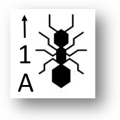

# Stratégie et méthodologie d'expérimentation

Dans ce chapitre seront détaillées la stratégie ainsi que la méthodologie d'expérimentation afin de répondre du mieux possible à la problématique posée.

Une stratégie pédagogique représente l'ensemble des méthodes pédagogiques choisies visant à atteindre un objectif comme :

- Motiver les apprennants et les aider à se concentrer.

- Organiser les informations pour que les apprennants puissent mieux les comprendre et les mémoriser.

- Contrôler et évaluer l'apprentissage.

*Problématique : Comment démystifier la vision qu'ont les élèves de l'intelligence artificielle ?*

## Enjeux de la problèmatique

Ci-dessous est indiquée une liste non exhaustive d'exemple de reportages diffusés sur de grandes chaînes de télévision françaises :

- ["TF1 - Etats-Unis : mon serveur est un robot"](https://www.tf1info.fr/high-tech/video-reportage-tf1-etats-unis-penurie-de-main-d-oeuvre-dans-les-restaurants-mon-serveur-est-un-robot-2245198.html)

- ["TF1 - ChatGPT, l'intelligence artificielle qui repousse les limites du possible : « Bluffant, même traumatisant en tant qu’humain »"](https://www.tf1info.fr/sciences-et-innovation/interview-chatgpt-intelligence-artificielle-qui-repousse-les-limites-du-possible-bluffant-pour-ne-pas-dire-traumatisant-en-tant-qu-humain-selon-jean-gabriel-ganascia-2244812.html)

- ["FranceTV - Au secours, mon patron est un algorithme"](https://www.france.tv/france-2/cash-investigation/1066737-au-secours-mon-patron-est-un-algorithme.html)

- ["TV5Monde - Intelligence artificielle : jusqu'où iront les robots humanoïdes ?"](https://information.tv5monde.com/video/intelligence-artificielle-jusqu-ou-iront-les-robots-humanoides)

- ["FranceTV - Intelligence artificielle : la médecine en pleine révolution"](https://www.france.tv/france-5/c-l-hebdo/c-l-hebdo-saison-7/4523950-intelligence-artificielle-la-medecine-en-pleine-revolution-j-e-bibault-c-l-hebdo-14-01-2023.html)

Ces reportages ont un thème commun : l'intelligence artificielle.

Nombreux sont les médias qui écrivent des articles ou réalisent des reportages sur l'apparition de nouvelles technologies utilisant l'intelligence artificielle, comme les voitures autonomes Tesla il y a quelques années, et plus récemment l'outil ChatGPT.

Ces reportages sont pour la plupart du temps de l'information vulgarisée : il n'y a pas ou peu d'explications sur le fonctionnement des algorithmes. Il y est surtout présenté les spécificités de la technologie. 

De plus, au travers du titre de l'article ou de la voix off, les médias arrivent à susciter chez les téléspectateurs une part de mystère, de crainte voire de peur envers l'intelligence artificielle.

Les téléspectateurs, dont les élèves, construisent alors peu à peu une vision souvent éronnée de l'intelligence artificielle. Par exemple, ils entendent ou utilisent les termes "machine learning" ou "apprentissage automatique" sans connaître leur signification.

L'intelligence artificielle est ainsi mystifiée, alors qu'elle est actuellement de plus en plus présente dans nos quotidiens, nos entreprises, nos recherches scientifiques. L'école a pour mission d'armer les élèves des connaissances nécessaires pour comprendre le monde dans lequel ils évoluent.

## Objectifs

L'objectif de la séquence est de faire découvrir l'intelligence artificielle aux élèves.

De manière plus précise, le but est de :

- Faire manipuler aux apprenants un algorithme d'apprentissage par renforcement dans un contexte simplifié.

- Faire développer les compétences de travail en équipe, comme par exemple la communication, la collaboration, la responsabilité ainsi que la mutualisation des connaissances et compétences ainsi que l'auto-organisation.

- Sensibiliser et faire se questionner l'élève sur l'intelligence artificielle.

## Progression

Les algorithmes d'apprentissage par renforcement et plus généralement l'intelligence artificielle ne sont pas au programme de SNT et NSI.

Malgré cela, en NSI, la séquence peut faire le lien avec un autre chapitre comme les graphes ou la programmation orientée objet en Terminale NSI, ou l'algorithme KNN (*K-nearest neighbors*) qui est un algorithme d'apprentissage supervisé en Première NSI.

La démarche de projet occupe une place importante dans les Bulletins Officiels des trois niveaux.

{width=70%}

On peut alors imaginer un projet de groupe où l'on demande aux élèves de programmer en Python un algorithme d'apprentissage par renforcement.

En Seconde SNT, les enjeux de la problématique rencontrent parfaitement ceux de la matière notés dans le préambule :

"L'enseignement de SNT en classe de seconde a pour objet de permettre d'appréhender les principaux concepts des sciences numériques, mais également de permettre aux élèves, à partir d'un objet technologique, de comprendre le poids croissant du numérique et les enjeux qui en découlent. [...] L’enseignement de sciences numériques et technologie aide à mieux comprendre les enjeux scientifiques et sociétaux de la science informatique et de ses applications, à adopter un usage réfléchi et raisonné des technologies numériques dans la vie quotidienne et à se préparer aux mutations présentes et à venir de tous les métiers."

Pour la suite, nous allons considérer que la séquence est à destination des Secondes SNT.

## Stratégie pédagogique

### Pédagogie par le jeu

En 1998, Denis Sestier, professeur d'histoire-géographie de l'académie de Caen écrit : "Un jeu est une activité de loisir, physique ou psychique, qui obéit à des règles fixées à l'avance s'appliquant à tous les joueurs, et que l'on pratique pour se divertir et en tirer du plaisir. Un jeu comporte un enjeu et se termine d'une clôture symbolique marquée par la victoire d'un joueur, d'un groupe de joueur ou parfois de tous les joueurs par l'atteinte d'un but".

L'idée, afin de compléter les objectifs annoncés plus haut, est de faire manipuler, en activité, un algorithme d'apprentissage par renforcement sous forme de jeu.

On appelle ludification (ou *gamification*) le fait de rendre ludique, avec l'utilisation de mécanismes de jeu, une situation d'apprentissage qui ne l'était pas à la base.

Ma stratégie repose sur l'exploitation des bienfaits du jeu pédagogique, c'est-à-dire d'une activité ludique permettant aux élèves l'acquisition de savoirs, savoir-faire et savoir-être.

Premièrement, le jeu permet le développement cognitif et social. Il fait apprendre à coopérer, à communiquer, à développer l'autonomie, à développer des capacités d'abstraction et à favoriser l'estime de soi.

Ensuite, le jeu permet d'accéder au savoir différamment des accès traditionnels. Il lie travail et plaisir : l'élève n'a pas l'impression de travailler. Le jeu fait appel à sa motivation intrinsèque étant donné que l'élève travaille désormais dans le but d'obtenir une satisfaction personnelle, celui de gagner.

Enfin, le jeu permet l'apprentissage par l'essai-erreur qui, nous l'avons vu avec les algorithmes d'apprentissage par renforcement, est une méthode d'apprentissage efficace et naturelle. Ceci est d'autant plus vrai que l'impact émotionnel d'une situation d'échec en jeu pédagogique est moins violent que celui d'un apprentissage classique.

Apprendre par le jeu a toutefois un gros inconvénient : une prise de conscience et la structuration des apprentissages sont indispensables à la fin du jeu pour que celui-ci soit efficace.

### Déroulé de la séquence

La séquence se découpe en deux parties principales l'une à la suite de l'autre :

- Jeu pédagogique : Manipulation d'un algorithme d'apprentissage par renforcement : Colonies de fourmis (1 heure):
  
  - Présentation de l'activité, de l'objectif et des consignes.

  - Activité : Travail en groupe en autonomie.

  - Production d'élève.

- Cours magistral (1 heure):

  - Structuration de l'apprentissage sur l'activité (retour sur l'objectif, les résultats obtenus).
  
  - Définition de l'intelligence artificielle.
  
  - Généralités sur l'intelligence artificielle (Histoire de l'IA, utilisations concrètes de l'IA).
  
  - Définition de l'apprentissage automatique et différenciation des algorithmes d'apprentissage supervisés et non supervisés.
  
  - Description des algorithmes d'apprentissage par renforcement en faisant lien avec l'algorithme des Colonies de fourmis.

Au début puis à la fin de la séquence, les élèves sont soumis à un questionnaire.

Le scénario pédagogique lié à cette séquence est disponible en \hyperref[sec:annexe4]{annexe 4}.

## Méthodologie d'expérimentation

La méthodologie ci-dessous se penche en particulier sur le fonctionnement de l'activité.

### Cours magistral

Le support du cours magistral est un diaporama disponible en \hyperref[sec:annexe5]{annexe 5}.

### Activité : Colonies de fourmis

#### Pré-requis

Il n'y a pas de pré-requis pour pouvoir réaliser l'activité.

Une connaissance élémentaire des graphes ainsi que du problème de recherche de poids minimal dans un graphe est utile pour appuyer davantage l'interêt de l'algorithme des Colonies de fourmis mais n'est pas nécessaire.

#### Nature de l'activité

Afin de mieux aborder l'algorithme, l'activité se déroule sous la forme d'un jeu de société avec lequel on déplace à la main les fourmis en suivant au fur et à mesure les règles de la notice.

Les élèves ont alors le rôle de l'ordinateur et réalisent eux-mêmes les instructions.

L'algorithme est ainsi "décortiqué" en profondeur : cela permet aux élèves de comprendre précisément son fonctionnement.

L'activité se réalise en groupe de trois ou quatre élèves.

#### Déroulé de l'activité

- Appropriation (15 minutes) : 
  
  - Les élèves lisent individuellement et attentivement une première fois la notice. 
  
  - Puis, les élèves repèrent sur la table les différentes pièces du matériel et préparent l'installation.

  - Enfin, ils réalisent une partie d'entraînement pour s'approprier des règles du jeu.

- Manipulation (40 minutes) : 
  
  - Les élèves sont en groupe sur un même plateau. Ils manipulent chacun en même temps leurs fourmis pour exécuter les instructions plus rapidement. Les élèves se voient attribuer un total de 10 fourmis maximum pour éviter l'engorgement. 

- Production (5 minutes) :

  - A l'issue de la manipulation, les élèves doivent rédiger un paragraphe répondant à la question suivante : "Qu'obtient comme avantage la colonie si les fourmis respectent les règles du jeu ?"

#### Matériel débranché

##### Notice de jeu

L'algorithme est représenté en \hyperref[sec:annexe6]{annexe 6}. sous la forme d'une notice de jeu de société et indique le matériel à utiliser, son installation et les règles du jeu.

##### Plateau de jeu

Le principal support sur lequel les élèves vont manipuler les fourmis est le plateau de jeu.

{width=80%}

##### Sacs choix chemin

Chaque sommet est représenté par un sac dans lequel y sont placées des perles de couleur. Chaque perle de couleur indique un chemin.

{width=40%}

{width=40%}

Pour choisir un chemin à partir d'un sommet $s$, l'élève pioche au hasard une perle depuis le sac situé sur le sommet $s$.

Lorsqu'un chemin est renforcé, on ajoute une perle de sa couleur dans le sac du sommet correspondant.

##### Pions fourmis

Une fourmi est un pion sur le plateau et possède un numéro, une lettre et une direction. Le pion est associé à un élève via une lettre.

Une fourmi peut être en mode "retour", c'est-à-dire lorsqu'elle doit revenir à la colonie. Pour distinguer les fourmis en mode "aller" des fourmis en mode "retour",  on retourne le pion : la fourmi est d'une autre couleur :

##### Tableau des chemins

Une fourmi doit mémoriser les chemins par lesquels elle est passée. On écrit alors dans le tableau des chemins les couleurs des chemins qu'elle a emprunté :

#### Structuration de l'apprentissage

J'effectue un retour sur l'activité, l'objectif à atteindre, les résultats obtenus et les productions des élèves, c'est-à-dire leur réponse à la question située à la fin de la notice.

Après une courte phase de débat et d'hypothèses sur les paramètres pouvant faire varier le taux de réussite, j'affiche alors les graphiques représentant le taux de résussite selon le nombre de fourmis et la fréquence d'évaporation.

Enfin, j'effectue une démonstration d'exécution de code implémentant l'algorithme de colonies de fourmis.

#### Inconvénients et limites

- L'execution de l'algorithme de colonies de fourmis prend beaucoup de temps, les algorithmes d'apprentissage par renforcement fonctionnant dans le temps. Il faudrait compter entre cinquante et soixante minutes pour voir apparaître des résultats si l'on manipule les fourmis une par une.

C'est pourquoi l'activité propose de faire manipuler toutes les fourmis de tous les élèves d'un groupe sur un tour.

- Par souci de temps, le graphe a été réfléchi de telle manière à ce que les fourmis atteignent "rapidement" la nourriture.

- La notice ne correspond pas tout à fait à l'algorithme de l'état de l'art. En effet, dans l'activité, les fourmis ne peuvent pas choisir le chemin par lesquels elles viennent d'arriver.

#### Plan de classe

Les groupes d'élèves sont disposés par "îlots" dans la salle de classe comme le décrit la figure ci-dessous.

{width=40%}

#### Outils de gestion de classe

La répartition des groupes, la gestion du temps et du bruit s'effectue à l'aide de l'application web [La Digitale](https://ladigitale.dev/digiscreen/).

## Collecte des données

L'analyse des données recueillies doit permettre de valider des hypothèses, comme celle d'afficher une différence sur la compréhension des mécanismes de l'intelligence artificielle entre le début et la fin de la séquence, l'objectif final étant de répondre à la problèmatique.

Les données exploitées sont récupérées via un questionnaire dans un premier temps puis via une évaluation de compétences dans un deuxième temps.

### Via un questionnaire

Les données à analyser sont les réponses d'un questionnaire distribué en début et fin de séquence. Il y aura donc un même questionnaire soumis deux fois aux élèves.

Le questionnaire est proposé en \hyperref[sec:annexe7]{annexe 7} et sa correction en \hyperref[sec:annexe8]{annexe 8}.

Le questionnaire est sous forme de QCM comprenant treize questions dont cinq de culture générale sur l'intelligence artificielle, six questions plus spécifiques aux algorithmes d'apprentissage automatique et deux questions personnelles.

L'objectif serait de déterminer une différence nette entre les résultats de la première évaluation et les résultats de la seconde pour prouver un potentiel impact de l'activité sur l'apprentissage des élèves.

On note $Notes_1$ et $Notes_2$ l'ensemble des notes receuillies respectivement avant la séance et après la séance ramenées sur 20.

Les échantillons sont indépendants : la moyenne devrait donc suivre une loi normale. Les résultats sont appariés et à caractère quantitatifs.

Nous allons donc, en utilisant les tests d'hypothèses, vérifier l'impact de la séance sur l'apprentissage des élèves en validant ou en rejettant les hypothèses.

#### Impact sur l'apprentissage de manière générale

Afin de démontrer une quelconque différence entre les moyennes de $Notes_1$ et $Notes_2$, nous allons utiliser le test de Student.

Le test de Student permet de valider ou de rejetter les hypothèses suivantes :

- Hypothèse nulle $H_0$ : La moyenne de $Notes_2$ est inférieure à celle de  $Notes_1$.

- Hypothèse alternative $H_1$ : La moyenne de $Notes_2$ est supérieure à celle de $Notes_1$.

Si l'hypothèse $H_1$ est validée, nous serons en mesure de confirmer que la séance a eu un impact positif sur l'apprentissage des élèves de manière générale.

#### Impact sur l'apprentissage des algorithmes d'apprentissage automatique

Plus précisément, nous souhaitons désormais savoir si la séance a eu un impact positif sur l'apprentissage des élèves à propos des algorithmes d'apprentissage automatique.

Pour cela, nous réalisons un premier test de Mc Nemar sur la question n°7 (: _"Que permet un algorithme d’apprentissage automatique ? De donner une conscience à l’objet doté d’une IA.  - De faire prendre des décisions à l’objet doté d’une IA."_).

Nous effectuons alors la mesure sur la question n°7 :

- Dans $Notes_1$, $n_1$ élèves ont correctement répondu à la question n°7, $p_1$ élèves n'ont pas correctement répondu.

- Dans $Notes_2$, $n_2$ élèves ont correctement répondu à la question n°7, $p_2$ élèves n'ont pas correctement répondu.

Ensuite, nous effectuerons un second test de Mc Nemar sur la question n°8 (: _"Qu’a besoin un algorithme d’apprentissage automatique ? Rien.  - De données."_).

Nous effectuons alors la mesure sur la question n°8 :

- Dans $Notes_1$, $n_1$ élèves ont correctement répondu à la question n°8, $p_1$ élèves n'ont pas correctement répondu.

- Dans $Notes_2$, $n_2$ élèves ont correctement répondu à la question n°8, $p_2$ élèves n'ont pas correctement répondu.

Enfin, nous réaliserons un troisième test de Mc Nemar sur la question n°9 (: _"Comment fonctionne un algorithme d’apprentissage ? Des règles complexes sont appliquées un petit nombre de fois.  - Des règles simples sont appliquées un grand nombre de fois."_).

Nous effectuons alors la mesure sur la question n°9 :

- Dans $Notes_1$, $n_1$ élèves ont correctement répondu à la question n°9, $p_1$ élèves n'ont pas correctement répondu.

- Dans $Notes_2$, $n_2$ élèves ont correctement répondu à la question n°9, $p_2$ élèves n'ont pas correctement répondu.

Si $n_2 > n_1$ pour ces trois tests, nous serons en mesure de confirmer que la séance a eu un impact positif sur l'apprentissage des élèves sur les algorithmes d'apprentissage automatique.

#### Impact sur l'apprentissage des algorithmes d'apprentissage par renforcement

Plus précisément, nous souhaitons désormais savoir si la séance a eu un impact positif sur l'apprentissage des élèves à propos des algorithmes d'apprentissage par renforcement.

Pour cela, nous réalisons un premier test de Mc Nemar sur la réponse à question n°11 (:  _"Les algorithmes d’apprentissage par renforcement sont-ils basés sur une manière naturelle d’apprendre, celle de l'essai-erreur : Oui  - Non"_).

On effectue alors la mesure sur la question n°11 :

- Dans $Notes_1$, $n_1$ élèves ont correctement répondu à la question n°11, $p_1$ élèves n'ont pas correctement répondu.

- Dans $Notes_2$, $n_2$ élèves ont correctement répondu à la question n°11, $p_2$ élèves n'ont pas correctement répondu.

Puis, nous effectuerons un second test sur la question n°12 (: _"L’idée des algorithmes d’apprentissage par renforcement est définie sur : La répétition d’une action jusqu’à ce qu’elle soit satisfaisante.  - Le renforcement d’une action selon une récompense"_).

On effectue alors la mesure sur la question n°12 :

- Avant la séance, $n_1$ élèves ont correctement répondu à la question n°12, $p_1$ élèves n'ont pas correctement répondu.

- Après la séance, $n_2$ élèves ont correctement répondu à la question n°12, $p_2$ élèves n'ont pas correctement répondu.

Si $n_2 > n_1$ pour ces deux tests, nous serons en mesure de confirmer que la séance a eu un impact positif sur l'apprentissage des élèves sur les algorithmes d'apprentissage par renforcement.

#### Corrélations entre réponse aux questions n°5 et n°6 et note de l'élève

L'idée des tests suivants est de déterminer si, avant la séance, certains élèves possèdent une vision mystifiée de l'intelligence artificielle.

Autrement dit, si la vision qu'ont ces élèves de l'intelligence artificielle est en effet mystifiée, ils ne devraient pas avoir une meilleure note que les autres.

Nous allons donc effectuer des mesures sur les réponses aux questions n°5 et n°6 obtenues lors du premier questionnaire afin de savoir s'il existe une corrélation entre la réponse à ces questions et la note de l'élève.

Mesure sur la question n°5 (: _"Pour quelles tâches quotidiennes l’IA est-elle utilisée ? (Plusieurs réponses possibles) : La reconnaissance automatique des visages de nos amis sur nos photos.  - L’utilisation d’un casque de réalité virtuelle.  - Envoyer un mail.  - Traduire une phrase avec un logiciel traducteur.  - La recommandation de chansons par rapport à nos précédentes écoutes. - La chaîne de montage d’une voiture dans une usine."_).

Pour valider ou rejetter l'hypothèse, nous utilisons un tableau de contingence :

\begin{tabular}{|c|c|c|}
\hline
Tableau de contingence&Notes < 10&Notes >= 10\\
\hline
Nombre de réponses correctes à la question n°5& & \\
\hline
Nombre de réponses incorrectes à la question n°5& & \\
\hline
\end{tabular}

Nous serons en mesure de confirmer, selon les résultats obtenus dans ce tableau de contingence, si les élèves sachant quels objets ou activités quotidiennes nécessitent l'intelligence artificielle ont une meilleure note que les élèves ne le sachant pas.

Mesure sur la question n°6 (: _"Avez-vous déjà entendu les termes "machine learning" ou "apprentissage automatique" et savez-vous ce que cela signifie ? : Oui et Oui.  - Oui et Non.  - Non et Non"_).

Pour valider ou réfuter l'hypothèse, nous utilisons un tableau de contingence :

\begin{tabular}{|c|c|c|}
\hline
Tableau de contingence&Notes < 10&Notes >= 10\\
\hline
Nombre de réponses "Oui et Oui" à la question n°6& & \\
\hline
Nombre de réponses "Oui et Non" à la question n°6& & \\
\hline
Nombre de réponses "Non et Non" à la question n°6& & \\
\hline
\end{tabular}

Nous serons en mesure de confirmer, selon les résultats obtenus dans ce tableau de contingence, si les élèves ayant déjà entendu les termes "machine learning" ou "apprentissage automatique" ont une meilleure note que ceux qui ne les ont jamais entendu.

#### Vérification de la citation de Guy de Maupassant

"On a peur que de ce qu'on ne comprend pas" Guy de Maupassant.

Nous souhaitons savoir s'il y a une corrélation entre la réponse à la dernière question (: _"Avez-vous peur de l'intelligence artificielle ? Oui  - Non"_) et la note de l'élève.

Pour cela, nous utilisons un tableau de contingence :

\begin{tabular}{|c|c|c|}
\hline
Tableau de contingence&Notes < 10&Notes >= 10\\
\hline
Nombre de réponses positives à la question n°13& & \\
\hline
Nombre de réponses négatives à la question n°13& & \\
\hline
\end{tabular}

Nous serons en mesure de confirmer, selon les résultats obtenus dans ce tableau de contingence, si les élèves ayant une moins bonne note ont peur de l'intelligence artificielle.

### Via les compétences

On peut également savoir si l'activité a eu un impact sur les savoir-faire des élèves notamment en les observant pendant l'activité et en évaluant leurs compétences.

L'évaluation est individuelle pour chaque élève et sont regroupées dans un tableau de compétences des savoir-faire :

\begin{tabular}{|c|c|c|}  
\hline   
Axes&Critères&Descriptifs\\
\hline   
\multirow{5}{*}{Algorithme}&
Réinvestissement des
&L'élève connaît les fonctionnements \\
&connaissances de base
& des constructions élémentaires\\

\cline{2-3}

&Réinvestissement des
&L'élève fait le lien entre ses connaissances sur\\
&connaissances sur les
&les algorithmes d'apprentissage par renforcement \\
&algorithmes d'apprentissage
&et l'algorithme des colonies de fourmis\\

\hline

Analyse&Problème du chemin
&L'élève analyse le problème du\\
&de poids minimum
&chemin de poids minimum dans un graphe\\

\hline
\multirow{3}{*}{Activité}
&Appropriation de la
&L'élève s'approprie le plateau et \\
&situation
&ses différents supports,\\
& &l'élève effectue l'algorithme des\\
& &colonies de fourmis sur ce plateau\\

\cline{2-3}

&Analyse d'une solution
&L'élève voit apparaître sur son plateau\\
& &une solution et sait l'analyser\\

\cline{2-3}

&Communication
&L'élève sait décrire les résultats qu'il a obtenus\\

\hline
\end{tabular}

Cette activité en groupe est également l'occasion d'évaluer les élèves sur leurs compétences à savoir travailler en groupe :

\begin{tabular}{|c|c|c|}  
\hline   
Axes&Critères&Descriptifs\\
\hline   
\multirow{2}{*}{Communication}
&Communication claire
&L'élève communique de manière concise, claire\\
& &et efficace\\
\cline{2-3}
&Partage&L'élève fait part de ses réflexions,\\
& &de ses idées\\

\cline{2-3}

&Langage approprié
&L'élève utilise un langage adapté à la\\
&&situation\\

\cline{2-3}

&Respect
&L'élève écoute activement, respecte les\\
& &temps de parole\\
\hline
Altruisme&Solidarité&L'élève favorise l'entraide\\
\hline

\multirow{2}{*}{Responsabilité}&Dans son travail
&L'élève accomplit sa part de travail\\

\cline{2-3}

&Dans son groupe
&L'élève est plutôt un élément moteur\\
&&qu'un élément perturbateur\\
\hline

\multirow{2}{*}{Collaboration}
&Répartition des tâches
&Les tâches sont divisées de\\
&&manière équitable\\

\cline{2-3}

&Mutualisation&Les élèves mutualisent de manière efficace\\
\hline
\end{tabular}
