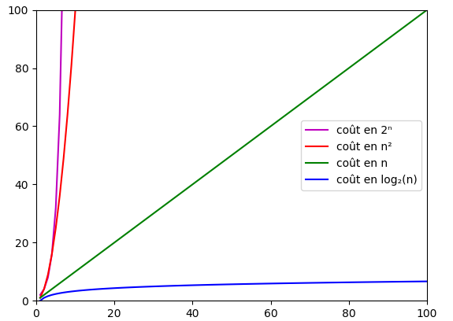

# Rappels des Algorithmes de Tri vus en  Première

## I. Généralités

### a) Trier

*Trier* un ensemble de valeurs (par exemple une liste), c'est obtenir une permutation de cet ensemble en vérifiant plusieurs contraintes.

Prenons `l`, une liste Python d'entiers naturels non triée et `l_triee` la permutation de `l` vérifiant :

- La taille de `l` est égale à la taille de `l_triee`.

- Tous les éléments contenus dans `l` sont présents dans `l_triee`.

- Pour chaque élément de `l` et de `l_triee`, le nombre d'occurence est le même.

- La liste `l_triee` obtenue respecte la relation d'ordre (croissant/décroissant).

### b) Spécificités

- Un tri est dit *stable* s'il préserve, à l'issue du tri, le même ordre sur des éléments égaux.

- Un tri est dit *en place* s'il modifie directement en mémoire la structure de données sur laquelle s'applique le tri.

- Il existe énormément d'algorithmes de tri, les informaticiens compare leur coût algorithmique pour repérer les plus efficaces.

Connaite le coût d'un algorithme est particulièrement important lorsque les algorithmes traitent des données de taille variable. Dans ce cas, il est important de savoir comment le coût varie en fonction la taille des données.

Les principales évolutions que l'on rencontre sont, en notant $n$ la taille des données :

- coût constant $1$.

- coût logarithmique : le coût est proportionnel à $n\log_2 n$.

- coût linéaire : le coût est proportionnel à $n$.

- coût quadratique : le coût est proportionnel à $n^2$.

- coût exponentiel : le coût est proportionnel à $2^n$.



### c) Applications

Le tri en informatique permet de réduire les coûts algorithmiques de beaucoup d'algorithmes comme la recherche d'un élément dans une liste, le calcul de la médiane et bien d'autres.

## II. Tri par sélection

### a) Principe

Nous parcourons la liste de la gauche vers la droite, en maintenant sur la gauche une partie triée :


A chaque étape, le plus petit élément dans la partie droite non triée est échangé avec le premier élément de la partie droite.


##### Application 1

Ecrire une fonction ``minimum(l : list, i : int)->int`` prenant en paramètre une liste ``l`` et un indice ``i`` et renvoyant l'indice de l'élément le plus petit dans la tranche `l[i:]`.

##### Application 2

Ecrire en python une fonction ``tri_selection(l : list)->None`` prenant en paramètre une liste ``l`` et qui trie dans l'ordre croissant les éléments de ``l``.

Le tri par sélection est un tri en place donc la fonction ``tri_selection()`` ne renvoie rien.

##### Application 3

Dans cette question, nous souhaitons déterminer la complexité temporelle de cet algorithme en comptant le nombre de comparaisons.

a) Proposer, pour une liste de longueur $n$, une estimation du nombre de fois que la fonction ``tri_selection()`` exécute la fonction ``minimum()``.

Trouver cette estimation en executant le code à la main sur papier.

b) Pour une liste de longueur $n$, estimer le nombre de comparaisons faites.

c) Modifier la fonction ``minimum()`` pour qu'elle affiche le nombre de comparaisons qu'elle effectue.

d) A partir de l'affichage, comment retrouver le nombre total de comparaisons effectués par la fonction ``tri_selection()`` ?

## III. Tri par insertion

### a) Principe

Nous parcourons la liste de la gauche vers la droite, en maintenant sur la gauche une partie triée :


Plutôt que de chercher la plus petite valeur, à chaque étapes, le tri par insertion va insérer le premier élément de la partie non triée dans la partie triée à sa bonne place.

Pour insérer l'élément à sa bonne place, tous les éléments déjà triés qui sont plus grands que l'élément à insérer seront décalés d'un cran vers la droite. Puis insérer l'élément à la place ainsi libérée.


##### Application 4

Voici ci-dessous l'algorithme de la fonction ``inserer(l : list, i : int)->None`` permettant d'insérer l'élément d'indice ``i`` dans la partie gauche triée :

```
Algorithme Insérer

- Créer la variable élément et lui donner la valeur de l[i]
- Créer la varaible j et lui donner la valeur de i
- Tant que j est supérieur à 0 et que élément est inférieur ou égal à la valeur de l à la position j-1 :
    - la valeur de l[j-1] est stockée dans l[j]
    - j est diminué de 1
- la valeur de élément est stockée dans l[j]
```

Réécrire, en python, la fonction ``inserer( l : list , i : int)->None`` 

##### Application 5

Ecrire en python une fonction ``tri_insertion(l : list)->None`` prenant en paramètre une liste ``l`` et trie dans l'ordre croissant les éléments de ``l``.

Le tri par insertion est un tri en place donc la fonction ``tri_insertion()``ne renvoie rien.

##### Application 6

Dans cette question, nous souhaitons déterminer la complexité de cet algortihme.

a) Donner, pour la liste `l = [5, 6, 2, 1, 3, 4]`, le nombre de fois que la fonction ``tri_insertion()`` execute la fonction `inserer()`. 

Trouver cette estimation en executant le code à la main sur papier.

b) Pour une liste déjà triée croissante, par exemple :``[1, 2, 3, 4, 5, 6, 7, 8]``, estimer le nombre de comparaisons.

c) Pour une liste strictement décroissante, par exemple : ``[8, 7, 6, 5, 4, 3, 2, 1]``, estimer le nombre de comparaisons.

d) Modifier la fonction `inserer()` pour qu'elle affiche le nombre de comparaisons qu'elle effectue.

e) A partir de l'affichage, donner le nombre de comparaisons total effectués par la fonction ``tri_insertion()`` pour les listes `[ 1, 2, 3, 4, 5, 6, 7, 8]` et `[ 8, 7, 6, 5, 4, 3, 2, 1]`.

f) A quel cas correspond la complexité de l'algorithme du tri par insertion sur une liste déjà triée ?

g) Comparer la complexité du tri par sélection avec la complexité du tri par insertion.

__________________

[Sommaire](./../README.md)
