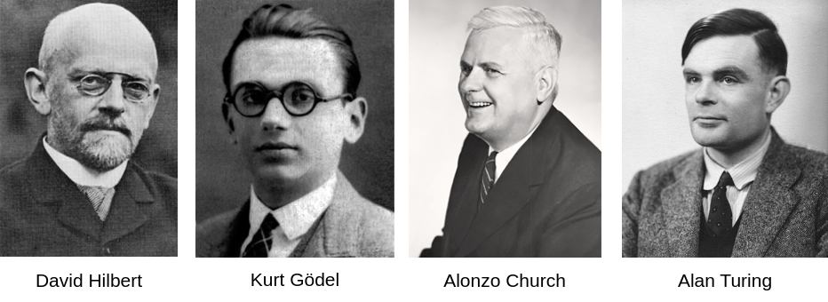

# Décidabilité et calculabilité

## I. Introduction

Le pouvoir de l'algorithmique n'est pas infini.

Nous savons que certains problèmes ne peuvent être résolus parfaitement de manière automatique.

L'étude des possibilités et limites des algorithmes définit le champ de la calculabilité, qui est l'un des piliers de la science informatique.

Ce champ d'étude a été largement travaillé par les mathématiciens et informaticiens de l'époque :



##### Application 1

À l'aide de la vidéo [L' Entscheidungsproblem ou la fin des mathématiques ? - Voyages au pays des maths - ARTE](https://ladigitale.dev/digiview/#/v/660042db6c3dd), répondre aux questions suivantes :

a) Quelle est la question posée par le mathématicien David Hilbert en 1928 ?

b) Comment résoudre le problème de décision ou l'*Entscheidungsproblem* ?

c) Qu'est-ce qu'une fonction calculable ?

## II. Historique

### a) Acte 1 : Les problèmes de Hilbert

En 1900, un des plus grands mathématiciens de l'époque, David Hilbert (1862-1943) énonce ce que l'on appellera plus tard le « Programme de Hilbert », à savoir une liste des vingt-trois plus grands problèmes qui, selon lui, restaient à résoudre en mathématiques.

Le programme de Hilbert adopte une démarche formaliste qui postule que toute proposition mathématique peut être soit démontrée soit réfutée à l'aide d'axiomes.

Un axiome est une affirmation que nous considérons comme vraie et que nous n'avons nul besoin de démontrer.

Les axiomes sont les postulats de départ permettant de construire un raisonnement.

### b) Acte 2 : La logique implacable de Gödel

En 1930, un jeune mathématicien autrichien, Kurt Gödel (1906-1978), met fin au rêve formaliste de Hilbert : il démontre qu'il existe des propositions vraies mais qui sont indémontrables dans la théorie.

Comme par exemple la proposition suivante : $P$ ->  « Je ne suis pas démontrable » (il s'agit d'un paradoxe mathématique !).

Et donne ainsi tort à Hilbert.

Cette preuve fait l'effet d'un coup de tonnerre dans le petit cercle des mathématiciens mais dépasse rapidement ce cadre et affecte aussi grandement l'informatique naissante, influençant notamment des mathématiciens comme Alonzo Church et Alan Turing.

### c) Acte 3 : Le problème de décision et de l'arrêt

David Hilbert formula un nouveau problème en 1928 : le problème de la décision ou *Entscheidungsproblem* en allemand.

La question est « Existe t-il un algorithme capable de déterminer si un énoncé mathématique donné en entrée est vrai ou faux ? »

En 1936, Kurt Gödel, Alonzo Church et Alan Turing, trois mathématiciens montrent de manière indépendante que la réponse à cette question est "non".

Alan Turing (1912-1954) est un mathématicien anglais. Il présente, en 1936, une machine baptisée « machine de Turing ».

La machine de Turing permet d'exécuter des instructions sur des données passées en entrée.

Cette machine est tout à fait théorique au moment où il l'a conçoit bien qu'elle ait été réellement fabriquée depuis. C'est l'ancêtre de l'ordinateur tel que nous le connaissons.

Sur sa machine, Turing se pose alors une question : « Existe-t-il un programme qui, prenant en entrée un autre programme et son entrée, détermine si ce programme finit par s'arrêter ou boucle indéfiniment ? »

Il prouve que ce problème appelé *problème de l'arrêt* répond également au problème de décision.

Gödel et Church, de leur côté, proposent une preuve indépendante menant au même résultat grâce à leur méthode de calcul respective : les fonctions récursives et le $\lambda$-calcul.

## III. Définitions

### a) Calculabilité 

Une fonction $f$ est *calculable* s'il existe une un algorithme qui, étant donné un argument $x$, calcule $f(x)$ en un nombre fini d'étape.

La fonction $f(x) = x+1$ est une fonction calculable puisqu'elle permet de calculer $x+1$ pour n'importe quel argument $x$ donné en un nombre fini d'étape.

> Les *méthodes de calcul* de type fonctions récursives, machine de Turing et $\lambda$-calcul permettent de définir des fonctions calculables.

> Nous admettrons que les langages de programmation actuels (Python, JavaScript, C, Perl, Java, Fortran, etc...) sont aussi des méthodes de calcul valables.

### b) Décidabilité

Un *problème de décision* est une question mathématique dont la réponse est "oui" ou "non".

Un problème de décision est *décidable* s'il existe une fonction calculable y répondant.

##### Application 2

"Ce nombre est-il un nombre premier ?"

a) Dire s'il s'agit d'un problème de décision.

b) Indiquer s'il est décidable. Si oui, écrire une fonction `est_premier(x : int)->bool` prenant en paramètre un nombre entier et renvoie $True$ s'il est premier, $False$ sinon.

## IV. Problème de l'arrêt

### a) Programmes en tant que données

Un programme (écrit en Python par exemple) n’est rien d'autre qu’une chaîne de caractères : c’est le texte même du programme.

Or les chaines de caractères peuvent être utilisées en paramètre des fonctions d'un programme :

```python
programme = '''
for i in range(3):
    print("Le Python, c'est cool")
'''
exec(programme)
```

Les programmes sont donc à part entière des données elles-mêmes utilisables en tant qu'entrées dans d'autres programmes.

### b) Problème de l'arrêt

Compte tenu du fait que les programmes qui ne se terminent pas peuvent avoir des conséquences fâcheuses, est-il possible de concevoir un programme nous permettant de nous indiquer si l'exécution d'un programme passé en paramètre peut se terminer ?

Ce problème, que l'on appelle "Problème de l'arrêt" est un problème de décision pour lequel les instances sont les programmes :

"Ce programme se termine t-il ?"

### c) L'indécidabilité du problème de l'arrêt

Considérons une fonction `arret(f, e)` qui prend en paramètre une fonction `f` et une entrée `e` et renvoie $True$ si $f(e)$ s'arrête et $False$ sinon.

##### Application 3

```python
def paradoxe(e) :
    if arret(paradoxe, e):
        while True :
            pass
    else :
        return True
```

a) Que penser de la fonction `paradoxe()` ?

b) Démontrer brièvement que le problème de l'arrêt n'est pas décidable.

____________

[Sommaire](./../../README.md)