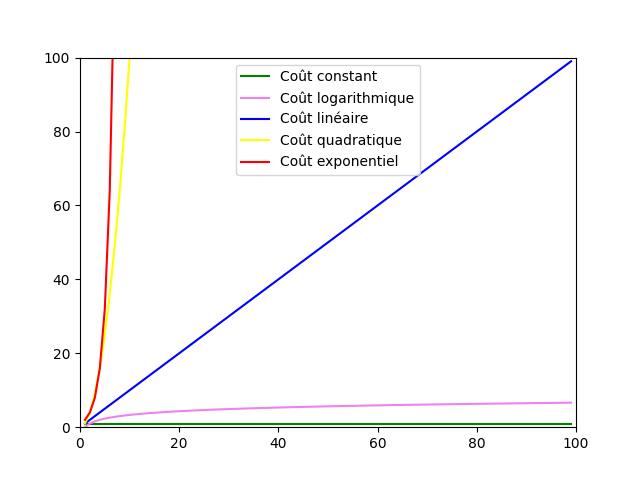

# Complexité

## I. Généralités

### a) Définitions

> [!IMPORTANT]
> La *complexité d'un algorithme* est le coût algorithmique de celui-ci.

> [!IMPORTANT]
> La *complexité spatiale* d'un algorithme est le coût en espace mémoire nécessaire à l'exécution d'un algorithme sur machine.

> [!IMPORTANT]
> La *complexité temporelle* d'un algorithme est le coût en temps nécessaire à l'exécution d'un algorithme sur machine.

### b) Objectifs

Pour un unique problème, il peut exister plusieurs algorithmes différents plus ou moins efficaces donnant la même solution.

Calculer leur coût permet de les comparer et de les classer afin de choisir le meilleur.

### c) Comparatif temporel

Pour calculer la complexité temporelle d'un algorithme, il suffit de compter le nombre d'opérations effectuées.

Plus il y a d'opérations, plus le coût en temps est important.

Les opérations de comparaison (`<`, `>`, `==` ou `!=`) étant les plus coûteuses, les informaticiens comptent uniquement ces opérations-ci.

### d) Évolution du coût en fonction de la taille des données

Souvent, les algorithmes agissent sur des données de taille variables comme les listes.

Dans ce cas, il est important de savoir comment le coût peut varier en fonction de la taille des données.

Les principales évolutions que l'on rencontre sont, en notant $n$ la taille des données :

- Coût constant : $O(1)$.

- Coût logarithmique : le coût est proportionnel à $O(\log_2 n)$.

- Coût linéaire : le coût est proportionnel à $O(n)$.

- Coût quadratique : le coût est proportionnel à $O(n^2)$.
<a name="courbes_evolution"></a>
- Coût exponentiel : le coût est proportionnel à $O(2^n)$.



## II. Mise en situation

Il existe au moins deux algorithmes pour le problème de recherche d'un élément dans une liste quelconque.

La spécification de ce problème est le suivant : 

`Renvoie l'indice de l'élément elt recherché dans la liste l s'il est présent, sinon renvoie la valeur -1`

Voici ci-dessous un premier algorithme :

```
Algorithme : recherche_1(l, elt)
Entrées : l une liste d'entiers et elt un entier
Sortie : Un entier, indice de elt dans l, -1 sinon

i <- 0
i_elt <- -1
TantQue i < taille(l), faire :
    Si l[i] = elt, alors :
        i_elt <- i
    i <- i + 1
Renvoyer i_elt
```

Puis un second algorithme :

```
Algorithme : recherche_2(l, elt)
Entrées : l une liste d'entiers et elt un entier
Sortie : Un entier, indice de elt dans l, -1 sinon

trouvé <- Faux
i <- 0
i_elt <- -1
TantQue i < taille(l) et trouvé = Faux, faire :
    Si l[i] = elt, alors
        trouvé <- Vrai
        i_elt <- i
    i <- i + 1
Renvoyer i_elt
```

#### <ins>Application 1</ins>

a) Sur feuille, recopier les algorithmes `recherche_1` et `recherche_2` et entourer les endroits où il y a une comparaison.

b) Dérouler l'algorithme `recherche_1` en comptant le nombre de comparaisons effectuées avec les paramètres suivants : 

- `l = [2, 7, 0, 1, 8, 5, 3, 10, 14, 4]`

- `elt = 1`

c) Dérouler l'algorithme `recherche_2` en comptant le nombre de comparaisons effectuées avec les paramètres suivants : 

- `l = [2, 7, 0, 1, 8, 5, 3, 10, 14, 4]`

- `elt = 1`

d) En fonction de $n$ la taille de la liste, donner le nombre de comparaisons effectuées dans le meilleur des cas et dans le pire des cas pour chacun des deux algorithmes.

e) En déduire leur complexité temporelle en fonction de $n$ la taille de la liste. 

f) En déduire celui qui est le plus efficace.

## III. Outils

En Python, les informaticiens utilisent des modules pour les aider à comparer le coût de leur algorithme.

### a) Module `matplotlib`

Le module `matplotlib` en Python permet de tracer des graphiques en fonction de données.

> Sa documentation est disponible [ici](https://matplotlib.org/stable/tutorials/pyplot.html).

#### <ins>Application 2</ins>

Sur Thonny, télécharger le fichier Python suivant : [courbes_d_evolution.py](./src/courbes_d_evolution.py) et compléter les zones de code `A COMPLETER`.

Ce fichier permet de tracer les courbes d'évolution vues plus [haut](#courbes_evolution) dans le chapitre.

### b) Module `time`

Le module `time` en Python permet de prendre des mesures de temps.

> Sa documentation est disponible [ici](https://docs.python.org/fr/3/library/time.html#).

La fonction `time()` permet de chronométrer l'exécution d'instructions.

> [!TIP]
> Par exemple, la fonction `mesure_temps()` ci-dessous permet de calculer le temps utilisé pour trier une liste de dix millions d'éléments :
>
> ```python
> from time import *
> from random import *
>
> def mesure_temps():
>     # Démarrage du chrono
>     debut = time()
>     
>     # Création d'une liste de 10 000 000 éléments
>     l = [i for i in range(1000000)]
>     # Mélange de la liste
>     shuffle(l)
>     # Tri de la liste
>     l.sort()
>    
>     # Fin du chrono
>     fin = time()
>     # Calcul du temps utilisé
>     return fin - debut
> ```

#### <ins>Application 3</ins>

Sur Thonny, recopier le code ci-dessus et exécuter la fonction pour connaître le nombre de secondes nécessaire à son exécution.

___________

[Exercices](./Exercices/Exercices_complexité.md)

___________

[Sommaire](./../../README.md)

___________

<p xmlns:cc="http://creativecommons.org/ns#" xmlns:dct="http://purl.org/dc/terms/"><a property="dct:title" rel="cc:attributionURL" href="https://github.com/boddaert/nsi">Cours NSI</a> by <a rel="cc:attributionURL dct:creator" property="cc:attributionName" href="https://github.com/boddaert">Théo Boddaert</a> is licensed under <a href="https://creativecommons.org/licenses/by/4.0/?ref=chooser-v1" target="_blank" rel="license noopener noreferrer" style="display:inline-block;">CC BY 4.0</a>    </p> 