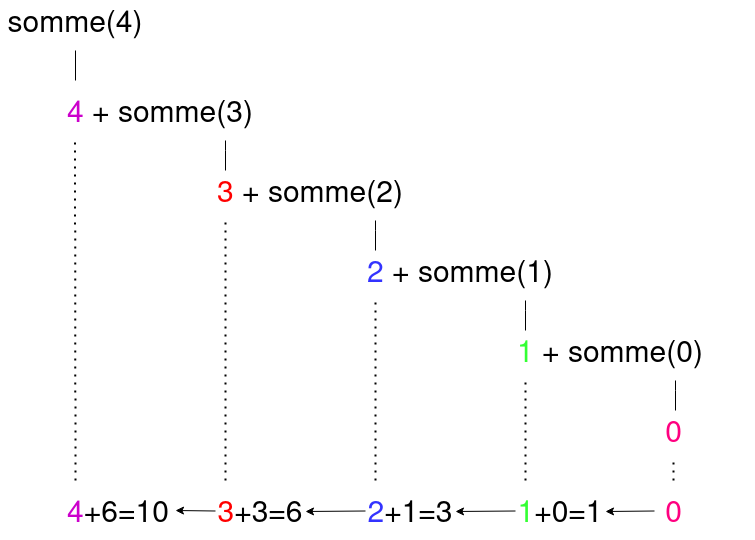

# Récursivité

## I. Introduction

**Question :** Est-il possible d'écrire une répétition d'instruction sans utiliser de boucle ?

*Rappel : Une boucle est une construction élémentaire permettant de répéter un bloc d'instruction.*

*Deuxième rappel : Une fonction est un nom auquel nous associons un bloc d'instruction.*

- La première idée serait d'appeler plusieurs fois la fonction :

```python
fonc()
fonc()
fonc()
```

Dans ce cas, le nombre de répétition est fixe.

- La seconde idée serait d'appeler la fonction dans son propre bloc d'instruction :

```python
def fonc():
    fonc()
```

Dans ce cas, le nombre de répétition est infini.

- La troisième idée serait d'utiliser la fonction de la deuxième idée mais en y ajoutant une condition qui arrêterait les appels à elle-même.

```python
def fonc():
    if arrêt :
        return resultat
    else :
        fonc()
```

La variable `arrêt` est une valeur booléenne : elle vaut donc $True$ ou $False$.

Cependant, la variable `arrêt` n'est pas définie, nous décidons de la passer en paramètre :

```python
def fonc(arrêt) :
    if arrêt :
        return resultat
    else :
        fonc(arrêt)
```

Récapitulons : 

- Si j'appelle `>>> fonc(False)`, la répétition est infinie.
- Si j'appelle `>>> fonc(True)`, il n'y a aucune répétition.

Il faut alors que la valeur de la variable `arrêt` passe à un moment donné de $False$ à $True$.

##### Application 1

Soit la fonction suivante :

```python
def fonction_recursive(n : int)->str :
    if n == 3 :
        return 'fini'
    else :
        return fonction_recursive(n + 1)
```

Dérouler à la main l'exécution de la fonction précédente avec $n = 0$.

## II. Définitions

Une *fonction récursive* est une fonction réalisant au moins un autre appel à elle-même avec des arguments différents.

La *récursivité* est une technique de programmation.

La récursivité permet de ne pas modifier l'état des variables en mémoire.

L'implémentation en Python est souvent très proche du principe de récurrence du problème.

### a) Mise en situation

Considérons la fonction suivante :

```python
def somme(n : int)->int :
    res = 0
    while n > 0 :
        res += n
        n -= 1
    return res
```

Elle calcule la somme des $n$ premiers entiers ($n + (n-1) + (n-2) + ... + 0$):

```python
>>> somme(4)
10
```

### b) Principe de récurrence

Dans un principe de récurrence, nous distinguons :

- Les *cas de base* pour lesquels les calculs sont triviaux.
- Les *cas récursifs* pour lesquels un appel à la définition est réalisé.


En reprenant l'exemple de la somme des $n$ premiers entiers, son principe de récurrence est :

$$
somme(n)=
\begin{cases}
0 & \quad \text{si n = 0}\\ 
n + somme(n-1) & \quad \text{si n > 0}
\end{cases}
$$

Ainsi, les valeurs de $somme(n)$, pour $n$ valant $0$, $1$, $2$ puis $3$ sont :

$somme(0) = 0$

$somme(1) = 1 + somme(0)$

$somme(2) = 2 + somme(1)$

$somme(3) = 3 + somme(2)$

Nous constatons que pour calculer la valeur de $somme(n)$, nous avons besoin de connaître la valeur de $somme(n-1)$.

Il s'agit bien d'une définition récursive du problème, nous avons bien une fonction nécessitant un appel à elle-même avec un argument différent.

##### Application 2

Donner le principe de récurrence de la fonction de l'application 1.

### c) Traduction en Python

Nous traduisons directement le principe de récurrence en programme Python :

```python
def somme(n : int)->int :
    if n == 0 :
        return 0
    else :
        return n + somme(n-1)
```

L'instruction `return 0` correspond au cas de base.

L'instruction `return n + somme(n-1)` correspond au cas récursif.

La condition `if n == 0 :` se nomme *condition d'arrêt*.

##### Application 3

Indiquer sur la fonction `fonction_recursive()` de l'application 1 où se situe le cas de base, le cas récursif et la condition d'arrêt.

## III. Pile d'appels

Une *pile d'appels* est la pile représentant tous les appels successifs nécessaires à l'exécution de la fonction.

Par exemple, pour l'appel `somme(4)`, cela donne :



##### Application 4

Dessiner la pile d'appels de la fonction `fonction_recursive()` de l'application 1 avec $n = 0$.

##### Application 5

a) Recopier le code de la fonction `fonction_recursive()` dans Thonny.

b) Avec l'outil `Debogueur` de Thonny, exécuter pas à pas l'instruction `fonction_recursive(0)`.

## IV. Méthodologie

Avant de se lancer dans l'écriture d'une fonction récursive, il est conseillé de respecter les bonnes pratiques suivantes :

1. Repérer le problème qui se répète et les relations entre les différents résultats.
2. Trouver la ou les conditions d'arrêt.
3. Ecrire le principe de récurrence.
4. Traduire le principe précédent en fonction récursive Python.
5. Vérifier le bon fonctionnement de la fonction récursive à l'aide du debogueur.

_________

[Exercices](./Exercices/Exercices_recursivite.md)

_________

[Sommaire](./../../README.md)