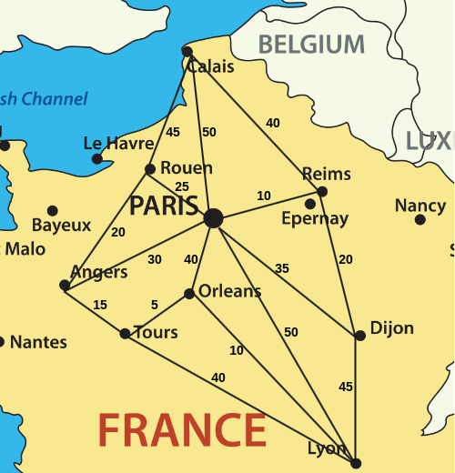

# Activité : Algorithme de Dijkstra

Nature : Débranchée.

Matériel : Aucun.

Prérequis : [Graphes](./Graphes.md), [Algorithmes sur les graphes](./Algorithmes_sur_les_graphes.md).

À faire : Par deux.

## I. Objectif

L'objectif de cette activité est d'appliquer l'algorithme de Dijkstra sur un graphe afin de répondre au problème de chemin de poids minimal.

## II. Énoncé

Depuis Calais, vous souhaitez rejoindre un ami sur Lyon.

Pour y aller, vous repérez le montant des péages de chaque autoroute sur une carte :



Vous remarquez que cela ressemble fortement à un graphe pondéré et décidez d'utiliser un algorithme permettant de trouver le chemin de poids minimal afin de dépenser le moins d'argent possible dans les péages.

## III. Algorithme de Dijkstra

L'algorithme de Dijkstra se présente sous la forme d'un tableau des distances.

À chaque étapes, nous notons la distance des voisins du sommet où l'on se trouve et sélectionnons la plus petite.

Il ne faut pas bien sûr oublier d'additionner les poids des arcs au fur et à mesure de notre avancée.

Si nous remarquons que nous pouvons visiter un sommet avec une distance plus petite que celle déjà notée, nous devons mettre à jour la distance.

> [!TIP]
> Par exemple :
> Soit $G$ le graphe pondéré suivant :
>
> ```mermaid
>     flowchart LR
>         A --20--> B
>         A --3--> D
>         C --5--> B
>         C --2--> F
>         D --2--> C
>         D --3--> E
>         E --2--> B
>         F --2--> E
> ```
>
> Appliquer l'algorithme de Dijkstra à partir du sommet $A$ donne le tableau des distances suivant :
>
> | / | $dA$ | $dB$ | $dC$ | $dD$ | $dE$ | $dF$ |
> | :---: | :---: | :---: | :---: | :---: | :---: | :---: |
> | / | $0^*$ | $+\infty$ | $+\infty$ | $+\infty$ | $+\infty$ | $+\infty$ |
> | $A$ | / | $20$ | $+\infty$ | $3^*$ | $+\infty$ |$+\infty$ |$+\infty$ |
> | $D$ | / | $20$ | $5^*$ | / | $6$ | $+\infty$ |
> | $C$ | / | $10$ | / | / | $6^*$ | $7$ |
> | $E$ | / | $8$ | / | / | / | $7^*$ |
> | $F$ | / | $8^*$ | / | / | / | / |


## VI. Travail à faire

a) À quoi correspond la première colonne du tableau d'exemple ?

b) À quoi correspondent toutes les autres colonnes du tableau ?

c) Pourquoi sur la deuxième ligne, la distance vers $A$ est de $0$ et la distance vers les autres sommets est de $+\infty$ ?

d) À l'aide du tableau, donner le chemin de poids minimal du sommet $A$ au sommet $B$ et sa valeur.

e) Reprendre la carte des péages donnés dans l'énoncé et appliquer l'algorithme de Dijkstra afin de construire le tableau des distances à partir de Calais.

f) En déduire, le chemin de poids minimal du sommet de Calais au sommet de Lyon.

___________________

[Sommaire](./../../README.md)

___________

<p xmlns:cc="http://creativecommons.org/ns#" xmlns:dct="http://purl.org/dc/terms/"><a property="dct:title" rel="cc:attributionURL" href="https://github.com/boddaert/nsi">Cours NSI</a> by <a rel="cc:attributionURL dct:creator" property="cc:attributionName" href="https://github.com/boddaert">Théo Boddaert</a> is licensed under <a href="https://creativecommons.org/licenses/by/4.0/?ref=chooser-v1" target="_blank" rel="license noopener noreferrer" style="display:inline-block;">CC BY 4.0</a>    </p> 