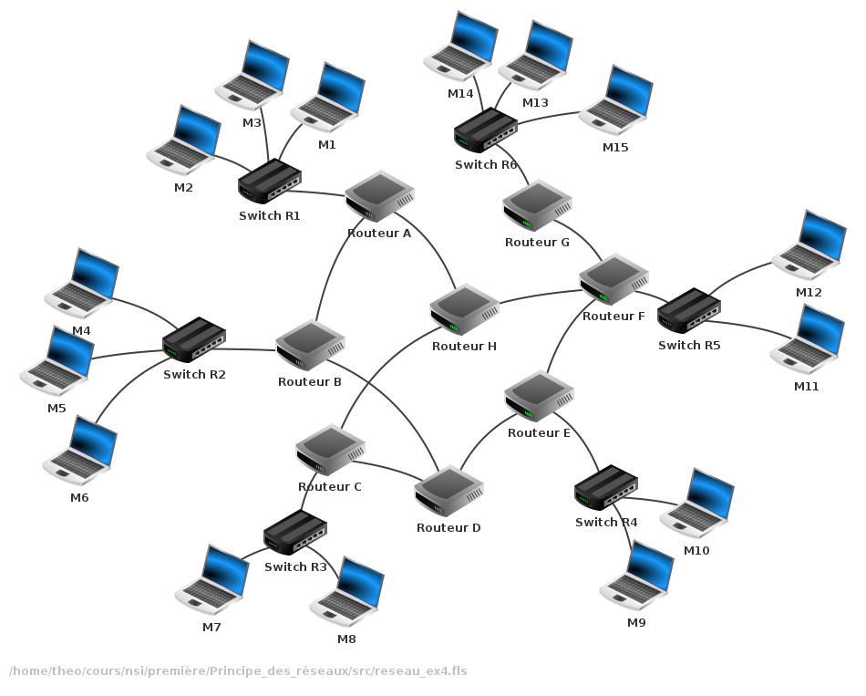

# Protocoles de routage

## I. Définitions

> [!IMPORTANT]
> Un *réseau informatique* est un ensemble de noeuds (équipements informatiques) reliés entre eux par des liens.
>
> Les réseaux informatiques permettent l'échange de données entre les machines au moyen de protocoles.

> [!IMPORTANT]
> Un *protocole* est un ensemble de règles permettant de standartiser la communication.

> [!IMPORTANT]
> Le *routage* des paquets est le calcul d'une meilleure route pour l'acheminement de ceux-ci dans un réseau informatique.

## II. Routeurs

> [!IMPORTANT]
> Un *routeur* est un équipement réseau informatique assurant le routage des paquets. Son rôle est de faire transiter des paquets d'un réseau vers un autre.

Les routeurs sont les nœuds internes d'un réseau.

Plus il y a de sous-réseaux, plus il y a besoin de routeurs pour les connecter ensemble.

> [!TIP]
> Par exemple :
> 

> [!IMPORTANT]
> *Internet* est l'ensemble des sous-réseaux mondiaux interconnectés.

#### <ins>Application 1</ins>

a) Sur votre terminal de commande, écrire la commande `traceroute google.fr`.

b) Répondre aux questions :

1. Qu'est-il affiché ?

2. Que fait la commande `traceroute` ?

## II. Tables de routage

Afin de router efficacement les paquets, les routeurs possèdent une table de routage.

> [!IMPORTANT]
> Une *table de routage* est un tableau indiquant la meilleure route à emprunter pour un paquet selon la destination de celui-ci.

> Une table de routage peut être assimilée à un panneau routier de direction.

Pour une adresse de destination, il indique le prochain routeur (appelé la *passerelle*) et le coût (appelée *métrique*).

> [!TIP]
> Par exemple, la table de routage du routeur B peut être (avec une métrique égal au nombre de routeurs traversés):
>
> | Destination | Passerelle | Métrique |
> | :---: | :---: | :---: |
> | 172.12.0.0 (Réseau 0) | Routeur A | 6 |
> | 192.168.1.0 (Réseau 1) | Routeur A | 2 |
> | 192.168.2.0 (Réseau 2) | Switch R2 | 1 |
> | 192.168.3.0 (Réseau 3) | Routeur D | 3 |
> | 192.168.4.0 (Réseau 4) | Routeur D | 3 |
> | 192.168.5.0 (Réseau 5) | Routeur A | 5 |

> [!NOTE]
> Il peut exister plusieurs meilleures routes à emprunter.

#### <ins>Application 2</ins>

Sur votre terminal de commande, écrire la commande `route`.

#### <ins>Application 3</ins>

Faire la table de routage du routeur G.

#### <ins>Application 4</ins>

a) Faire la table de routage du routeur A.

b) Expliquer en une ligne les étapes d'acheminement d'un paquet allant du réseau 2 au réseau 1 et son nombre de sauts.

## III. Construction de la table de routage

Un réseau informatique est en réalité un graphe et le routage des paquets est donc lié au problème de chemin de poids minimal dans un graphe.

Deux algorithmes permettent de construire la table de routage d'un routeur.

### a) Protocole RIP

Le protocole RIP (pour *Routing Internet Protocol*) est un protocole permettant de construire une table de routage en utilisant l'algorithme de Bellman-Ford.

Il calcule comme métrique le nombre de sauts, c'est-à-dire le nombre de routeurs à traverser.

Au départ, chaque routeur ne connait que les réseaux directement accessibles, avec une distance nulle.

Ensuite, toutes les trente secondes, les routeurs envoient leurs tables de routages à leurs routeurs voisins.

À leur réception, chaque routeur met à jour sa table de routage en associant à chaque destination la passerelle vers la meilleure route.

### b) Protocole OSPF

Le protocole OSPF (pour *Open Shortest Path First*) est un protocole permettant de construire une table de routage en utilisant l'algorithme de Dijkstra.

Il calcule comme métrique la somme des débits de la bande passante des liaisons.

Soit $c$ le coût, nous admettrons $c = \dfrac{10^8}{d}$ avec $d$ le débit en bit/s.

| Type de liaison | Débit |
| :---: | :---: |
| Fibre | $1$ Gbit/s |
| Fast-Ethernet | $100$ Mbits/s |
| Ethernet | $10$ Mbits/s |

#### <ins>Application 5</ins>

Selon le tableau ci-dessus, calculer le coût d'une liaison :

1. En fibre.

2. En Fast-Ethernet.

3. En Ethernet.

_______________

[Exercices](./Exercices/Exercices_protocoles_de_routage.md)

_______________

[Sommaire](./../../README.md)

___________

<a property="dct:title" rel="cc:attributionURL" href="https://github.com/boddaert/nsi">Cours NSI</a> by <a rel="cc:attributionURL dct:creator" property="cc:attributionName" href="https://github.com/boddaert">Théo Boddaert</a> is licensed under <a href="https://creativecommons.org/licenses/by/4.0/?ref=chooser-v1" target="_blank" rel="license noopener noreferrer" style="display:inline-block;">CC BY 4.0</a>    
 