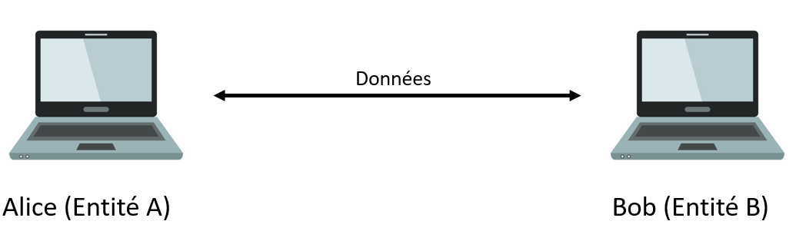
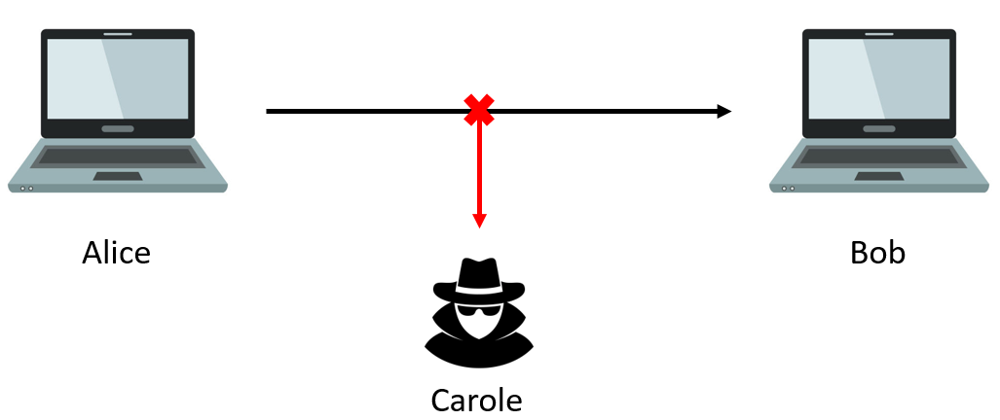
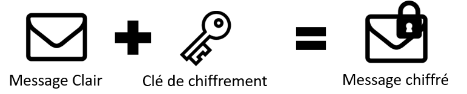
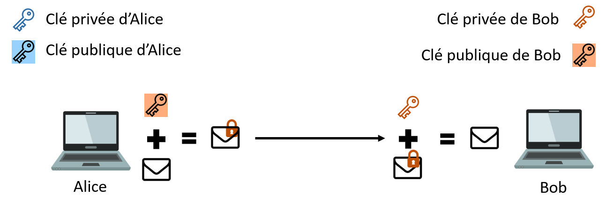
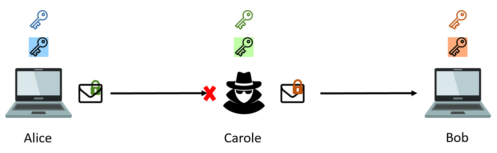
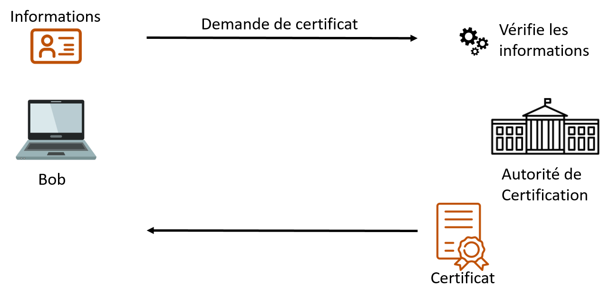
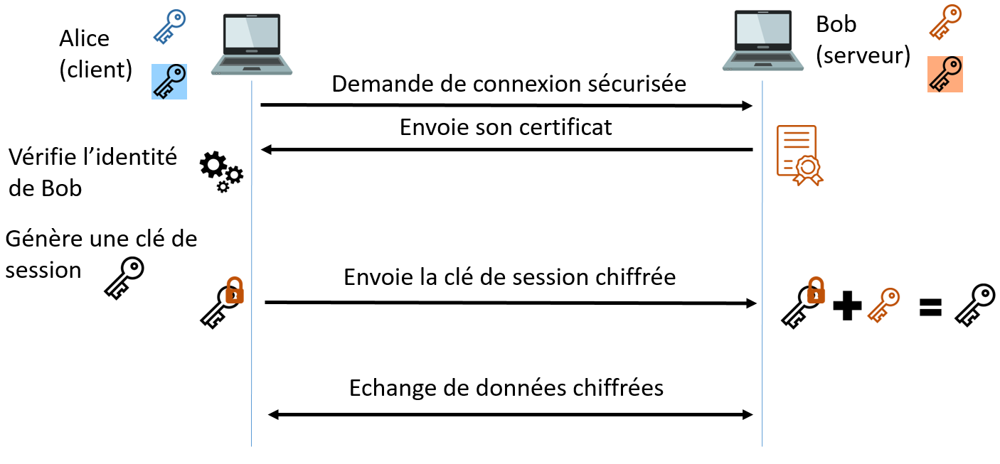

# Sécurisation des communications

## I. Introduction

$\to$ *Qu'est-ce qu'une communication ?*

C'est le fait d'échanger des informations entre deux **entités** à travers un **support**.

> En communication verbale, les entités sont les interlocuteurs et discutent à travers le son.

Lorsque l'on parle de communication informatique, les informations échangées sont des données que s'échangent deux machines via câbles ou ondes :

$\to$ *Pourquoi sécuriser ?*

Une troisième entité, Carole (entité C), peut intercepter les données que s'échangent Alice et Bob :

$\to$ *Comment sécuriser ?*

Deux idées ont été proposées :

1. La première, celle qui n'a pas été retenue, était de protéger physiquement le support (trop coûteux financièrement et en temps).

2. La seconde, celle qui a été retenue, est de rendre incompréhensibles (ou **inintelligibles**) les données échangées.

## II. Généralités

### a) Missions

La sécurisation d'une communication doit accomplir trois missions :

1. **La confidentialité** : Rendre l'accès aux données uniquement à ceux qui sont autorisés.

2. **L'intégrité** : S'assurer que les données n'ont pas été modifiées entre l'émission et la réception de celles-ci.

3. **L'authenticité** : S'assurer que les données proviennent bien de l'entité émettrice.

### b) Idée

L'idée est de rendre incompréhensible les données qu'Alice envoie à Bob : 

Ainsi, Carole ne peut pas utiliser les données qu'elle intercepte.

Seulement, il faut que Bob puisse comprendre les données envoyées par Alice.

Pour réussir un tel stratagème, nous allons nous servir de la cryptologie.

### b) Définitions

> [!IMPORTANT]
> La *cryptologie* est la science du chiffrement.

> [!IMPORTANT]
> Un *message clair* est un message dont les données sont compréhensibles.

> [!IMPORTANT]
> Un *message chiffré* est un message dont les données sont incompréhensibles.

> [!IMPORTANT]
> *Chiffrer* un message revient à transformer un message clair en un message chiffré à l'aide d'une clé de chiffrement :
>
> 

> [!IMPORTANT]
> *Déchiffrer* un message revient à transformer un message chiffré en un message clair à l'aide d'une clé de déchiffrement :
>
> 

> [!IMPORTANT]
> *Décrypter* un message revient à transformer un message chiffré en un message clair à l'aide de la cryptanalyse :
>
> 

> [!IMPORTANT]
> La *cryptanalyse* est l'ensemble de méthodes permettant de retrouver le message clair sans posséder la clé de déchiffrement.

### c) Principe de Kerkoffs

Un **bon système de chiffrement** doit être :

- Facilement déchiffrable.

- Difficilement décryptable.

#### <ins>Application 1</ins>

a) Décrypter les messages suivants :

1. ꓭOꓭ ꓤՈOᒋNOꓭ

2. slt alice, jv b1 et toi tfk ?

b) Sont-ils de bons systèmes de chiffrements ?

## III. Un peu d'histoire

- Les premières méthodes de chiffrement remontent à l'Antiquité. Utilisées à des fins militaires, les Perses, les Carthaginois ou encore les Chinois chiffrèrent leurs ordres. Leurs ennemis ne purent pas connaître les stratégies même s'ils réussissaient à intercepter le message.

- À l'époque Romaine, Jules César chiffra ses messages pour communiquer de manière secrète avec ses correspondants. Son système dechiffrement reste connu sous le nom de Chiffre de César.

- Durant la Seconde Guerre Mondiale, les allemands Nazis chiffrèrent leurs messages à l'aide de la machine de chiffrement Enigma. Un certain Alan Turing réussissa l'exploit de construire une machine permettant de décrypter automatiquement les messages. On estime à deux ans de guerre et deux millions de victimes évitées par la création de cette machine.

> Documentaire Arte (1h) : [Alan Turing | Comment les maths ont vaincu Hitler](https://www.youtube.com/watch?v=WdxHjoCQpJU)

- Depuis les années 60, avec l'apparition de l'informatique, la cryptologie est devenue une science à part entière et permet de sécuriser chaques messages envoyé sur le réseau informatique.

## IV. Chiffrements Symétriques

> [!IMPORTANT]
> Un *chiffrement symétrique* est un chiffrement où la clé de chiffrement et de déchiffrement est la même.

Il existe deux familles de chiffrements symétriques : les chiffrements monoalphabétiques et les chiffrements polyalphabétiques.

### a) Chiffrements monoalphabétiques

L'idée est de substituer une lettre par une autre lettre pour chaque lettre du message en utilisant un seul alphabet de subsitution.

Un célèbre chiffrement monoalphabétique est le Chiffre de César, il substitue une lettre par une autre lettre décalée dans l'alphabet.

> [!TIP]
> Par exemple :
>
> Avec une clé de chiffrement de $2$, le message message clair `ATTAQUEZ LE CHATEAU` est chiffré en `CVVCSWGB NG EJCVGCW` :
>
> | Décalage        | 2   | 2   | 2   | 2   | 2   | 2   | 2   | 2   | 2   | 2   | 2   | 2   | 2   | 2   | 2   | 2   | 2   |
> | --------------- | --- | --- | --- | --- | --- | --- | --- | --- | --- | --- | --- | --- | --- | --- | --- | --- | --- |
> | Message clair   | A   | T   | T   | A   | Q   | U   | E   | Z   | L   | E   | C   | H   | A   | T   | E   | A   | U   |
> | Message chiffré | C   | V   | V   | C   | S   | W   | G   | B   | N   | G   | E   | J   | C   | V   | G   | C   | W   |

> [!NOTE]
> Réaliser le décalage dans le sens inverse revient à déchiffrer le message.

#### <ins>Application 2</ins>

a) Sur feuille et en utilisant le système du Chiffre de César, chiffrer le message `SAUTEZ LE PONT` avec une clé de chiffrement de $6$.

b) Sur feuille et en utilisant le système du Chiffre de César, déchiffrer  le message `CPAWT TXXPOTLE` avec une clé de chiffrement de $11$.

### b) Chiffrements polyalphabétiques

L'idée est de substituer une lettre par une autre lettre pour chaque lettre du message en utilisant plusieurs alphabets de subsitution.

Un célèbre chiffrement polyalphabétique est le Carré de Vigenère, il utilise le Chiffre de César en variant les alphabets de substitution.

> [!TIP]
> Par exemple :
>
> Avec une clé de déchiffrement de $2,4,1$, le message clair ``ATTAQUEZ LE CHATEAU`` est chiffré en ``CXUCUVGD MG GICXFCY``:
>
> | Décalage        | 2   | 4   | 1   | 2   | 4   | 1   | 2   | 4   | 1   | 2   | 4   | 1   | 2   | 4   | 1   | 2   | 4   |
> | --------------- | --- | --- | --- | --- | --- | --- | --- | --- | --- | --- | --- | --- | --- | --- | --- | --- | --- |
> | Message clair   | A   | T   | T   | A   | Q   | U   | E   | Z   | L   | E   | C   | H   | A   | T   | E   | A   | U   |
> | Message chiffré | C   | X   | U   | C   | U   | V   | G   | D   | M   | G   | G   | I   | C   | X   | F   | C   | Y   |

> [!WARNING]
> Nous remarquons que le carré de Vigenère permet une plus grande inintelligibilité que le Chiffre de César :
>
> - Le premier ``T`` est chiffré en ``X`` alors que le second ``T`` est chiffré en ``U``.
>
> - Le premier ``U`` chiffré donne en clair ``T`` alors que le second ``U`` chiffré donne en clair ``Q``.

#### <ins>Application 3</ins>

a) Sur feuille et en utilisant le système du Carré de Vigenère, chiffrer le message `SAUTEZ LE PONT` avec une clé de chiffrement de $5, 1, 3, 2$.

b) Sur feuille et en utilisant le système du Carré de Vigenère, déchiffrer le message `QTHOGC B THWGUT` avec une clé de chiffrement de $2, 3, 4$.

### c) Problème : échange de clé

L'énorme inconvénient du chiffrement symétrique est **l'échange de clé**.

Si Alice souhaite communiquer de manière sécurisée en utilisant un chiffrement symétrique avec Bob, Alice va devoir lui transmettre la clé elle aussi de manière sécurisée.

Alice va devoir utiliser un chiffrement asymétrique pour résoudre ce problème.

## V. Chiffrements asymétriques

L'idée est de ne pas devoir s'échanger une clé pour commencer la communication.

Pour celà, on va utiliser deux clés :

- La *clé privée* : l'accès à cette clé est limitée à l'entité la possèdant.

- La *clé publique* : l'accès à cette clé n'est pas limitée (toutes les entités peuvent y accéder).

### a) Principe

> [!TIP]
> Par exemple :
>
> Alice et Bob possèdent ainsi chacun deux clés, et vont pouvoir s'échanger des informations de la manière suivante :
>
> 1. Alice veut envoyer un message chiffré à Bob.
> 
> 2. Alice va chiffrer les données avec la clé publique de Bob.
>
> 3. Bob reçoit le message chiffré.
>
> 4. Bob déchiffre le message avec sa clé privée.
>
> 

> [!NOTE]
> La clé publique est donc utilisée en tant que clé de chiffrement et la clé privée, en tant que clé de déchiffrement.

### b) Protocole d'échange de clé symétrique

Le chiffrement asymétrique étant coûteux, nous l'utilisons généralement pour se transmettre une clé de chiffrement symétrique de manière sécurisée.

> Actuellement, nous utilisons le chiffrement asymétrique RSA pour échanger une clé de chiffrement symétrique AES pour échanger sur Internet.

### c) Problème : attaque de l'Homme du milieu

> [!IMPORTANT]
> L'*attaque de l'Homme du milieu* est une stratégie d'attaque permettant à Carole de déchiffrer tous les messages qu'Alice envoie à Bob.

> [!TIP]
> Par exemple :
>
> 1. Avant le début de la communication, Bob envoie sa clé publique à Alice.
>
> 2. Carole intercepte la clé publique de Bob et envoie à Alice sa propre clé publique.
>
> 3. Lorsqu'Alice voudra chiffrer un message, elle le fera avec la clé publique de Carole.
>
> 4. Carole intercepte le message envoyé par Alice et le déchiffre avec sa clé privée.
>
> 5. Carole a ainsi accès à toutes les données du message.
>
> 6. Pour éviter la suspicion, Carole peut rechiffrer le message avec la clé publique de Bob et l'envoyer à Bob.
>
> 

## VI. Certificats

### a) Principe

Afin de sécuriser complètement les communications, les entités doivent prouver leur identité et leur bienveillance.

Pour celà, ils devront possèder un certificat.

> [!IMPORTANT]
> Les *certificats* sont des cartes d'identité numériques dans lequel plusieurs informations y figurent comme :
>
> - Des informations personnelles.
>
> - Une signature numérique.
>
> - Une clé publique.

### b) Autorités de certification

Pour obtenir un certificat, les entités n'ont pas d'autre choix que de demander à une autorité de certification.

> [!IMPORTANT]
> Les *autorités de certification* jouent le rôle de tiers de confiance, il peut s'agir d'un gouvernement, d'une grande société. En tout cas, quelqu'un dont, à priori, tout le monde peut avoir confiance.

Ces autorités délivrent les certificats uniquement si les informations transmises sont exactes.

> [!TIP]
> Par exemple :
>
> 
>
> Une fois le certificat obtenu, Bob pourra le transmettre à Alice pour prouver son identité. 

## VII. Protocole HTTPS

Le protocole HTTPS (pour *Hyper Text Transfer Protocol Secure*) est la version HTTP sécurisée. Il utilise pour celà le protocole TLS (pour *Transport Layer Security*).

### a) Principe de TLS

Il est utilisé lorsqu'un client souhaite se connecter sur un serveur de manière sécurisée.

> [!TIP]
> Par exemple :
> 1. Alice (le client) demande une connexion sécurisée à Bob (le serveur).
>
> 2. Bob, ayant obtenu au préalable son certificat, l'envoie à Alice.
>
> 3. Alice vérifie l'identité de Bob.
>
> 4. Si Bob est en effet ce qu'il prétend être, Alice génère une clé de chiffrement symétrique que nous appelons : *clé de session*.
>
> 5. Alice chiffre la clé de session avec la clé publique contenue dans le certificat de Bob et l'envoie à Bob.
>
> 6. Bob déchiffre avec sa clé privée.
>
> 7. Alice et Bob possèdent tous les deux une clé de chiffrement symétrique et peuvent communiquer de manière sécurisée.
>
> 

#### <ins>Application 5</ins>

a) Sur Firefox, aller sur : [https://fr.wikipedia.org/wiki/Informatique](https://fr.wikipedia.org/wiki/Informatique).

b) À gauche de la barre d'adresse, cliquer sur le cadenas.

c) Puis sur ``connexion sécurisée`` et sur ``Plus d'informations``.

d) Sur la fenêtre qui vient de s'ouvrir, cliquer sur le bouton ``Afficher le certificat``.

e) Retrouver et noter les informations suivantes :
   
   - Le nom de l'organisation qui a demandé le certificat.
   
   - Le nom de l'autorité qui lui a donné.
   
   - La période de validité du certificat.
   
   - Quelques informations concernant la clé publique.

__________

[Exercices](./Exercices/Exercices_sécurisation_des_communications.md)

_________

[Sommaire](./../../README.md)

___________

<a property="dct:title" rel="cc:attributionURL" href="https://github.com/boddaert/nsi">Cours NSI</a> by <a rel="cc:attributionURL dct:creator" property="cc:attributionName" href="https://github.com/boddaert">Théo Boddaert</a> is licensed under <a href="https://creativecommons.org/licenses/by/4.0/?ref=chooser-v1" target="_blank" rel="license noopener noreferrer" style="display:inline-block;">CC BY 4.0</a>    
 

