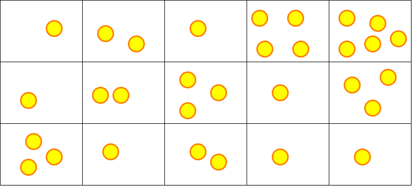

# Activité : Le chercheur d'or

Nature : Débranchée

Matériel : Boîte rangement, perles, papier, crayon

Prérequis : Problèmes d'optimisation combinatoire, algorithmes gloutons

À faire : Par deux

## I. Objectif

L'objectif est de repérer les inconvénients de la stratégie gloutonne et de découvrir la solution à ces inconvénients : la programmation dynamique.

## II. Matériel

Vous disposez, par groupe, d'une boîte de rangement à plusieurs compartiments, de plusieurs perles, d'une feuille et d'un crayon. 

La boîte de rangement représente la mine d'or et les perles les pépites.

## III. Installation

Placez les pépites dans les cases de la boîte comme montré ci-dessous :



## IV. Règles du jeu

Le chercheur d'or souhaite récolter le plus de pépites d'or possible.

Il commence toujours par creuser dans la parcelle du coin supérieur gauche de la mine et termine sur la parcelle dans le coin inférieur droit.

Pour chaque nouvelle parcelle de roche creusée, il récupère le nombre de pépites présentes dans celle-ci et l'ajoute à son butin.

Afin d'éviter de se faire ensevelir, le chercheur n'a d'autre choix que de creuser la parcelle située soit à droite soit en bas de sa position actuelle.

Mais il dispose d'un outil lui permettant de connaître précisément le nombre de pépites présentes dans chaque parcelle de la mine.

Il ne lui reste plus qu'à trouver un chemin optimisé lui permettant de récupérer le maximum de pépites.

## V. Travail à faire

Par groupe de deux, répondre aux questions suivantes :

a) Quel est le chemin que le chercheur doit traverser pour récupérer le plus de pépites ?

b) Démontrer qu'il s'agit d'un problème d'optimisation combinatoire.

c) Combien y a t-il de chemins possibles pour une mine de taille $2\times2$ ? $3\times3$ ? $4\times4$ ?

d) Est-ce raisonnable d'écrire un programme qui calcule le butin récolté de tous les chemins possibles ?

e) Quelle est la stratégie gloutonne pour le problème du chercheur d'or ? Quel est le butin récolté donné par cette stratégie ?

f) Expliquer pourquoi, dans ce problème-ci, la stratégie gloutonne ne donne pas une solution satisfaisante.

La programmation dynamique cherche à obtenir une solution optimale en utilisant les solutions optimales précédentes.

Dans ce problème, la stratégie de la programmation dynamique consiste à calculer le nombre maximal de pépites que le chercheur peut obtenir pour chaque parcelle de la mine en utilisant les nombres maximaux de pépites des parcelles précédentes.

g) Pour quelle(s) parcelle(s) de la mine, le chercheur connaît-il exactement le nombre maximal de pépites qu'il aura récoltées depuis le début du chemin ?

Pour les autres parcelles, deux choix sont possibles : soit le chercheur arrive depuis la parcelle supérieure, soit le chercheur arrive depuis la gauche.

Il s'agit donc de déterminer si le chercheur arrive sur la parcelle avec plus de pépites en arrivant depuis le haut ou s'il arrive avec plus de pépites en arrivant depuis la gauche.

h) Ajouter, pour chaque parcelle de la mine, des perles de façon à ce que le nombre de pépite corresponde au nombre maximal de pépites pouvant être récoltées de la première parcelle jusqu'à celle-ci.

i) Depuis la dernière parcelle en remontant jusqu'à la première, reconstituer le chemin offrant le plus de pépites et donner la réponse au problème.

j) Soit `chercheur_d_or(i : int, j : int)->int` la fonction récursive qui prend en paramètre deux entiers et renvoie le nombre maximal de pépites de la parcelle $(i,j)$ pouvant être récoltées par le chercheur depuis la première parcelle.

Avec :

```python
mine = [[1, 2, 1, 4, 5],
        [1, 2, 3, 1, 3],
        [3, 1, 2, 1, 1]]
```

Compléter le principe de récurence suivant :

$$
chercheur\textunderscore d\textunderscore or(i, j)=
\begin{cases}
mine[0][0] & \quad \text{si i = .. et si j = ..}\\ 
mine[0][j] + chercheur\textunderscore d\textunderscore or(0, j-1) & \quad \text{si i = 0 et si j != 0}\\
mine[i][0] + chercheur\textunderscore d\textunderscore or(.., ..) & \quad \text{si i != 0 et si j = 0}\\
mine[i][j] + max(chercheur\textunderscore d\textunderscore or(.., ..), chercheur\textunderscore d\textunderscore or(.., ..)) & \quad \text{sinon}
\end{cases}
$$

k) Écrire la fonction récursive `chercheur_d_or(i : int, j : int)->int` et tester-la afin de vérifier la bonne réponse au problème de notre chercheur d'or.

l) En suivant le principe de récurrence, que va renvoyer l'appel `>>> chercheur_d_or(1, 1)` ? Dessiner sa pile d'appel.

m) Même question pour `>>> chercheur_d_or(2, 4)`.

n) Que remarque t-on dans la pile d'appels ?

____________________

[Sommaire](./../README.md)