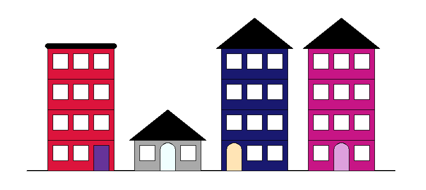
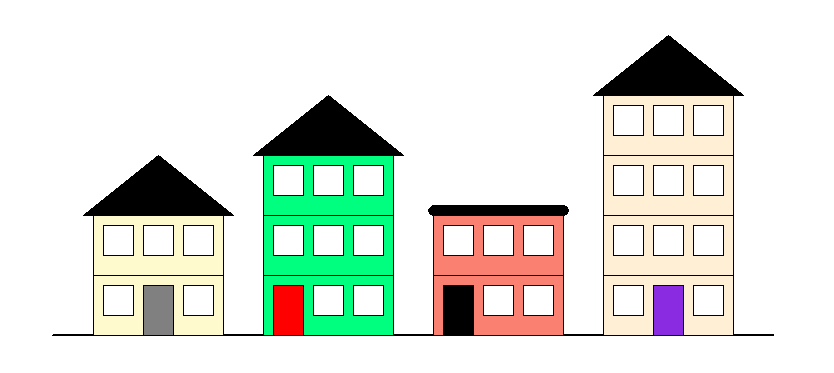
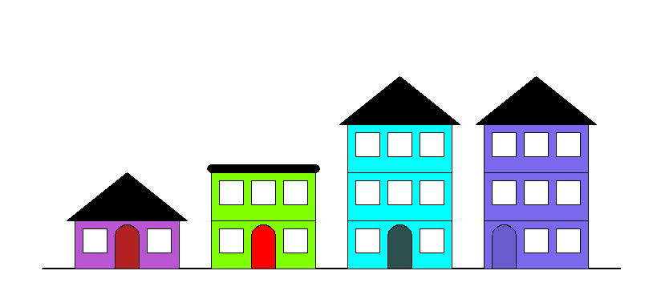

# Projet : Architectes

## I. Description

Vous avez été appelés pour écrire seul un programme permettant de générer **aléatoirement** le dessin d'une rue.

Voici ci-dessous quelques exemples de dessins que vous pourriez obtenir en exécutant votre programme :

## II. Cahier des charges

1. Votre programme Python doit utiliser les modules `turtle` et `random`.

2. Votre programme doit être modulaire, c'est-à-dire que vous devez décomposer le plus possible votre programme en plusieurs fonctions voire dans plusieurs fichiers.

3. Pour chaque fonction que vous écrivez dans votre programme, elle doit être munie d'une documentation DocString.

Rappels de Première :  [Sur la DocString](./../../première/Spécification/Prototypage.md)

4. Le code doit être lisible, les noms de variable et noms de fonction explicites.

5. Les contraintes urbaines doivent être respectées.

## III. Contraintes urbaines

Les contraintes urbaines sont les suivantes :

- La rue doit comporter quatre immeubles.
- Un immeuble a un nombre d'étage aléatoire. Il a au minimum un rez-de-chaussée et peut avoir jusqu'à quatre étages.
- Toutes les fenêtres sont identiques et sont des carrés.
- Un immeuble est colorié d'une couleur aléatoire.
- Les rez-de-chaussée n'ont qu'une seule porte.

Tout le reste est libre et peut donc être personnalisé.

## IV. Module Turtle

Le module `turtle` permet de dessiner dans un repère orthonormé.

Les fonctions incluses dans ce module permettent de déplacer une tortue munie d'un crayon dans le repère.

La tortue commence au point de coordonnées $(0,0)$ et est dirigée vers la droite.

Voici quelques fonctions simples pour commencer à utiliser `turtle` :

| Fonctions disponibles | Description |
|---|---|
| `mainloop()` | Empêche la fermeture de la fenêtre |
| `goto(x : int, y : int)` | La tortue se déplace au point de coordonnées $(x,y)$. |
| `forward(d : int)` | La tortue avance de $d$ points. |
| `backward(d : int)` | La tortue recule de $d$ points. |
| `left(a : int)` | La tortue pivote à gauche de l'angle $a$. |
| `right(a : int)` | La tortue pivote à droite de l'angle $a$ |
| `circle(r : int, a : int)` | La tortue trace un arc de cercle d'angle $a$ et de rayon $r$. |
| `dot(r : int)` | La tortue trace un point de rayon $r$. |
| `up()` | La tortue relève son crayon. |
| `down()` | La tortue pose son crayon. |
| `width(e : int)` | La tortue trace d'une épaisseur $e$. |
| `color(c : str)` | La tortue trace d'une couleur $c$. |
| `begin_fill()` | La tortue active le mode remplissage. |
| `end_fill()` | La tortue désactive le mode remplissage. |
| `fillcolor(c)` | La tortue sélectionne la couleur $c$ pour le mode remplissage. |
| `speed(s : int)` | La tortue se déplace d'une vitesse $s$. |
| `ht()` | La tortue est invisible. |

Documentation de `turtle` : [https://docs.python.org/fr/3/library/turtle.html](https://docs.python.org/fr/3/library/turtle.html)

## V. Evaluation

Vous serez évalués sur :

- La qualité du code fourni (lisibilité du code, modularité, explicité des noms).

- Le respect du cahier des charges.

- La qualité de la DocString.

____________

[Sommaire](./../README.md)