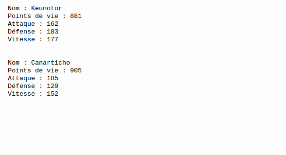

# Projet : Combat de Pokémons

## I. Description

Deux pokémons se rencontrent et décident de s'attaquer. Nous souhaitons écrire un programme simulant le combat entre ces deux Pokémons.

Pour ce faire, nous utiliserons la programmation orientée objet.

## II. Classe Pokémon

- Pokémon est une classe dont les attributs sont :

    + Un nom donné en paramètre du constructeur.

    + Un nombre de point de vie initialisé par défaut de manière aléatoire.

    + Un nombre de point d'attaque initialisé par défaut de manière aléatoire.

    + Un nombre de point de défense initialisé par défaut de manière aléatoire.

    + Un nombre de point de vitesse initialisé par défaut de manière aléatoire.

    + Un booléen indiquant si le pokémon est KO ou non, initialisé par défaut à `False`.

- Et dont les méthodes sont :

    + Tous les accesseurs des attributs précédents.

    + Une méthode `set_point_de_vie(new_point_de_vie : int)` qui prend en paramètre un entier et fixe les points de vie de l'objet à cet entier.

    + Une méthode `set_ko()` mettant à `True` l'attribut `KO` si le pokémon possède des points de vie inférieur ou égal à zéro.

    + Une méthode `affiche_statistiques()` qui affiche toutes les caractérisitiques du pokémon.

- L'objet Pokémon dispose également de quatre actions disponibles pendant son tour de jeu :

    + Une méthode `augmente_attaque(bonus : int)` qui prend en paramètre un entier et ajoute le montant de l'argument aux points d'attaque de l'objet.

    + Une méthode `augmente_point_de_vie(bonus : int)` qui prend en paramètres un entier et ajoute le montant de l'argument aux points de vie de l'objet.

    + Une méthode `augmente_vitesse(bonus : int)` qui prend en paramètre un entier et ajoute le montant de l'argument aux points de vitesse de l'objet.

    + Une méthode `attaque(pokemon_adverse : Pokemon)->int` qui prend en paramètre un second objet Pokémon et renvoie le montant des dégâts que le pokémon passé en paramètre doit recevoir.

## III. Règles d'un combat de Pokémons

1. Deux Pokémons se battent en duel jusqu'à ce que l'un des deux soit mis KO, c'est-à-dire, avec les points de vie inférieur ou égal à zéro.

2. Au tour par tour, chacun des deux Pokémons vont choisir aléatoirement une action parmi quatre :

    - Augmenter ses points d'attaque.

    - Augmenter ses points de vie.

    - Augmenter ses points de vitesse.

    - Attaquer le pokémon adverse.

3. Le Pokémon le plus rapide, celui qui a le plus de point de vitesse, joue en premier.

4. Le nombre de dégât reçus est calculé de la manière suivante : $att - def$ avec $att$ le nombre de point d'attaque du pokémon attaquant et $def$ le nombre de point de défense du pokémon attaqué.

## IV. Cahier des charges

1. Votre programme Python doit utiliser la programmation orientée objet (cf [Programmation orientée objet](./../Structures_de_données/Programmation_orientée_objet/Programmation_orientée_objet.md)).

2. La classe Pokémon doit au moins inclure tous les attributs et toute les méthodes citées dans [II. Classe Pokémon](#classe_pokemon).

3. Les règles d'un combat de pokémons doivent être appliquées.

4. Le code doit être lisible, les noms de variable et noms de fonction explicites.

## V. Exemple de rendu

## VI. Aller plus loin

1. Ajouter les consommables (potions, baies, etc...)

2. Ajouter les capacités, un pokémon a le choix entre quatre capacités.

3. Ajouter les types et par conséquent les capacités super ou peu efficaces.

________

[Sommaire](./../README.md)

___________

<a property="dct:title" rel="cc:attributionURL" href="https://github.com/boddaert/nsi">Cours NSI</a> by <a rel="cc:attributionURL dct:creator" property="cc:attributionName" href="https://github.com/boddaert">Théo Boddaert</a> is licensed under <a href="https://creativecommons.org/licenses/by/4.0/?ref=chooser-v1" target="_blank" rel="license noopener noreferrer" style="display:inline-block;">CC BY 4.0</a>    
 