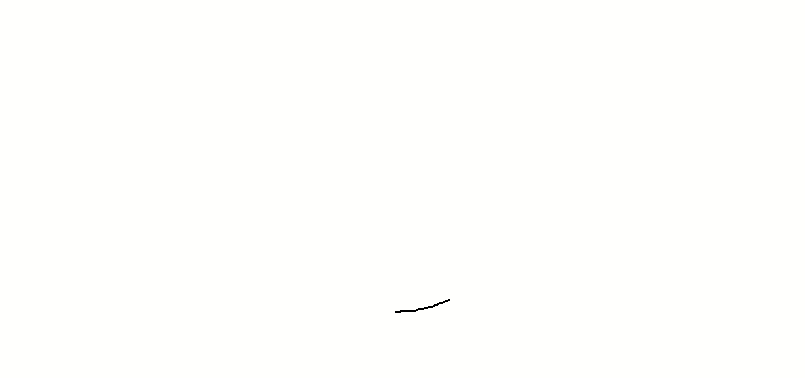

# Projet : Dessine ton Mii

## I. Description

Un Mii est un avatar virtuel créé par Shigeru Miyamoto pour la console Wii de Nintendo, et utilisé par la suite sur Nintendo DS, Nintendo 3DS, Wii U, et Nintendo Switch, ainsi que sur certains jeux mobiles Nintendo.

L'objectif du projet est d'écrire un programme Python permettant de dessiner trois Miis de manière automatique et aléatoire à l'aide du module `turtle`.

## II. Cahier des charges

1. Votre programme Python doit utiliser le module `turtle` (voir [Module Turtle](#turtle)).

2. Votre programme doit afficher trois Miis générés chacun aléatoirement.

3. Un Mii peut être dessiné selon au moins :

    - Trois types de visage.

    - Trois types de bouche.

    - Trois types de nez.

    - Trois types d'yeux.

4. Votre programme doit être modulaire (cf [Modularité](./Modularité.md))

5. Le code doit être lisible, les noms de variable et noms de fonction explicites.

## III. Exemple de rendu

## IV. <a name="turtle">Module Turtle

Le module `turtle` permet de dessiner dans un repère orthonormé.

Les fonctions incluses dans ce module permettent de déplacer une tortue munie d'un crayon dans le repère.

La tortue commence au point de coordonnées $(0,0)$ et est dirigée vers la droite.

Voici quelques fonctions simples pour commencer à utiliser `turtle` :

| Fonctions disponibles | Description |
|---|---|
| `mainloop()` | Empêche la fermeture de la fenêtre |
| `goto(x : int, y : int)` | La tortue se déplace au point de coordonnées $(x,y)$. |
| `forward(d : int)` | La tortue avance de $d$ points. |
| `backward(d : int)` | La tortue recule de $d$ points. |
| `left(a : int)` | La tortue pivote à gauche de l'angle $a$. |
| `right(a : int)` | La tortue pivote à droite de l'angle $a$ |
| `circle(r : int, a : int)` | La tortue trace un arc de cercle d'angle $a$ et de rayon $r$. |
| `dot(r : int)` | La tortue trace un point de rayon $r$. |
| `up()` | La tortue relève son crayon. |
| `down()` | La tortue pose son crayon. |
| `width(e : int)` | La tortue trace d'une épaisseur $e$. |
| `color(c : str)` | La tortue trace d'une couleur $c$. |
| `begin_fill()` | La tortue active le mode remplissage. |
| `end_fill()` | La tortue désactive le mode remplissage. |
| `fillcolor(c)` | La tortue sélectionne la couleur $c$ pour le mode remplissage. |
| `speed(s : int)` | La tortue se déplace d'une vitesse $s$. |
| `ht()` | La tortue est invisible. |

Documentation officielle de `turtle` : [https://docs.python.org/fr/3/library/turtle.html](https://docs.python.org/fr/3/library/turtle.html)

## V. Aller plus loin

1. Ajouter d'autres éléments (cheveux, lunettes, etc...).

2. Ajouter d'autres formes.

3. Ajouter de la couleur.

____________

[Sommaire](./../README.md)

___________

<a property="dct:title" rel="cc:attributionURL" href="https://github.com/boddaert/nsi">Cours NSI</a> by <a rel="cc:attributionURL dct:creator" property="cc:attributionName" href="https://github.com/boddaert">Théo Boddaert</a> is licensed under <a href="https://creativecommons.org/licenses/by/4.0/?ref=chooser-v1" target="_blank" rel="license noopener noreferrer" style="display:inline-block;">CC BY 4.0</a>    
 