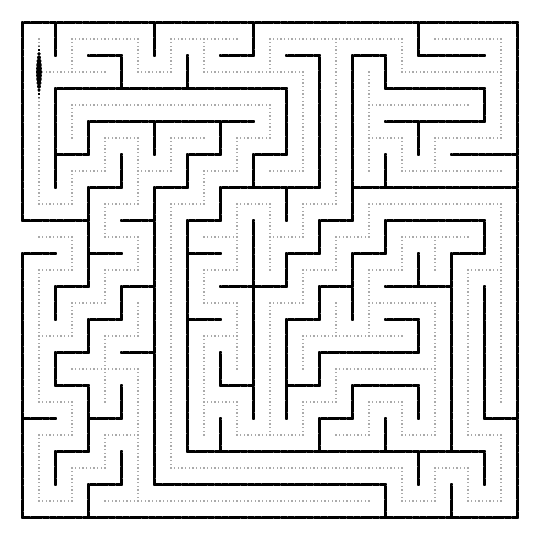
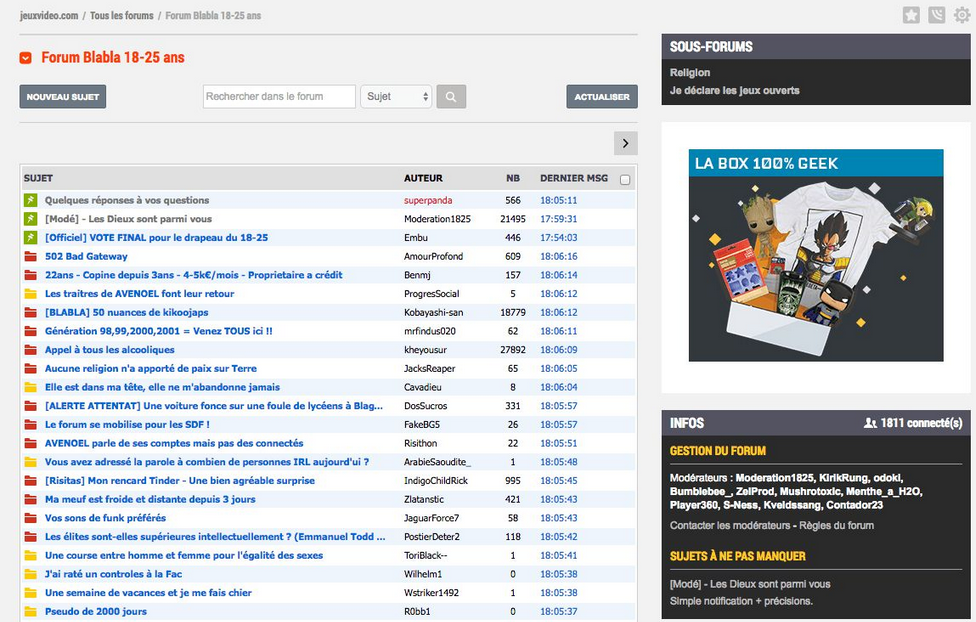

# Projet Final

## I. Généralités

### a) Description

Ce projet final est un projet à réaliser en groupe de trois à quatre élèves sur l'idée de votre choix (avec l'accord du professeur).

Il constitue l'unique note de projet du second semestre.

Ce projet se présente comme l'aboutissement des deux années passées en spécialité de Numérique et Sciences Informatiques et doit, par conséquent, être complètement finalisé et utilisable.

### b) Timeline

Deux à quatre heures de cours par semaine sont dédiées au projet final pendant une dizaine de semaines.

### c) Livrables

Le projet est découpé en trois parties indépendantes les unes des autres.

Chaque partie intègre plusieurs livrables qu'il faudra restituer à la fin du projet.

- Partie Code :

    + Tous les fichiers de code informatique.

    + Un `README` destiné aux utilisateurs expliquant comment utiliser les codes.

- Partie Présentation :

    + Soutenance de dix à quinze minutes afin de présenter et défendre votre projet.

    + Cinq minutes de questions éventuelles.

- Partie Gestion de projet :

    + Diagramme de Gantt.

    + Journal de bord.

    + Rapport comprenant la réflexion autour de la stratégie choisie : 
        
        * L'encadrement du projet (voir III. Conseils).
        
        * La répartition des tâches.
        
        * Les difficultés rencontrées.
        
        * La résolution de ces difficultés.
        
        * Les comptes-rendu des réunions avec le client.

### d) Contraintes

1. Parmi les langages informatiques vus en NSI (Python, SQL, JavaScript, HTML/CSS), vous devrez en utiliser au moins deux dont l'un est obligatoirement Python.

2. Vous devrez intégrer au moins une structure de données vue en Terminale (piles, files, arbres, graphes) au code informatique de votre projet.

3. Au cours des semaines, vous devrez au moins effectuer deux réunions avec le client (à votre demande) afin de rendre compte de l'avancée du projet et des difficultés.

### e) Évaluation

Chaque partie est évaluée sur dix points, ce qui constitue une note globale sur trente points.

## II. Conseils pour mener à bien son projet

1. Définir précisément l'encadrement du projet :

    - À quels besoins répond-il ?

    - Quels peuvent être les utilisateurs cibles du projet ?

    - Quelles sont les différentes fonctionnalités du projet ?

    - À quoi ressemble t-il ? 

    - Sur quels langages informatiques repose t-il ?

    - Comment sont modélisées/structurées les données ?

    - ...

2. Séparer la partie algorithmique de la partie graphique.

3. Faire des recherches et lire les documentations des modules. 

4. Écrire la documentation et les tests.

5. Travailler.

## III. Idées de projets

#### Metroidvania

Le [Metroidvania](https://fr.wikipedia.org/wiki/Jeu_de_plates-formes) est un sous-genre du jeu vidéo d'action-aventure et de plate-forme qui empruntent fortement au système de jeu des séries Metroid et Castlevania.

#### Shoot them up

Caractérisés par une vue objective du vaisseau ou du personnage contrôlé par le joueur. Le but des [Shoot them up](https://fr.wikipedia.org/wiki/Shoot_%27em_up) est de détruire les ennemis tout en esquivant leurs tirs.

#### Action-Role Playing Game

Le [A-RPG](https://fr.wikipedia.org/wiki/Action-RPG) est un jeu en troisième personne où le joueur incarne un personnage et suit son évolution dans le monde dans lequel il se trouve.

#### Tactical-Role Playing Game

Le [T-RPG](https://fr.wikipedia.org/wiki/Tactical_RPG) est un jeu de rôle tactique. Dans ce genre de jeu vidéo, le gameplay est basé sur les décisions tactiques que le joueur doit prendre.

#### Jeu de puzzle

Le [jeu de puzzle](https://www.gamedle.wtf/?lang=fr) est un jeu réflexif où le joueur doit trouver la solution au problème posé.

#### Simulateur de populations

Le simulateur [Wa-Tor](https://en.wikipedia.org/wiki/Wa-Tor) simule les variations des populations de poissons et de requins suivants des règles simples.

#### Génération et résolution de labyrinthes

La génération et la résolution automatique de labyrinthes sont des problèmes algorithmiques connus.

#### Forum de discussion

Un forum est un espace virtuel qui permet de discuter librement de divers sujets.

#### Exploitation d'Open Data en temps réel

L'Open Data sont des données publiques libres et gratuites disponibles au téléchargement.

L'idée est de créer une application exploitant les données téléchargées en format `csv`.

## IV. Outils utiles

### Module `Flask`

Le module `flask` est un module permettant de démarrer un serveur. Sa documentation est disponible [ici](https://flask.palletsprojects.com/en/3.0.x/).

____________

[Sommaire](./../README.md)
