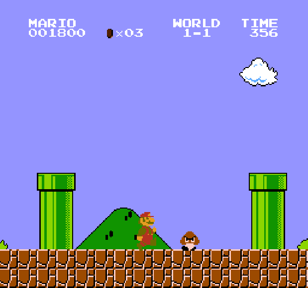
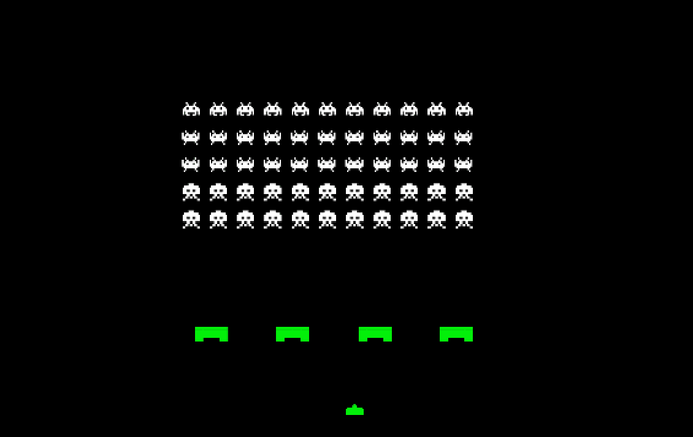
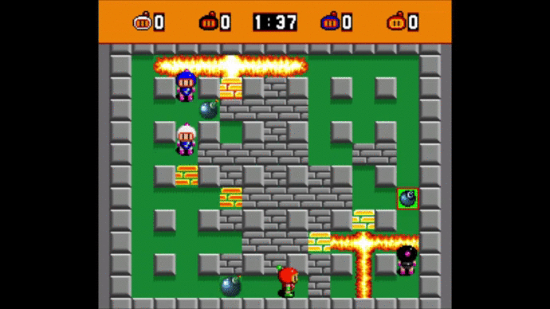
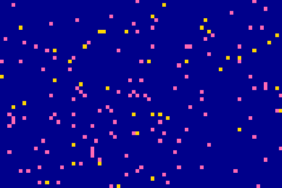
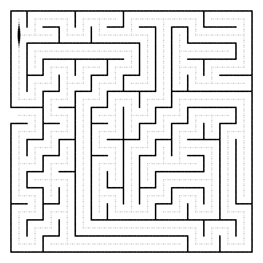
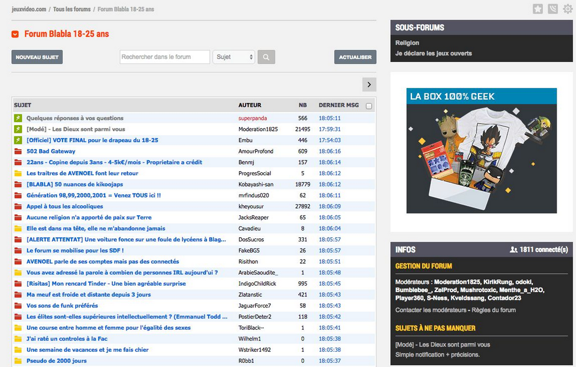

# Projet Final

## I. Généralités

### a) Description

Ce projet se présente comme l'aboutissement des deux années passées en spécialité de Numérique et Sciences Informatiques, il s'inclut dans le concours nationnal informatique : [Trophées NSI](https://trophees-nsi.fr/). 

### b) Organisation du travail

Le projet sera à travailler majoritairement à la maison et quelques heures en classe seront dédiées.

La communication entre les membres des groupes et avec moi-même se fera sur un serveur Discord (lien d'invitation : [Numérique et Science Informatique](https://discord.gg/44azGYjURP)).

Des réunions pourront être organisées afin d'attester de l'avancée du projet.

### c) *Deadline*

La date de rendu de projet est annoncée pour fin Mars.

### c) Présentation du concours

[Présentation du concours](https://trophees-nsi.fr/media/pages/communication/7358a2a15f-1738881057/trophees_nsi_2025-presentation.pdf)

## II. Conseils pour mener à bien son projet

1. Définir précisément l'encadrement du projet :

    - À quels besoins répond-il ?

    - Correspond t-il à la thématique du concours ?

    - Quels peuvent être les utilisateurs cibles du projet ?

    - Quelles sont les différentes fonctionnalités du projet ?

    - Sur quels langages informatiques repose t-il ?

    - Comment sont modélisées/structurées les données ?

    - ...

2. Séparer la partie algorithmique de la partie graphique.

3. Faire des recherches et lire les documentations des modules. 

4. Écrire la documentation et les tests.

5. Travailler.

## III. Idées de projets

#### Metroidvania

Le [Metroidvania](https://fr.wikipedia.org/wiki/Jeu_de_plates-formes) est un sous-genre du jeu vidéo d'action-aventure et de plate-forme qui emprunte fortement au système de jeu des séries Metroid et Castlevania.

#### Shoot them up

Caractérisés par une vue objective du vaisseau ou du personnage contrôlé par le joueur, le but des [Shoot them up](https://fr.wikipedia.org/wiki/Shoot_%27em_up) est de détruire les ennemis tout en esquivant leurs tirs.

#### Action-Role Playing Game

Le [A-RPG](https://fr.wikipedia.org/wiki/Action-RPG) est un jeu en troisième personne où le joueur incarne un personnage et suit son évolution dans le monde dans lequel il se trouve.

#### Tactical-Role Playing Game

Le [T-RPG](https://fr.wikipedia.org/wiki/Tactical_RPG) est un jeu de rôle tactique. Dans ce genre de jeu vidéo, le gameplay est basé sur les décisions tactiques que le joueur doit prendre.

#### Jeu de puzzle

Le [jeu de puzzle](https://www.gamedle.wtf/?lang=fr) est un jeu réflexif où le joueur doit trouver la solution au problème posé.

#### Simulateur de populations

Le simulateur [Wa-Tor](https://en.wikipedia.org/wiki/Wa-Tor) simule les variations des populations de poissons et de requins suivants des règles simples.

#### Génération et résolution de labyrinthes

La génération et la résolution automatique de labyrinthes sont des problèmes algorithmiques connus.

#### Forum de discussion

Un forum est un espace virtuel qui permet de discuter librement de divers sujets.

#### Exploitation d'Open Data en temps réel

L'Open Data sont des données publiques libres et gratuites disponibles au téléchargement.

L'idée est de créer une application exploitant les données téléchargées en format `csv`.

## IV. Outils utiles

### a) Modules

- Le module `flask` est un module permettant de démarrer un serveur. Sa documentation est disponible [ici](https://flask.palletsprojects.com/en/3.0.x/).

- Le module `sqlite3` est un module permettant d'intégrer une base de données à un fichier Python. Sa documentation est disponible [ici](https://docs.python.org/3/library/sqlite3.html).

- Le module `pygame` est un module permettant le développement de jeux vidéo. Sa documentation est disponible [ici](https://pypi.org/project/pygame/).

### b) Environnements de Développement

- L'IDE Visual Studio Code est un environnement de développement se prêtant très bien aux projets car il permet de programmer dans plusieurs langages de programmation différents.

### c) Partage de fichiers

- Discord est un média social très pratique permettant de communiquer très facilement ses fichiers et de travailler à plusieurs à distance via appel vidéo.

- GitHub est un outil en ligne permettant d'ajouter sur un Cloud des fichiers disponibles au téléchargement à toutes les personnes qui y sont auorisées.

### d) Présentation de document

- Canva est un outil en ligne permettant de compléter facilement un diagramme de Gantt via un template ou une présentation de soutenance. L'outil est disponible en cliquant [ici](https://www.canva.com/).

____________

[Sommaire](./../README.md)
