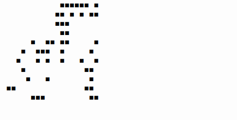

# Projet : Jeu de la vie

## I. Description

L'objectif de ce projet est de programmer le jeu de la vie en Python.

Le jeu de la Vie (*Game of Life* en anglais) est un automate cellulaire imaginé par John Horton Conway en 1970.

Le jeu de la Vie est un "jeu à zéro joueur", puisqu'il ne nécessite aucune intervention du joueur lors de son déroulement.

Le jeu se déroule sur une grille à deux dimensions, théoriquement infinie, dont les cases appelées "cellules", peuvent prendre deux états distincts : *vivante* ou *morte*.

Une cellule possède huit voisines, qui sont les cellules adjacentes horizontalement, verticalement et diagonalement.

À chaque itération, l'état d’une cellule est entièrement déterminé par l’état de ses huit cellules voisines, selon les règles suivantes :

1. Une cellule morte possédant exactement trois cellules voisines vivantes devient vivante.

2. Une cellule vivante possédant deux ou trois cellules voisines vivantes le reste, sinon elle meurt.

Pour en savoir plus : [Jeu de la vie](https://fr.wikipedia.org/wiki/Jeu_de_la_vie).

## II. Cahier des charges

1. L'état du jeu de la vie doit être affiché proprement dans la console.

2. La programmation de ce projet peut se réaliser en impératif ou en orientée objet.

3. Le programme doit être modulaire (cf [Modularité](./../Langages_et_programmation/Modularité/Modularité.md)).

4. Chaque fonction écrite doit être munie d'une spécification complète (DocString pour le prototypage, Assertions pour les préconditions et Jeux de tests pour les postconditions) (cf [Mise au point des programmes](./../Langages_et_programmation/Mise_au_point_des_programmes/Rappels_mise_au_point_des_programmes.md)).

## III. Exemple de rendu 

## IV. Aller plus loin

1. La grille est torique :

- Tout ce qui disparaît par le bas réapparaît par le haut et inversement.

- Tout ce qui disparaît par la gauche réapparaît par la droite et inversement.

2. En début de partie, demander au joueur une configuration de cellules vivantes.

____________

[Sommaire](./../README.md)

___________

<a property="dct:title" rel="cc:attributionURL" href="https://github.com/boddaert/nsi">Cours NSI</a> by <a rel="cc:attributionURL dct:creator" property="cc:attributionName" href="https://github.com/boddaert">Théo Boddaert</a> is licensed under <a href="https://creativecommons.org/licenses/by/4.0/?ref=chooser-v1" target="_blank" rel="license noopener noreferrer" style="display:inline-block;">CC BY 4.0</a>    
 