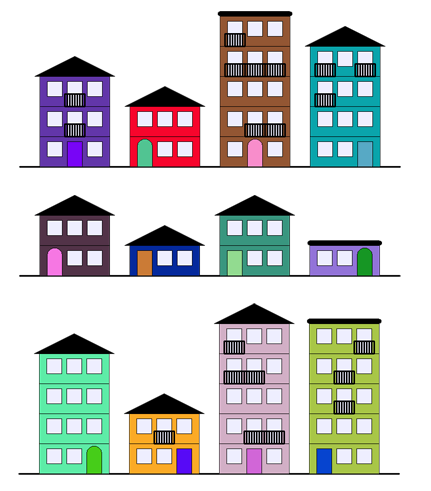

# Projets

## Projet n°1 : Architectes

### a) Description

Vous avez été appelés pour écrire seul un programme permettant de générer **aléatoirement** le dessin d'une rue.

Voici ci-dessous quelques exemples de dessins que vous pourriez obtenir en exécutant votre programme :



### b) Cahier des charges

1. Votre programme Python doit utiliser les modules `turtle` et `random`.

2. Votre programme doit être modulaire, c'est-à-dire que vous devez décomposer le plus possible votre programme en plusieurs fonctions voire dans plusieurs fichiers.

3. Pour chaque fonction que vous écrivez dans votre programme, elle doit être munie d'une documentation DocString.

Rappels de Première :  [Sur la DocString](./../../première/Spécification/Specification.md)

4. Le code doit être lisible, les noms de variable et noms de fonction explicites.

5. Les contraintes urbaines doivent être respectées.

### c) Contraintes urbaines

Les contraintes urbaines sont les suivantes :

- La rue doit comporter quatre immeubles.
- Un immeuble a un nombre d'étage aléatoire. Il a au minimum un rez-de-chaussée et peut avoir jusqu'à quatre étages.
- Toutes les fenêtres sont identiques et sont des carrés.
- Un immeuble est colorié d'une couleur aléatoire.
- Les rez-de-chaussée n'ont qu'une seule porte.

Tout le reste est libre et peut donc être personnalisé.

### d) Module Turtle

Le module `turtle` permet de dessiner dans un repère orthonormé.

Les fonctions incluses dans ce module permettent de déplacer une tortue munie d'un crayon dans le repère.

La tortue commence au point de coordonnées $(0,0)$ et est dirigée vers la droite.

Voici quelques fonctions simples pour commencer à utiliser `turtle` :

| Fonctions disponibles | Description |
|---|---|
| `mainloop()` | Empêche la fermeture de la fenêtre |
| `goto(x : int, y : int)` | La tortue se déplace au point de coordonnées $(x,y)$. |
| `forward(d : int)` | La tortue avance de $d$ points. |
| `backward(d : int)` | La tortue recule de $d$ points. |
| `left(a : int)` | La tortue pivote à gauche de l'angle $a$. |
| `right(a : int)` | La tortue pivote à droite de l'angle $a$ |
| `circle(r : int, a : int)` | La tortue trace un arc de cercle d'angle $a$ et de rayon $r$. |
| `dot(r : int)` | La tortue trace un point de rayon $r$. |
| `up()` | La tortue relève son crayon. |
| `down()` | La tortue pose son crayon. |
| `width(e : int)` | La tortue trace d'une épaisseur $e$. |
| `color(c : str)` | La tortue trace d'une couleur $c$. |
| `begin_fill()` | La tortue active le mode remplissage. |
| `end_fill()` | La tortue désactive le mode remplissage. |
| `fillcolor(c)` | La tortue sélectionne la couleur $c$ pour le mode remplissage. |
| `speed(s : int)` | La tortue se déplace d'une vitesse $s$. |
| `ht()` | La tortue est invisible. |

Documentation de `turtle` : [https://docs.python.org/fr/3/library/turtle.html](https://docs.python.org/fr/3/library/turtle.html)

### e) Evaluation

Vous serez évalués sur :

- La qualité du code fourni (lisibilité du code, modularité, explicité des noms).

- Le respect des contraintes urbaines.

- La qualité de la DocString.

## Projet n°2 : Combat de Pokémons

### a) Description

Nous souhaitons écrire un programme simulant le combat entre deux Pokémons.

Pour ce faire, nous utiliserons la programmation orientée objet.

### b) Règles d'un combat de Pokémons

Deux Pokémons se battent en duel jusqu'à ce que l'un des deux soit mis KO, c'est-à-dire, avec les points de vie inférieur ou égal à zéro.

Au tour par tour, chacun des deux Pokémons vont choisir aléatoirement une action parmi trois :

Les Pokémons peuvent augmenter leurs points d'attaque, augmenter leurs points de vie, augmenter leurs points de vitesse et attaquer le Pokémon adverse.

Le Pokémon le plus rapide, celui qui a le plus de point de vitesse, joue en premier.

Le nombre de dégât reçus est calculé de la manière suivante : C'est le nombre de point d'attaque du Pokémon qui attaque - le nombre de point de défense du Pokémon qui se fait attaqué.

### c) Cahier des charges

a) Classe Pokémon

- Pokémon est une classe dont les attributs sont :
    + Un nom donné en paramètre du constructeur.
    + Un nombre de point de vie initialisé par défaut aléatoirement entre $800$ et $1000$.
    + Un nombre de point d'attaque initialisé par défaut aléatoirement entre $100$ et $200$.
    + Un nombre de point de défense initialisé par défaut aléatoirement entre $100$ et $200$.
    + Un nombre de point de vitesse initialisé par défaut aléatoirement entre $100$ et $200$.
    + Un booléen indiquant si le pokémon est KO ou non. Initialisé par défaut à `False`.
- Et dont les méthodes sont :
    + Tous les accesseurs des attributs précédents.
    + Une méthode `set_point_de_vie(new_point_de_vie : int)` qui prend en paramètre un entier et fixe les points de vie de l'objet à cet entier.
    + Une méthode `set_ko()` mettant à `True` l'attribut si le pokémon possède des points de vie inférieur ou égal à zéro.
    + Une méthode `affiche_statistiques()` qui affiche toutes les caractérisitiques du pokémon.
- L'objet Pokémon dispose également de trois actions disponibles pendant son tour de jeu :
    + Une méthode `augmente_attaque(bonus : int)` qui prend en paramètre un entier et ajoute le montant de l'argument aux points d'attaque de l'objet.
    + Une méthode `augmente_point_de_vie(bonus : int)` qui prend en paramètres un entier et ajoute le montant de l'argument aux point de vie de l'objet.
    + Une méthode `augmente_vitesse(bonus : int)` qui prend en paramètre un entier et ajoute le montant de l'argument aux points de vitesse de l'objet.
    + Une méthode `attaque(pokemon_adverse : Pokemon)->int` qui prend en paramètre un second objet Pokémon et renvoie le montant des dégâts reçus.

b) Programme principal

Le programme principal est découpé en plusieurs fonctions :

- Une fonction `joue_en_premier(pokemon_1 : Pokemon, pokemon_2 : Pokemon)->tuple` qui prend en paramètres deux objets Pokémon et renvoie un tuple de deux objets Pokémon dont le premier élément est le Pokémon le plus rapide.

- Une fonction `choix_action(pokemon_1 : Pokemon, pokemon_2 : Pokemon)->None` qui prend en paramètres deux objets Pokemon et effectue une action aléatoire sur `pokemon_1`.

- Une fonction `combat(pokemon_1 : Pokemon, pokemon_2 : Pokemon)->None` qui prend en paramètres deux objets Pokemon et simule un combat entre ces deux Pokémons.

### d) Affichage

Le programme doit afficher :

- Au début du combat les caractéristiques de chaque Pokémon.
- Les actions utilisées.
- Le gagnant du combat.

Par exemple :

```
Nom : Tiplouf
Points de vie : 848
Attaque : 130
Défense : 143
Vitesse : 106


Nom : Canarticho
Points de vie : 851
Attaque : 151
Défense : 108
Vitesse : 182


Tour numéro n°1
Canarticho est plus rapide !
Canarticho augmente son attaque physique à 20.
Tiplouf attaque Canarticho en faisant 22 dégats.


PV de Canarticho : 829
PV de Tiplouf : 848


Tour numéro n°2
Canarticho est plus rapide !
Canarticho augmente son attaque physique à 20.
Tiplouf augmente son attaque spéciale à 20.


PV de Canarticho : 829
PV de Tiplouf : 868

...
```
________

[Sommaire](./../README.md)