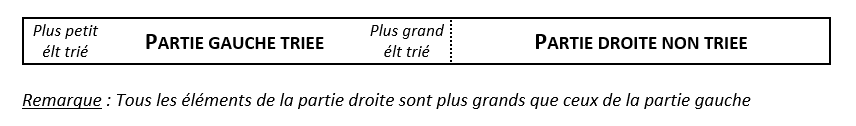

# Rappels des Algorithmes de Tri vus en  Première

## Généralités

- Qu'est-ce qu'un tri ?

Trier c'est classer, répartir les éléments d'un ensemble selon un critère. En informatique, le tri peut s'effectuer sur des nombres entiers, des nombres réels dans des structures de données dites "ordonnées" comme les listes.

- Applications

Le tri en informatique permet énormément d'applications comme la recherche d'un élément dans une liste, le calcul de la médiane et est présent dans beaucoup d'autres algorithmes.

- Spécificités

Dans ce TP, nous allons voir de nombreux algorithmes simples permettant de trier les éléments d'une liste, voici leurs caractéristiques : 

​        - Les éléments qui composent la liste à trier seront des nombres entiers 

​        - La relation d'ordre : les listes seront triées en ordre croissant

## Tri par sélection

### Principe

On parcourt la liste de la gauche vers la droite, en maintenant sur la gauche une partie triée :



A chaque étape, on <u>sélectionne</u> le plus petit élément dans la partie droite non triée. Puis on l'échange avec le premier élément de la partie droite.

Ainsi, à la première étape, on va déterminer le plus petit élément de la liste et le placer tout à gauche. Lors de la seconde étape, on va déterminer le deuxième plus petit élément et le placer à la deuxième case de la liste, etc ...


Voici un outil pour s'exercer : [Tri par selection](http://nsi2019.ostralo.net/premiere/chap11/pages/tri_selection_visuel.htm)

#### Question 1

Ecrire en python une fonction ``minimum( l : list , i : int ) -> int`` prenant en paramètre une liste ``l`` et un indice ``i`` et renvoyant l'indice de l'élément le plus petit dans la tranche de ``i`` au dernier élément.

#### Question 2

Ecrire en python une fonction ``tri_selection( l : list )`` prenant en paramètre une liste ``l`` et qui trie dans l'ordre croissant les éléments de ``l``. Le tri par sélection est un tri en place donc la fonction ``tri_selection`` ne renvoie rien.

#### Question 3

Dans cette question, on souhaite déterminer la complexité de cet algorithme.

1. Proposez, pour une liste de longueur ``n`` , une estimation du nombre de fois que la fonction ``tri_selection`` execute la fonction ``minimum``. On essaiera de trouver cette estimation sur papier en executant le code à la main.

2. Pour une liste de longueur ``n``, estimer le nombre de comparaisons faites.

3. On souhaite maintenant visualiser cette valeur sur machine. Modifier la fonction ``minimum`` pour qu'elle affiche le nombre de comparaisons qu'elle effectue.

4. A partir de l'affichage, comment retrouver le nombre total de comparaisons effectués par la fonction ``tri_selection`` ?

## Tri par insertion

### Principe

On parcourt la liste de la gauche vers la droite, en maintenant sur la gauche une partie triée :

| Partie gauche triée | Partie droite non triée |
| ------------------- | ----------------------- |

Plutôt que de chercher la plus petite valeur, à chaque étapes, le tri par insertion va <u>insérer</u> le premier élément de la partie non triée dans la partie triée à sa bonne place. Pour insérer l'élément à sa bonne place, on va décaler vers la droite tous les éléments déjà triés qui sont plus grands que l'élément à insérer, puis déposer cette dernière dans la case ainsi libérée.


Voici un outil pour s'exercer : [Tri par insertion](http://nsi2019.ostralo.net/premiere/chap11/pages/tri_insertion_visuel.htm)  

#### Question 4

Voici, en français, le pseudo-code de la fonction ``inserer`` permettant d'insérer l'élément à l'indice ``i`` dans la partie gauche triée :

```
Fonction inserer
Entrées : l une liste , i un entier
Sortie :

- On crée la variable élément et lui donne la valeur de l à la position i
- On crée la varaible j et lui donne la valeur de i
- Tant que j est supérieur à 0 et que élément est inférieur ou égal à 
la valeur de l à la position j-1, on répète les instructions suivantes :
    - la valeur de l à la position j-1 est stockée dans l à la position j
    - j est diminué de 1
- la valeur de élément est stockée dans l à la position j
```

Réécrire, en python, la fonction ``inserer( l : list , i : int)`` 

#### Question 5

Ecrire en python une fonction ``tri_insertion( l : list )`` prenant en paramètre une liste ``l`` et trie dans l'ordre croissant les éléments de ``l``. Le tri par insertion est un tri en place donc la fonction ``tri_insertion``ne renvoie rien.

#### Question 6

Dans cette question, on souhaite déterminer la complexité de cet algortihme.

1. Donner, pour la liste `l = [5, 6, 2, 1, 3, 4]`, le nombre de fois que la fonction ``tri_insertion`` execute la fonction `inserer`. On essaiera de trouver cette estimation sur papier en executant le code à la main.

2. Pour une liste déjà triée croissante, par exemple :``[ 1, 2, 3, 4, 5, 6, 7, 8]``, estimer le nombre de comparaisons.

3. Pour une liste strictement décroissante, par exemple : ``[ 8, 7, 6, 5, 4, 3, 2, 1]``, estimer le nombre de comparaisons.

4. On souhaite maintenant visualiser cette valeur sur machine. Modifier la fonction `inserer` pour qu'elle affiche le nombre de comparaisons qu'elle effectue.

5. A partir de l'affichage, donner le nombre de comparaisons total effectués par la fonction ``tri_insertion`` pour les listes `[ 1, 2, 3, 4, 5, 6, 7, 8]` et `[ 8, 7, 6, 5, 4, 3, 2, 1]`

6. La liste déjà triée croissante correspond au meilleur ou pire des cas ?

        La liste décroissante correspond au meilleur ou pire des cas ?

7. Comparer la complexité du tri par sélection avec la complexité du tri par insertion.

## Aller plus loin ...

## Tri cocktail

### Principe

Le tri cocktail ou tri à bulles bidirectionnelles est une variante du tri à bulles. 

Le tri à bulles consiste à comparer répétitivement les éléments consécutifs d'une liste, et à les permuter lorsqu'ils sont mal triés. Il doit son nom au fait qu'il déplace les éléments comme des bulles d'air à l'intérieur d'un liquide. 

Voici un exemple de code du tri à bulles :

```python
def tri_bulles(l : list):
    decorateur = 0
    for i in range(len(l), 1 ,-1 ):
        decorateur += 1
        for j in range(0, i-1):
            if l[j+1] < l [j]:
                l[j+1], l[j] = l[j], l[j+1]
```

Le tri à bulles peut être représenté par le schéma suivant : 


On remarque que les éléments plus grands situés en début de liste (les "lièvres") remontent rapidement tandis que les éléments plus petits situés en fin de liste (les "tortues") descendent lentement.

#### Question 7

Pour la liste `` l = [ 5, 6, 3, 1, 2, 4 ]``, donner l'état de la liste à chaque étape de la boucle.

Donner la fonctionnalité du code aux lignes 6 et 7.

Que contiendra la variable ``decorateur`` en fin de programme pour une liste de taille ``n`` éléments ?

Le tri cocktail est plus efficace et permet aux lièvres et aux tortues de remonter / descendre plus rapidement. Il effectue alternativement un tri dans les deux sens :


#### Question 8

Ecrire en python une fonction ``tri_cocktail( l : list )`` prenant en paramètre une liste ``l`` et trie par ordre croissant les éléments de ``l`` selon la méthode du tri cocktail.

## Tri d'objets

### Principe

On s'interesse maintenant à des listes contenant des instances de classe. Il est possible de les trier selon leurs attributs.

Prenons une classe voiture :

```python
class Voiture():
    def __init__(self,marque,couleur,annee):
        self.__marque = marque
        self.__couleur = couleur
        self.__annee = annee

    def get_marque(self):
        pass

    def get_couleur(self):
        pass

    def get_annee(self):
        pass

    def __str__(self):
        """
        Méthode permettant d'afficher une instance de la classe voiture. 
        Elle s'utilise de la même manière que print.
        Exemple : >>> print(voiture_1)
        """
        return "marque :" + self.get_marque() + ", couleur :"+ self.get_couleur() +", annee :" + str(self.get_annee())
```

#### Question 9

Complétez les méthodes de la classe ``Voiture()`` permettant de récupérer la marque, la couleur et l'année d'une voiture.

Soit une collection d'objets ``Voiture()`` :

```python
# Création des instances 
voiture_1 = Voiture("renault","bleue",2012)
voiture_2 = Voiture("peugeot","rouge",2015)
voiture_3 = Voiture("peugeot","bleue",2015)
voiture_4 = Voiture("renault","bleue",2018)
voiture_5 = Voiture("citroen","verte",2012)

#Création de la collection
collection = [voiture_1, voiture_2, voiture_3, voiture_4, voiture_5]
```

#### Question 10

Ecrire en python, une fonction ``tri_voitures( l : list )`` prenant en paramètre une collection d'objet ``Voiture()`` et trie les voitures selon leurs attributs. 

C'est-à-dire que les voitures sont triés d'abord selon leur marque, si celle-ci est identique, les voitures sont triés selon leur couleur, si la couleur est également identique, les voitures sont triés selon leur année.
