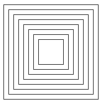
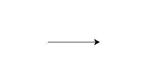
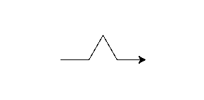
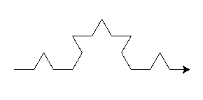
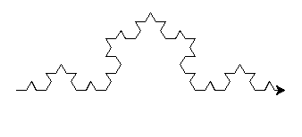

# Exercices

## Exercice 1

Soit la fonction récursive suivante :

```python
def affiche_n_rec(n : int)->None :
    if n == 0 :
        print(0)
    else :
        print(n)
        affiche_n_rec(n-1)
```

a) Qu'affiche dans la console l'instruction `affiche_n_rec(5)` ?

b) Dérouler pas à pas en utilisant l'outil débogueur l'instruction précédente.

c) Repérer le cas de base et le cas récursif afin d'écrire le principe de récurrence.

d) Transformer la fonction `affiche_n_rec()` en fonction itérative.

## Exercice 2

Soit la fonction itérative suivante :

```python
def affiche_bonjour(n : int)->None :
    while n >= 0 :
        print('bonjour')
        n -= 1
```

a) Repérer le cas de base et le cas récursif afin d'écrire le principe de récurrence.

b) Transformer la fonction `affiche_bonjour()` en fonction récursive en vous appuyant sur le principe de récurrence.

## Exercice 3

Soit la fonction récursive suivante :

```python
def taille_rec(mot : str)->int :
    if mot == "" :
        return 0
    else :
        return 1 + taille_rec(mot[1:])
```

a) Qu'affiche dans la console l'instruction `taille_rec('bonjour')` ?

b) Dérouler pas à pas en utilisant l'outil débogueur l'instruction précédente.

c) Repérer le cas de base et le cas récursif afin d'écrire le principe de récurrence.

d) Transformer la fonction `taille_rec()` en fonction itérative sans utiliser la fonction `len()`.

## Exercice 4

Soit la fonction itérative suivante :

```python
def nb_occurence(mot : str, lettre :str)->int :
    res = 0
    while mot != "" :
        if mot[0] == lettre :
            res += 1
        mot = mot[1:]
    return res
```

a) Repérer le cas de base et le cas récursif afin d'écrire le principe de récurrence.

b) Transformer la fonction `nb_occurence()` en fonction récursive en vous appuyant sur le principe de récurrence.

## Exercice 5

a) Ecrire une fonction non récursive `puissance(x : int, n : int)->int` qui prend en paramètres deux entiers et renvoie comme résultat $x^n$.

Cette fonction ne doit pas utiliser l'opérateur de puissance `**`.

b) Repérer le cas de base et le cas récursif afin d'écrire le principe de récurrence de la puissance.

c) Ecrire une fonction récursive `puissance_rec(x : int, n : int)->int` qui prend en paramètres deux entiers et renvoie comme résultat $x^n$.

d) Dessiner la pile d'appels de la fonction puissance avec $x = 3$ et $n = 5$.

## Exercice 6

a) Ecrire une fonction non récursive `factorielle(x : int)->int` qui prend en paramètre un entier et renvoie comme résultat $x!$.

*Rappel* : $5!=5*4*3*2*1$. et $0!=1$.

b) Repérer le cas de base et le cas récursif afin d'écrire le principe de récurrence de la factorielle.

c) Ecrire une fonction récursive `factorielle_rec(x : int)->int` qui prend en paramètre un entier et renvoie comme résultat $x!$.

d) Dessiner la pile d'appels de la fonction factorielle avec $x = 4$.

## Exercice 7

Ecrire une fonction récursive `nb_chiffre_rec(n : int)->int` qui prend en paramètre un entier et renvoie comme résultat le nombre de chiffre présent dans $n$.

```python
>>> nb_chiffre_rec(34126)
5
```

## Exercice 8

Ecrire une fonction récursive `somme_chiffre(n : int)->int` qui prend en paramètre un entier et renvoie comme résultat la somme des chiffres qui compose $n$.

```python
>>> somme_chiffre(45)
9
```

## Exercice 9

Ecrire une fonction `max_rec(l : list)->int` qui prend en paramètre une liste d'entiers et renvoie comme résultat l'entier le plus grand de $l$.

```python
>>> max_rec([4, 8, 9, 10])
10
```

## Exercice 10

a) En utilisant le module `turtle`, écrire une fonction `carre(c : int)->None` qui prend en paramètre un entier et dessine un carré centré de côté $c$.

b) Ecrire une fonction récursive `carres_rec(n : int, c : int)->None` qui prend en paramètres deux entiers et dessine $n$ carrés emboîtés de côté $c$ comme le montre l'image ci-dessous :



## Exercice 11

La courbe de Koch est une figure qui s'obtient de manière récursive.

Le cas de base est à une profondeur $n = 0$ et est simplement le dessin d'un segment de longueur $l$ :



Le cas récursif de profondeur $n$ s'obtient en divisant ce segment en trois morceaux même longueur $l/3$, puis en dessinant un triangle équilatéral dont la base est le morceau du milieu, en prenant le soin de ne pas dessiner cette base.

Ci-dessous, une courbe de profondeur $n = 1$ :



Puis une courbe de Koch de profondeur $n = 2$ :



Et enfin une courbe de Koch de profondeur $n = 3$ :



a) Ecrire le principe de récurrence en vous aidant des informations ci-dessus.

b) Ecrire une fonction `koch_rec(n : int, l : int)->None` qui prend en paramètres deux entiers et dessine à l'aide du module `Turtle` une courbe de Koch de profondeur $n$ et de longueur $l$.

________________

[Sommaire](./../README.md)