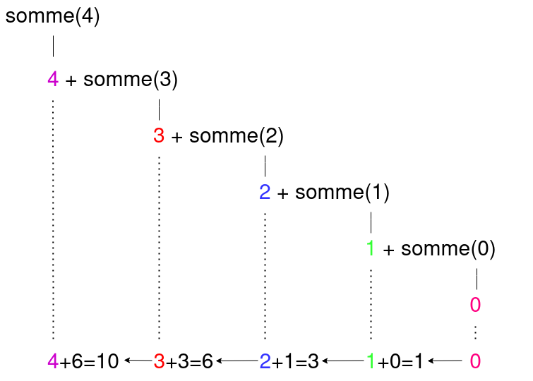

# Récursivité

## I. Introduction

Considérons la fonction suivante :

```python
def somme(n : int)->int :
    res = 0
    while n > 0 :
        res += n
        n -= 1
    return res
```

Elle calcule la somme des $n$ premiers entiers ($n + (n-1) + (n-2) + ... + 0$):

```python
>>> somme(4)
10
```

**Question :** Est-il possible d'écrire cet algorithme sans utiliser de boucle ?

Afin répéter des instructions sans utiliser de boucle, la première idée serait d'écrire dans une fonction les instructions et d'appeler autant de fois cette fonction que nécessaire en modifiant les arguments.

Il est possible, en programmation, d'écrire une instruction réalisant un appel de fonction à l'intérieur de cette fonction.

##### Application 1

Soit la fonction suivante :

```python
def fonction_recursive(n : int)->str :
    if n == 3 :
        return 'fini'
    else :
        n += 1
        return fonction_recursive(n)
```

Dérouler à la main l'exécution de la fonction précédente avec $n = 0$.

## II. Définitions

Une *fonction récursive* est une fonction réalisant au moins un autre appel à elle-même avec des arguments différents.

La *récursivité* est une technique de programmation.

La récursivité permet de ne pas modifier l'état des variables en mémoire.

L'implémentation en Python est souvent très proche du principe de récurrence du problème.

### a) Principe de récurrence

Dans un principe de récurrence, nous distinguons :

- Les *cas de base* pour lesquels les calculs sont triviaux.
- Les *cas récursifs* pour lesquels un appel à la définition est réalisé.

En reprenant l'exemple de la somme des $n$ premiers entiers, son principe de récurrence est :

$$
somme(n)=
\begin{cases}
0 & \quad \text{si n = 0}\\ 
n + somme(n-1) & \quad \text{si n > 0}
\end{cases}
$$

##### Application 2

Donner le principe de récurrence de la fonction de l'application 1.

### b) Traduction en Python

```python
def somme(n : int)->int :
    if n == 0 :
        return 0
    else :
        return n + somme(n-1)
```

L'instruction `return 0` correspond au cas de base.

L'instruction `return n + somme(n-1)` correspond au cas récursif.

La condition `if n == 0 :` se nomme *condition d'arrêt*.

##### Application 3

Noter sur la fonction `fonction_recursive()` de l'application 1 une où se situe le cas de base, le cas récursif et la condition d'arrêt.

## III. Pile d'appels

Une *pile d'appels* est la pile représentant tous les appels succéssifs nécessaires à l'exécution de la fonction.

Par exemple, pour l'appel `somme(4)`, cela donne :



##### Application 4

Dessiner la pile d'appels de la fonction `fonction_recursive()` de l'application 1 avec $n = 0$.

##### Application 5

a) Recopier le code de la fonction `fonction_recursive()` dans Thonny.

b) Avec l'outil `Debogueur` de Thonny, exécuter pas à pas l'instruction `fonction_recursive(0)`.

## IV. Méthodologie

### a) Bonnes pratiques

Avant de se lancer dans l'écriture d'une fonction récursive, il est conseillé de respecter les bonnes pratiques suivantes :

1. Repérer le problème qui se répète et les relations entre les différents résultats.
2. Trouver la ou les conditions d'arrêt.
3. Ecrire le principe de récurrence.
4. Traduire le principe précédent en fonction Python.
5. Vérifier le bon fonctionnement de la fonction récursive à l'aide de la pile d'appels.

### b) Activité : couples de lapins

Cette activité est débranchée.

a) Dessiner $12$ cases sur une feuille. Chaque case représente un enclos de lapin pour un mois dans l'année.

Nous cherchons à connaître le nombre de couple de lapin au bout du douzième mois en sachant :

- Au début du deuxième mois, les élèveurs placent un couple dans l'enclos.
- Les lapins ne peuvent se reproduire qu'à partir de l'âge de deux mois.
- A chaque début de mois, tout couple susceptible de se reproduire engendre exactement un nouveau couple de lapin.

b) Un couple de lapin est représenté par un point dans l'enclos, remplir les douze mois en respectant les contraintes précédentes.

c) Pour un mois $m$ donné, quelle est la relation entre $m$, $m-1$ et $m-2$ ?

d) Pour quels mois cette relation ne s'applique pas ?

e) Soit $f(m)$ une fonction permettant de calculer le nombre de couple de lapins pour un mois $m$ donné.

A l'aide des réponses précédentes, compléter le principe de récurrence suivant :

$$
f(m)=
\begin{cases}
0 & \quad \text{si m = .....}\\ 
..... & \quad \text{si m = 1}\\
f(.....) + f(.....) & \quad \text{sinon}
\end{cases}
$$

f) Sur Thonny, écrire la fonction `f()`.

g) Donner la pile d'appels pour `f(5)`.