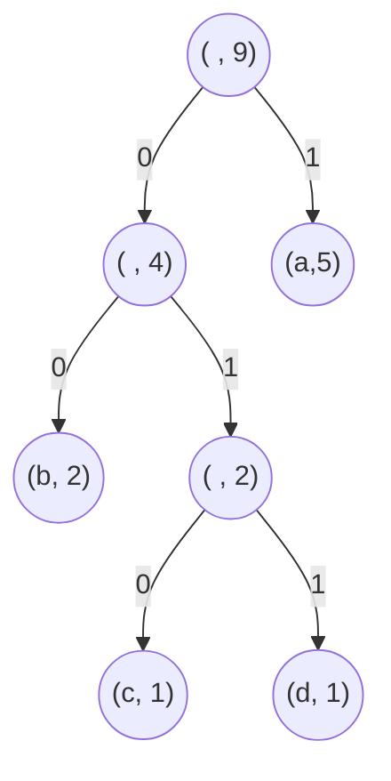

# Activité : Codage de Huffman

Nature : Branchée

Matériel : Aucun

Prérequis : Arbres binaires, encodages de textes en machine

Groupe : Par deux

## I. Objectif

L'objectif est d'écrire un programme permettant d'encoder un texte selon le codage de Huffman.

Le codage de Huffman est un codage binaire d'un texte qui s'appuie sur la fréquence des lettres.

Plus une lettre est fréquente dans le texte, plus la longueur du mot binaire représentant le caractère est petit.

L'encodage de Huffman est optimal, c'est-à-dire qu'il n'existe pas d'encodages utilisant moins de bits afin de représenter un texte.

Petit rappel sur les encodages de textes [Représentation des textes en machine](./../../première/Chaînes_de_caractère/Représentation_des_textes_en_machine.md).

Plus d'informations : [Wikipédia](https://fr.wikipedia.org/wiki/Codage_de_Huffman)

## II. Algorithme

L'idée est de construire un arbre binaire et de s'en servir pour donner une table de codage des caractères.

Prenons un exemple, le texte : `"aabacbada"` possède cinq lettres `a`, deux lettres `b`, une lettre `c` et une lettre `d`.

A partir des fréquences des lettres de ce texte, voici ci-dessous son arbre de Huffman :

Puis à partir de cet arbre, voici ci-dessous son codage de Huffman :

| Lettre | Encodage |
| :---: | :---: |
| `a` | `1` |
| `b` | `00` |
| `c` | `010` |
| `d` | `011` |

Ainsi, le texte `aabacbada` est encodé : `110010100010111`.
