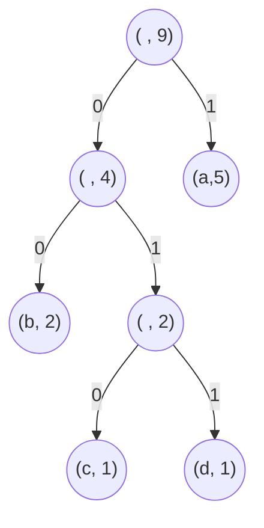

# Activité : Codage de Huffman

Nature : Branchée

Matériel : Aucun

Prérequis : Arbres binaires, encodages de textes en machine

Groupe : Par deux

## I. Objectif

L'objectif est d'écrire un programme permettant d'encoder un texte selon le codage de Huffman.

Le codage de Huffman est un codage binaire d'un texte qui s'appuie sur la fréquence des lettres.

Plus une lettre est fréquente dans le texte, plus la longueur du mot binaire représentant le caractère est petit.

L'encodage de Huffman est optimal, c'est-à-dire qu'il n'existe pas d'encodages utilisant moins de bits afin de représenter un texte.

Petit rappel sur les encodages de textes [Représentation des textes en machine](./../../première/Chaînes_de_caractère/Représentation_des_textes_en_machine.md).

Plus d'informations : [Wikipédia - Codage de Huffman](https://fr.wikipedia.org/wiki/Codage_de_Huffman)

## II. Exemple du codage de Huffman

L'idée est de construire un arbre binaire et de s'en servir pour donner une table de codage des caractères.

Prenons un exemple, le texte : `"aabacbada"` possède cinq lettres `a`, deux lettres `b`, une lettre `c` et une lettre `d`.

A partir des occurences des lettres de ce texte, voici ci-dessous son arbre de Huffman :



Puis à partir de cet arbre, voici ci-dessous son codage de Huffman :

| Lettre | Encodage |
| :---: | :---: |
| `a` | `1` |
| `b` | `00` |
| `c` | `010` |
| `d` | `011` |

Ainsi, le texte `aabacbada` est encodé : `110010100010111`.

## III. Algorithme de construction de l'arbre de Huffman

L'algorithme de construction de l'arbre de Huffman est le suivant :

- Calculer les occurences de chaque lettre du texte.

- Pour chaque occurence de lettre, créer un arbre d'un seul noeud dans lequel se trouve dans la racine un couple $(lettre, occurence)$.

- Placer tous les arbres dans une liste appelée forêt.

- Tant qu'il n'y a pas qu'un seul arbre dans la forêt faire :

    + Trouver les deux arbres $a$ et $b$ ayant les poids (occurences) les plus faibles.

    + Fusionner les deux arbres en un où le sous-arbre gauche est $a$, le sous-arbre droit est $b$ et où le poids de la racine de cet arbre est égal à la somme des poids des racines des deux sous-arbres.

## IV. Questions

Par groupe de deux, répondre aux questions suivantes :

### Partie A : Sur papier

a) En suivant l'algorithme de construction de l'arbre de Huffman, construire l'arbre de Huffman à partir du texte suivant : `la cigale ayant chanté tout l'été`.

b) Construire le codage de Huffman de ce texte à partir de l'arbre construit à la question précédente.

c) Enfin, à partir du codage de Huffman, encoder le texte en binaire.

### Partie B : Sur l'ordinateur 

```python
texte = """la cigale et la fourmi,
la cigale ayant chanté tout l'été
se trouva fort dépourvue
quand la bise fut venue
pas un seul petit morceau
de mouche ou de vermisseau
elle alla crier famine
chez la fourmi sa voisine
la priant de lui prêter
quelque grain pour subsister
jusqu'à la saison nouvelle
je vous paierai lui dit elle
avant l'août foi d'animal
interêt et principal
la fourmi n'est pas prêteuse
c'est là son moindre défaut
que faisiez vous au temps chaud
dit elle à cette emprunteuse
nuit et jour à tout venant
je chantais ne vous déplaise
vous chantiez j'en suis fort aise
eh bien dansez maintenant
"""
```

d) Ecrire en Python, une fonction `occ(texte : str)->dict` qui prend en paramètre une chaîne de caractère et renvoie un dictionnaire dans lequel les clés sont les lettres et les valeurs sont le nombre de fois qu'elles apparaissent.

e) Ecrire une fonction `creer_foret(occ : dict)->list` qui prend en paramètre un dictionnaire et renvoie une liste d'arbres binaires dans lesquels se trouve un couple $(lettre, occurence)$.

f) Ecrire une fonction `poids(ab : AB)->int` qui prend en paramètre un arbre binaire et renvoie le poids des occurences de cet arbre.

g) Ecrire une fonction `deux_plus_faibles_poids(foret : list)->tuple` qui prend en paramètre une liste d'arbres binaires et renvoie un couple d'arbres dont les poids sont les plus petits.

h) Ecrire une fonction `fusion(ab1 : AB, ab2 : AB)->AB` qui prend en paramètre deux arbres binaires et renvoie un arbre binaire dont les deux sous-arbres sont les deux arbres passés en argument et dont la racine est égal à la somme des racines des deux sous-arbres.

i) Ecrire une fonction `arbre_huffman(texte : str)->AB` qui prend en paramètre une chaîne de caractère et renvoie son arbre de Huffman.

j) Ecrire une fonction `codage_huffman(ab_huffman : AB)->dict` qui prend en paramètre un arbre binaire et renvoie le codage de Huffman sous forme de dictionnaire.

_____________________

[Sommaire](./../README.md)