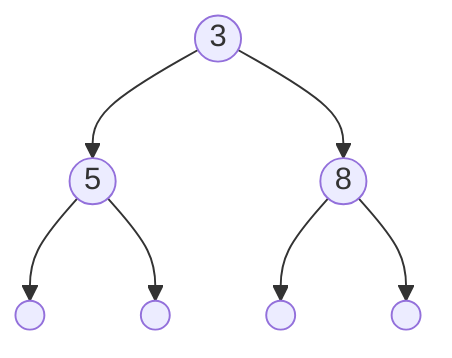
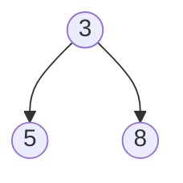

# Arbres binaires

## I. Définitions

Une *structure arborescente de données* est une structure dans laquelle chaque élément possède un parent (sauf le premier). 

Un *arbre* est une structure de données arborescente dont chaque élément est appelé *noeud*.

Est appelé la *racine*, le noeud qui n'a pas de parent.

Sont appelés *feuilles*, les noeuds qui n'ont pas d'enfants.

Un *arbre binaire* est un arbre dont tous les noeuds possèdent au plus deux enfants.

## II. Définition de l'arbre et ses propriétés

### a) Type abstrait

Un arbre binaire est soit :

- Un arbre vide.
- Un triplé constitué :
    + D'un noeud.
    + D'un sous-arbre gauche.
    + D'un sous-arbre droit.

Nous remarquons qu'il s'agit d'une définition récursive : les sous-arbres gauches et droits étant eux aussi des arbres.

### b) Notation

Nous notons les arbres entre parenthèses sous la forme : $(noeud, SAG, SAD)$ avec $SAG$ le sous-arbre gauche et $SAD$ le sous-arbre droit.

L'arbre vide se note $\emptyset$.

Ainsi, un arbre consitué que d'une racine $3$ se note : $(3, \emptyset, \emptyset)$.

Et l'arbre constitué d'une racine $3$ et de deux sous-arbres dont la racine du sous-arbre gauche est $5$ et la racine du sous-arbre droit est $8$ se note : $(3, (5, \emptyset, \emptyset), (8, \emptyset, \emptyset))$.

### c) Représentation schématisée

Un arbre binaire est souvent représenté sous la forme d'un schéma :


En informatique, les arbres poussent vers le bas.

$3$, $5$ et $8$ sont les noeuds de l'arbre.

$3$ est la racine de l'arbre.

$5$ est la racine du sous-arbre gauche.

$8$ est la racine du sous-arbre droit.

$5$ et $8$ sont également les feuilles de l'arbre.

Par habitude, nous ne dessinons pas les arbres vides :



### d) Propriétés

La *taille* d'un arbre est le nombre de noeuds dans l'arbre.

La *profondeur d'un noeud* est le nombre de noeuds du chemin allant de la racine à ce noeud.

La *hauteur de l'arbre* est la profondeur maximale.

Un *arbre filiforme* est un arbre dans lequel au moins l'un de ses sous-arbres est vide.

Un *peigne* (droit ou gauche) est un arbre filiforme toujours que d'un côté.

Un *arbre binaire complet* est un arbre binaire dans lequel ses sous-arbres sont soit vides soit non-vides.

### e) Encadrement de la hauteur

Si l'arbre est un arbre filiforme, sa taille sera égale à sa hauteur.

Si l'arbre est complet, sa taille sera égale à deux puissance sa hauteur.

Encadrement de la taille en fonction de la hauteur de l'arbre : $h \leq n \leq 2^{h}-1$ avec $n$ la taille de l'arbre et $h$ sa hauteur.

Encadrement de la hauteur en fonction de la taille de l'arbre : $\log_2 n \leq h \leq n-1$.

## III. Implémentation en Python

### a) Classe Arbre Binaire

Nous implémentons les arbres binaires en Python à l'aide de la programmation orientée objet.

Ci-dessous une classe `AB` contenant les opérations primitives `est_vide()`, `racine()`, `sag()` et `sad()` permettant respectivement de savoir si un arbre binaire est vide, de renvoyer sa racine, de renvoyer son sous-arbre gauche, de renvoyer son sous-arbre droit :


```python
class AB:
    def __init__(self, *args):
        if len(args) == 0 :
            self.__content = ()
        elif len(args) == 3 :
            if isinstance(args[1], AB) and isinstance(args[2], AB):
                self.__racine = args[0]
                self.__sag = args[1]
                self.__sad = args[2]

    def est_vide(self):
        pass

    def racine(self):
        pass

    def sag(self):
        pass

    def sad(self):
        pass
```

### b) Utilisation de la classe

```python
>>> ab = AB()
>>> ab.est_vide()
True
>>> ab = AB(3, AB(5, AB(), AB()), AB(8, AB(), AB()))
>>> ab.est_vide()
False
>>> ab.racine()
3
>>> ab.sag()
<__main__.AB object at 0x7fc93c18a470>
>>> ab.sag().racine()
5
>>> ab.sad()
<__main__.AB object at 0x7fc93c18abf0>
>>> ab.sad().racine()
8
```

## IV. Parcours de l'arbre

Un *parcours d'arbre* consiste à visiter tous les noeuds de l'arbre une et une seule fois dans le but de leur appliquer un traitement.

Il existe trois 