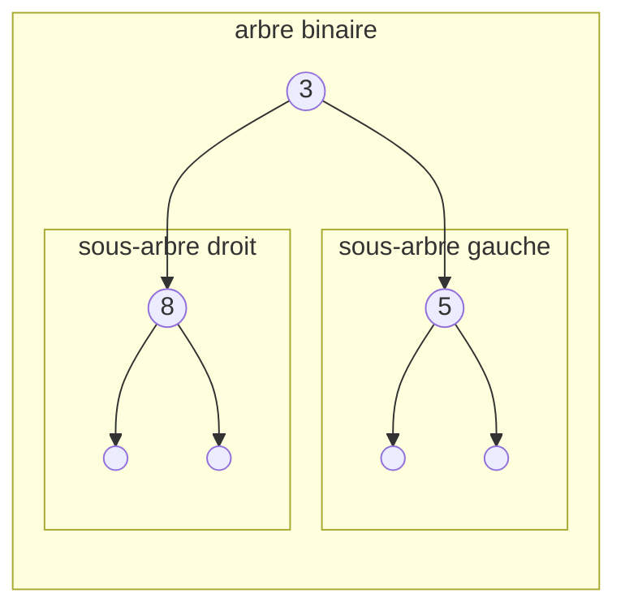
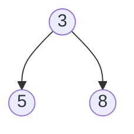
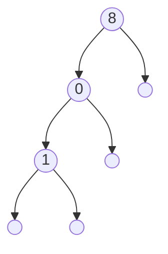
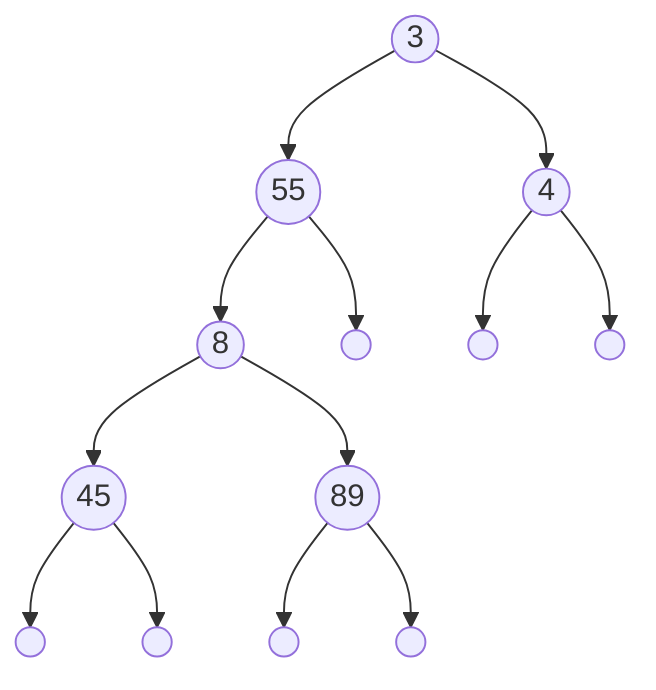
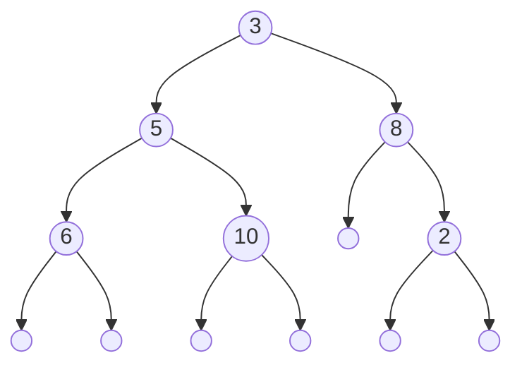

# Arbres binaires

## I. Définitions

Une *structure arborescente de données* est une structure qui peut se présenter sous la forme d'une hierarchie. 

Un *arbre* est une structure de données arborescente dont chaque élément est appelé *noeud*.

Est appelé la *racine*, le noeud initial de l'arbre.

Sont appelés *feuilles*, les noeuds qui n'ont pas d'enfants.

Un *arbre binaire* est un arbre dont tous les noeuds possèdent au plus deux enfants.

##### Application 1

Donner des exemples informatiques ou de la vie quotidienne de structures pouvant se présenter sous la forme d'un arbre.

## II. Définition de l'arbre et ses propriétés

### a) Type abstrait

Un arbre binaire est soit :

- Un arbre vide.
- Un triplé constitué :
    + D'une racine.
    + D'un sous-arbre gauche.
    + D'un sous-arbre droit.

Nous remarquons qu'il s'agit d'une définition récursive : les sous-arbres gauches et droits étant eux aussi des arbres.

### b) Notation

Nous notons les arbres entre parenthèses sous la forme : $(racine, sag, sad)$ avec $sag$ le sous-arbre gauche et $sad$ le sous-arbre droit.

L'arbre vide se note $\emptyset$.

Ainsi, un arbre consitué que d'une racine $3$ se note : $(3, \emptyset, \emptyset)$.

Et l'arbre constitué d'une racine $3$ et de deux sous-arbres dont la racine du sous-arbre gauche est $5$ et la racine du sous-arbre droit est $8$ se note : $(3, (5, \emptyset, \emptyset), (8, \emptyset, \emptyset))$.

### c) Représentation schématisée

Un arbre binaire est souvent représenté sous la forme d'un schéma :


En informatique, les arbres poussent vers le bas.

$3$, $5$ et $8$ sont les noeuds de l'arbre.

$3$ est la racine de l'arbre.

$5$ est la racine du sous-arbre gauche.

$8$ est la racine du sous-arbre droit.

$5$ et $8$ sont également les feuilles de l'arbre.

Par habitude, nous ne dessinons pas les arbres vides :



##### Application 2

Dessiner, avec les arbres vides, la représentation schématisée des arbres suivants :

a) $(7, (2, \emptyset, \emptyset), \emptyset)$.

b) $(9, (0, \emptyset, (12, \emptyset, \emptyset)), (23, (90,\emptyset, \emptyset), (55, \emptyset, \emptyset)))$.

c) $(1, \emptyset, (2, \emptyset, (3, \emptyset, \emptyset)))$

##### Application 3

Donner les notations d'arbre d'après les représentations schématisés suivantes :

a)



b)



### d) Propriétés

La *taille* d'un arbre est le nombre de noeuds dans l'arbre.

La *profondeur d'un noeud* est le nombre de noeuds du chemin allant de la racine à ce noeud.

La profondeur du noeud racine est égale à $1$.

La *hauteur de l'arbre* est la profondeur maximale.

Un *arbre filiforme* est un arbre dans lequel au moins l'un de ses sous-arbres est vide.

Un *peigne* (droit ou gauche) est un arbre filiforme toujours que d'un côté.

Un *arbre binaire complet* est un arbre binaire dans lequel ses sous-arbres sont soit vides soit non-vides.

##### Application 4

a) Donner la taille des arbres de l'application trois.

b) Donner la profondeur du noeud $8$ des arbres de l'application trois.

c) Donner la hauteur des arbres de l'application trois.

d) Dessiner la représentation schématisée d'un peigne droit de hauteur $4$.

e) Dessiner la représentation schématisée d'un arbre binaire complet de hauteur $4$.

### e) Encadrement de la hauteur

Si l'arbre est un arbre filiforme, sa taille sera égale à sa hauteur.

Si l'arbre est complet, sa taille sera égale à deux puissance sa hauteur.

Encadrement de la taille en fonction de la hauteur de l'arbre : $h \leq n \leq 2^{h}-1$ avec $n$ la taille de l'arbre et $h$ sa hauteur.

Encadrement de la hauteur en fonction de la taille de l'arbre : $\log_2 n \leq h \leq n-1$.

##### Application 5

a) Donner l'encadrement de la taille pour un arbre de hauteur $4$.

b) Vérifier en calculant la taille des arbres déssinés respectivement aux d) et e) de l'application quatre.

## III. Implémentation en Python

### a) Classe Arbre Binaire

Nous implémentons les arbres binaires en Python à l'aide de la programmation orientée objet.

Ci-dessous une classe `AB` contenant les opérations primitives `est_vide()`, `racine()`, `sag()` et `sad()` permettant respectivement de savoir si un arbre binaire est vide, de renvoyer sa racine, de renvoyer son sous-arbre gauche, de renvoyer son sous-arbre droit :


```python
class AB:
    def __init__(self, *args):
        if len(args) == 0 :
            self.__contenu = ()
        elif len(args) == 3 :
            if isinstance(args[1], AB) and isinstance(args[2], AB):
                self.__racine = args[0]
                self.__sag = args[1]
                self.__sad = args[2]
                self.__contenu = (self.__racine, self.__sag, self.__sad)

    def est_vide(self):
        pass

    def racine(self):
        pass

    def sag(self):
        pass

    def sad(self):
        pass
```

### b) Utilisation de la classe

```python
>>> ab = AB()
>>> ab.est_vide()
True
>>> ab = AB(3, AB(5, AB(), AB()), AB(8, AB(), AB()))
>>> ab.est_vide()
False
>>> ab.racine()
3
>>> ab.sag()
<__main__.AB object at 0x7fc93c18a470>
>>> ab.sag().racine()
5
>>> ab.sad()
<__main__.AB object at 0x7fc93c18abf0>
>>> ab.sad().racine()
8
```

##### Application 6

a) Ecrire les instruction permettant de créer, à l'aide de la classe, les arbres de l'application trois.

b) Ecrire les instructions permettant d'afficher chaque noeud des arbres de l'application trois. 

## IV. Parcours de l'arbre

Un *parcours d'arbre* consiste à visiter tous les noeuds de l'arbre une et une seule fois dans le but de leur appliquer un traitement.

Il existe deux types de parcours d'arbres : le parcours en largeur d'abord et le parcours en profondeur d'abord.

### a) Parcours en largeur d'abord

Le *parcours en largeur d'abord* est un parcours d'arbre par niveau. Il consiste à visiter tous les noeuds de la même génération avant de passer à la génération suivante.

Par exemple sur l'arbre suivant :



L'ordre de traitement des noeuds selon le parcours en largeur d'abord est : $3$, $5$, $8$, $6$, $10$ et $2$.

##### Application 7

Donner l'ordre de traitement des noeuds selon le parcours en largeur d'abord des arbres de l'application trois.

### b) Algorithme du parcours en largeur d'abord

L'algorithme du parcours en largeur d'abord sur un arbre s'écrit très facilement avec une File (cf : [Files](./../Structures_linéaires_de_données/Files.md)) :

```algo
Procédure parcours_largeur_d_abord(ab : ArbreBinaire):
    f = File()
    f.enfile(ab)
    Tant que f n'est pas vide :
        n = f.defile()
        Si n n'est pas un arbre vide :
            Traiter(n.racine())
            f.enfile(n.sag())
            f.enfile(n.sad())
```

##### Application 8

Exécuter l'algorithme du parcours en profondeur d'abord sur les arbres de l'application trois afin de vérifier vos réponses à l'application sept.

### c) Parcours en profondeur d'abord

Le *parcours en profondeur d'abord* est un parcours d'arbre par branche. Il consiste à visiter en profondeur les enfants avant de passer aux branches suivantes.

Par exemple sur l'arbre suivant :


L'ordre de traitement des noeuds selon le parcours en profondeur d'abord est : $3$, $5$, $6$, $10$, $8$ et $2$.

##### Apllication 9

Donner l'ordre de traitement des noeuds selon le parcours en profondeur d'abord des arbres de l'application trois.

### d) Algorithme itératif du parcours en profondeur d'abord

L'algorithme du parcours en profondeur d'abord sur un arbre s'écrit très facilement avec une Pile (cf : [Piles](./../Structures_linéaires_de_données/Piles.md)) :

```algo
Procédure parcours_profondeur_d_abord_iteratif(ab : ArbreBinaire):
    p = Pile()
    p.empile(ab)
    Tant que p n'est pas vide :
        n = p.depile()
        Si n n'est pas un arbre vide :
            Traiter(n.racine())
            p.empile(n.sag())
            p.empile(n.sad())
```

### e) Algotihme récursif du parcours en profondeur d'abord

L'algorithme du parcours en profondeur d'abord s'écrit également très facilement de manière récursive :

```algo
Procédure parcours_profondeur_d_abord_recursif(ab : ArbreBinaire):
    Si ab n'est pas un arbre vide :
        Traiter(ab.racine())
        parcours_profondeur_d_abord_recursif(ab.sag())
        parcours_profondeur_d_abord_recursif(ab.sad())
```
##### Application 10

a) Exécuter l'algorithme itératif du parcours en profondeur d'abord sur le premier arbre de l'application trois afin de vérifier votre réponse à l'application neuf.

b) Exécuter l'algorithme récursif du parcours en profondeur d'abord sur le second arbre de l'application trois afin de vérifier votre réponse à l'application neuf.

### e) Types parcours en profondeur d'abord

Dans le parcours en profondeur d'abord, l'ordre de traitement des noeuds peut changer selon l'ordre de visite sur le sous-arbre gauche et le sous-arbre droit.

#### 1. Parcours préfixe

Il y a le parcours préfixe qui consiste à traiter le noeud puis à visiter le sous-arbre gauche puis le sous-arbre droit.

Le parcours préfixe correspond au parcours en profondeur d'abord classique décrit ci-dessus.

#### 2. Parcours infixe

Il y a le parcours infixe qui consiste à visiter le sous-arbre gauche puis traiter le noeud puis visiter le sous-arbre droit.

Avec l'arbre donné en exemple plus haut, l'ordre de traitement des noeuds donne : $6$, $5$, $10$, $3$, $8$ et $2$.

#### 3. Parcours suffixe

Enfin, il y a le parcours suffixe qui consiste à visiter le sous-arbre gauche puis le sous-arbre droit puis traiter le noeud.

Avec l'arbre donné en exemple plus haut, l'ordre de traitement des noeuds donne : $6$, $10$, $5$, $2$, $8$ et $3$.

##### Application 11

Donner les parcours infixes et suffixes des arbres de l'application trois.

________________

[Feuille d'exercice](./Exercices/Exercices_arbres_binaires.md)

________________

[Sommaire](./../README.md)