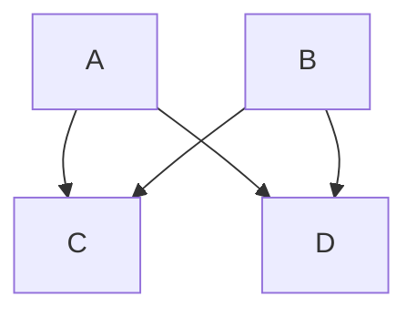

# Arbres binaires

## I. Définitions

Une *structure arborescente de données* est une structure dans laquelle chaque élément possède un parent (sauf le premier). 

Un *arbre* est une structure de données arborescente dont chaque élément est appelé *noeud*.

Est appelé la *racine*, le noeud qui n'a pas de parent.

Sont appelés *feuilles*, les noeuds qui n'ont pas d'enfants.

Un *arbre binaire* est un arbre dont tous les noeuds possèdent au plus deux enfants.

