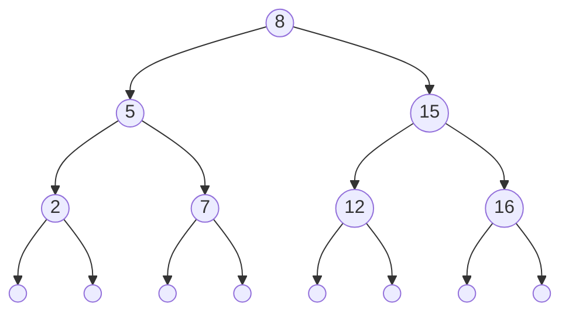

# Arbres binaires de recherche

## I. Définitions et propriétés

### a) Type abstrait

Un arbre binaire de recherche est soit :

- Un arbre binaire vide.

- Un arbre binaire vérifiant :

    + Son sous-arbre gauche est un arbre binaire de recherche.

    + Son sous-arbre droit est un arbre binaire de recherche.

    + Tous les noeuds du sous-arbre gauche sont inférieurs à la valeur de la racine.

    + Tous les noeuds du sous-arbre droit sont supérieurs à la valeur de la racine.

### b) Exemple

Voici ci-dessous, une représentation schématisée d'un arbre binaire de recherche :



##### Application 1

a) Expliquer en quelques lignes pourquoi l'arbre ci-dessus est un ABR.

b) Où se trouve l'élément le plus grand dans un ABR ?

c) Où se trouve l'élément le plus petit dans un ABR ?

## II. Recherche d'élément 

### a) Algorithme

L'algorithme de recherche d'élément consiste à renvoyer vrai si l'élément est présent, faux sinon.

L'algorithme de recherche d'élément dans un arbre binaire de recherche se voit modifié par rapport à l'algorithme de recherche dans un arbre binaire quelconque.

En effet, si nous considérons les propriétés de l'ABR, nous pouvons accélérer le processus de recherche. Voici ci-dessous un exemple d'algorithme de recherche dans un ABR :

```algo
Procédure recherche_abr(abr : AB, elt : int)->bool:
    Si l'arbre est vide :
        Renvoie Faux
    Sinon si abr.racine() est égal à elt :
        Renvoie Vrai
    Sinon :
        Si elt est inférieur à abr.racine() :
            Renvoie recherche(abr.sag(), elt)
        Sinon :
            Renvoie recherche(abr.sad(), elt)
```

##### Application 2

Ecrire une fonction `recherche_abr(abr : AB, elt : int)->bool` qui prend en paramètre un arbre binaire de recherche et un entier et renvoie $True$ si `elt` est présent, $False$ sinon.

### b) Efficacité

#### Rappel : complexité ou coût algorithmique

Pour un problème algorithmique donné, il existe plusieurs solutions, plusieurs algorithmes.

Par exemple : trier ou rechercher.

Afin de comparer l'efficacité des algorithmes entre eux, les informaticiens calculent leurs compléxités ou leurs coûts algorithmiques.

Une complexité peut être calculée sur le temps ou l'espace mémoire que nécessite l'exécution d'un algorithme.

En NSI, nous calculons principalement le coût algorithmique du temps.

Les instructions les plus coûteuses sont les comparaisons. Et nous décidons donc de comparer le nombre de comparaisons pour un certain nombre de données en entrée.

Par exemple, la recherche séquentielle d'un élément dans une liste (avec une boucle `for`) effectue $n$ comparaisons pour une liste de taille $n$. Son coût algorithmique est *linéaire* $O(n)$.

#### Coût algorithmique de la recherche dans un arbre binaire de recherche équilibré

Un arbre *équilibré* est un arbre qui maintient une profondeur de noeud minimum. Un arbre complet est équilibré, un peigne ou un arbre filiforme ne l'est pas. 

Dans un arbre binaire de recherche équilibré, le coût algorithmique de recherche d'un élément est *logarithmique* $O(\log_2 n)$ avec $n$ le nombre de noeuds, ce qui est bien moins coûteux que la recherche séquentielle.

##### Application 3

a) Exécuter à la main l'algorithme de recherche classique sur l'arbre donné en début de leçon pour l'élément $12$ en comptant le nombre de comparaisons effectué.

b) Exécuter à la main l'algorithme de recherche dans un ABR dans le même arbre pour l'élément $12$ en comptant le nombre de comparaisons effectué.

c) Comparer les résultats trouvés aux questions a) et b).

_________________

[Feuille d'exercice](./Exercices/Exercices_arbres_binaires_de_recherche.md)

_________________

[Sommaire](./../README.md)