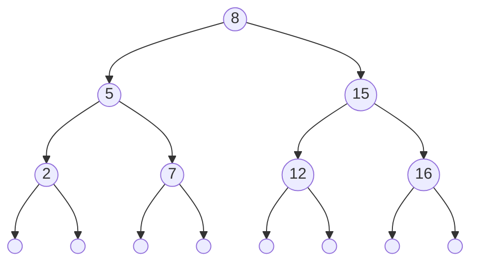

# Arbres binaires de recherche

## I. Définitions et propriétés

### a) Type abstrait

Un arbre binaire de recherche est soit :

- Un arbre binaire vide.

- Un arbre binaire vérifiant :

    + Son sous-arbre gauche est un arbre binaire de recherche.

    + Son sous-arbre droit est un arbre binaire de recherche.

    + Tous les noeuds du sous-arbre gauche sont inférieurs à la valeur de la racine.

    + Tous les noeuds du sous-arbre droit sont supérieurs à la valeur de la racine.

### b) Exemple

Voici ci-dessous, une représentation schématisée d'un arbre binaire de recherche :

## II. Efficacité

Un *arbre binaire de recherche* ou *ABR* est un arbre binaire vérifiant certaines propriétés. Ces propriétés permettent d'insérer, supprimer ou rechercher efficacement un élément.