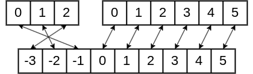

# Exercices

## Exercice 1

Dans cet exercice, nous allons travailler avec une classe `Boite`.

Les attributs de cette classe sont `longueur`, `largeur`, `hauteur` trois entiers compris entre 1 et 50 inclus

Les méthodes de cette classe sont `volume()` qui renvoie le volume de la boîte et `infos()` qui renvoie une chaîne de caractères contenant les informations sur la boîte sous la forme $L×l×h$.

a) Écrire le constructeur de la classe `Boite` qui prend trois entiers en paramètres : la longueur, la largeur et la hauteur.

b) Écrire tous les accesseurs liés aux attributs `longueur`, `largeur` et `hauteur`. Puis, dans la console, vérifier le fonctionnement de vos méthodes.

c) Écrire la méthode `volume(self)` qui ne prend pas de paramètres et renvoie comme résultat le volume de la boîte.

d) Écrire la méthode `infos(self)` qui ne prend pas de paramètres et renvoie une chaîne de caractère de la forme $Lxlxh$.

## Exercice 2

Reprendre la classe de l'exercice $1$.

a) En dehors de la classe, écrire une fonction `maxi(b1 : Boite, b2 : Boite)->Boite` qui prend deux boîtes en paramètres et renvoie la boite dont le volume est le plus grand.

b) Tester votre fonction dans la console.

## Exercice 3

Reprendre la classe de l'exercice $1$.

a) En dehors de la classe, écrire une fonction `creer_liste_boites(n : int)->list` qui prend un nombre entier $n$ en paramètre et renvoie une liste de $n$ boîtes dont les tailles sont aléatoires.

b) En dehors de la classe, écrire une fonction `maxi_liste_boites(liste_boites : list)->Boite` qui prend une liste de boîtes en paramètre et renvoie la boite dont le volume est le plus grand.

c) Tester vos deux fonctions dans la console.

## Exercice 4 (Difficile)

Nous voulons définir une classe `TaBiDir` pour des tableaux bidirectionnels, dont une partie des éléments ont des indices positifs et une partie des éléments ont des indices négatifs, et qui sont extensibles aussi bien par la gauche que par la droite.

La classe `TaBiDir` a pour attributs deux listes Python : une liste `droite` contenant l'élément d'indice $0$ et les autres éléments d'indice positifs, et une liste `gauche` tel que `gauche[0]` contient l'élément d'indice $-1$ du tableau bidirectionnel et les éléments d'indices négatifs suivants.

> [!TIP]
> Par exemple :
>
> 

a) Écrire un constructeur construisant un tableau bidirectionnel contenant dans l'ordre, les éléments des tableaux `g` et `d`. Le premier élément de `g` devra être calé avec l'élément d'indice $-1$ du tableau bidirectionnel, et le premier élément de `d` sur l'indice $0$.

b) Écrire les méthodes `imin(self)->int` et `imax(self)->int` renvoyant respectivement l'indice minimum et l'indice maximum du tableau bidirectionnel.

c) Écrire une méthode `taille(self)->int` qui renvoie la taille du tableau bidirectionnel.

d) Écrire une méthode `ajoute_en_fin(self, elt : int)->None` qui ajoute l'élément `elt` à la fin du tableau bidirectionnel.

e) Écrire une méthode `ajoute_au_debut(self, elt : int)->None` qui ajoute l'élément `elt` au début du tableau bidirectionnel.

f) Écrire une méthode `elt_d_indice(self, i : int)->int` qui renvoie l'élément d'indice $i$ du tableau bidirectionnel.

g) Écrire une méthode `premier_element(self)->int` qui renvoie le premier élément du tableau bidirectionel.

h) Écrire une méthode `affiche(self)->None` qui affiche dans l'ordre les éléments du tableau bidirectionnel.

_______________

[Sommaire](./../../../README.md)

___________

<a property="dct:title" rel="cc:attributionURL" href="https://github.com/boddaert/nsi">Cours NSI</a> by <a rel="cc:attributionURL dct:creator" property="cc:attributionName" href="https://github.com/boddaert">Théo Boddaert</a> is licensed under <a href="https://creativecommons.org/licenses/by/4.0/?ref=chooser-v1" target="_blank" rel="license noopener noreferrer" style="display:inline-block;">CC BY 4.0</a>    
 