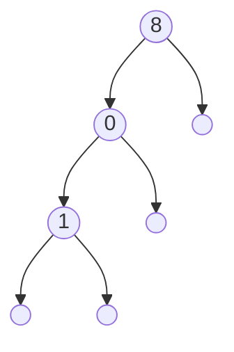
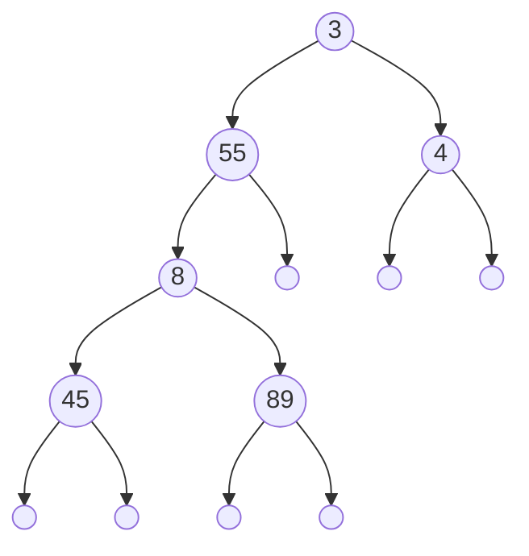

# Arbres binaires

## I. Définitions

> [!IMPORTANT]
> Une *structure arborescente de données* est une structure qui peut se présenter sous la forme d'une hierarchie. 

> [!IMPORTANT]
> Un *arbre* est une structure de données arborescente dont chaque élément est appelé *nœud*.

> [!IMPORTANT]
> La *racine* est le nœud initial de l'arbre.

> [!IMPORTANT]
> Les *feuilles* sont les nœuds qui n'ont pas d'enfants.

> [!IMPORTANT]
> Un *arbre binaire* est un arbre dont tous les nœuds possèdent au plus deux enfants.

#### <ins>Application 1</ins>

Donner des exemples informatiques ou de la vie quotidienne de structures pouvant se présenter sous la forme d'un arbre.

## II. Définition de l'arbre binaire

### a) Type abstrait

> [!IMPORTANT]
> Un arbre binaire est soit :
>
> - Un arbre binaire vide.
> 
> - Un triplé constitué :
>
>     + D'une racine.
> 
>     + D'un sous-arbre gauche.
>    
>     + D'un sous-arbre droit.

> [!NOTE]
> Il s'agit d'une définition récursive : les sous-arbres gauches et droits étant eux-mêmes aussi des arbres.

### b) Notation

Les arbres se notent entre parenthèses sous la forme : $(racine, sag, sad)$ avec $sag$ le sous-arbre gauche et $sad$ le sous-arbre droit.

L'arbre vide se note $\emptyset$.

> [!TIP]
> Par exemple :
>
> Un arbre binaire consitué que d'une racine $3$ se note : $(3, \emptyset, \emptyset)$.
>
> Un arbre binaire constitué d'une racine $3$ et de deux sous-arbres dont la racine du sous-arbre gauche est $5$ et la racine du sous-arbre droit est $8$ se note : $(3, (5, \emptyset, \emptyset), (8, \emptyset, \emptyset))$.

#### <ins>Application 2</ins>

Écrire la notation d'un arbre constitué d'une racine $5$ d'un sous-arbre gauche dont la racine est $8$.

### c) Représentation schématisée

Un arbre binaire est souvent représenté sous la forme d'un dessin.

> [!TIP]
> Par exemple :
>
> ```mermaid
> flowchart TB
>     subgraph Arbre binaire
>             direction TB
>             A((3))
>                subgraph Sous-arbre droit
>                   direction TB
>                   C((8))
>                   F((" "))
>                   G((" "))
>                   C --> F
>                   C --> G
>                end
>                subgraph Sous-arbre gauche
>                   direction TB
>                   B((5))
>                   D((" "))
>                   E((" "))
>                   B --> D
>                   B --> E
>                end
>                A --> C
>                A --> B
>     end
> ```
>
> $3$, $5$ et $8$ sont les nœuds de l'arbre.
> 
> $3$ est la racine de l'arbre.
>
> $5$ est la racine du sous-arbre gauche.
> 
> $8$ est la racine du sous-arbre droit.
>
> $5$ et $8$ sont également les feuilles de l'arbre.

> En informatique, les arbres poussent vers le bas.

Par habitude, nous ne dessinons pas les arbres vides.

> [!TIP]
> Par exemple :
>
> ```mermaid
> flowchart TB
>     A((3))
>     B((5))
>     C((8))
>     A --> B
>     A --> C
> ```

#### <a name="app_3_4"></a><ins>Application 3</ins>

Dessiner, avec les arbres vides, la représentation schématisée des arbres suivants :

a) $(7, (2, \emptyset, \emptyset), \emptyset)$.

b) $(9, (0, \emptyset, (12, \emptyset, \emptyset)), (23, (90,\emptyset, \emptyset), (55, \emptyset, \emptyset)))$.

c) $(1, \emptyset, (2, \emptyset, (3, \emptyset, \emptyset)))$

#### <ins>Application 4</ins>

Écrire la notation des arbres d'après les représentations schématisés suivantes :

1. Schéma 1


2. Schéma 2


### d) Propriétés

> [!IMPORTANT]
> La *taille* d'un arbre est le nombre de nœuds dans l'arbre.

> [!IMPORTANT]
> La *profondeur d'un nœud* est le nombre de nœuds du chemin allant de la racine à ce nœud.

> [!WARNING]
> La profondeur du nœud racine est égale à $1$.

> [!IMPORTANT]
> La *hauteur de l'arbre* est la profondeur maximale.

> [!IMPORTANT]
> Un *arbre filiforme* est un arbre dans lequel au moins l'un de ses sous-arbres est vide.

> [!IMPORTANT]
> Un *peigne* (droit ou gauche) est un arbre filiforme toujours que d'un côté.

> [!IMPORTANT]
> Un *arbre binaire complet* est un arbre binaire dans lequel toutes les feuilles de l'arbre sont à la même hauteur.

#### <ins>Application 5</ins>

a) Donner la taille des arbres de l'[application 4](#app_3_4).

b) Donner la profondeur du nœud $8$ des arbres de l'[application 4](#app_3_4).

c) Donner la hauteur des arbres de l'[application 4](#app_3_4).

d) Dessiner la représentation schématisée d'un peigne droit de hauteur $4$.

e) Dessiner la représentation schématisée d'un arbre binaire complet de hauteur $4$.

### e) Encadrement de la hauteur

Si l'arbre est un arbre filiforme, sa taille sera égale à sa hauteur.

Si l'arbre est complet, sa taille sera égale à deux puissance sa hauteur moins un.

> [!IMPORTANT]
> Encadrement de la taille en fonction de la hauteur de l'arbre : $h \leq n \leq 2^{h}-1$ avec $n$ la taille de l'arbre et $h$ sa hauteur.

> [!IMPORTANT]
> Encadrement de la hauteur en fonction de la taille de l'arbre : $\log_2 n \leq h \leq n-1$.

#### <ins>Application 6</ins>

a) Donner l'encadrement de la taille pour un arbre de hauteur $4$.

b) Vérifier en calculant la taille des arbres déssinés respectivement aux d) et e) de l'application $5$.

## III. Implémentation en Python

### a) Classe Arbre Binaire

Les arbres binaires sont implémentés en Python à l'aide de la programmation orientée objet.

Ci-dessous la classe `AB` : 

```python
class AB:
    def __init__(self, *args):
        if len(args) == 0 :
            self.__contenu = ()
        elif len(args) == 3 :
            if isinstance(args[1], AB) and isinstance(args[2], AB):
                self.__racine = args[0]
                self.__sag = args[1]
                self.__sad = args[2]
                self.__contenu = (self.__racine, self.__sag, self.__sad)

    def est_vide(self):
        pass

    def racine(self):
        pass

    def sag(self):
        pass

    def sad(self):
        pass
```

Avec :

- Un constructeur permettant de créer un arbre binaire vide ou un arbre binaire contenant une racine et deux sous-arbres.

- `est_vide()` permettant de vérifier si l'arbre binaire est vide.

- `racine()` permettant de renvoyer la valeur de la racine de l'arbre binaire.

- `sag()` permettant de renvoyer le sous-arbre gauche de l'arbre binaire.

- `sad()` permettant de renvoyer le sous-arbre droit de l'arbre binaire.

#### <ins>Application 7</ins>

Compléter les méthodes `est_vide()`, `racine()`, `sag()` et `sad()`.

### b) Utilisation de la classe

```python
>>> ab = AB()
>>> ab.est_vide()
True
>>> ab = AB(3, AB(5, AB(), AB()), AB(8, AB(), AB()))
>>> ab.est_vide()
False
>>> ab.racine()
3
>>> ab.sag()
<__main__.AB object at 0x7fc93c18a470>
>>> ab.sag().racine()
5
>>> ab.sad()
<__main__.AB object at 0x7fc93c18abf0>
>>> ab.sad().racine()
8
```

#### <ins>Application 8</ins>

a) Écrire les instructions permettant de créer, à l'aide de la classe, les arbres de l'[application 3 et 4](#app_3_4).

b) Écrire les instructions permettant d'afficher le nœud le plus en bas à droite possible de l'arbre. 

## IV. Parcours de l'arbre

### a) Définition

> [!IMPORTANT]
> Un *parcours d'arbre* consiste à visiter tous les nœuds de l'arbre une et une seule fois dans le but de leur appliquer un traitement.

Il existe deux types de parcours d'arbres : le **parcours en largeur d'abord** et le **parcours en profondeur d'abord**.

### b) Parcours en largeur d'abord

> [!IMPORTANT]
> Le *parcours en largeur d'abord* est un parcours d'arbre par niveau. Il consiste à visiter tous les nœuds de la même génération avant de passer à la génération suivante.

> [!TIP]
> Par exemple sur l'arbre suivant :
> ```mermaid
> flowchart TB
>     A((3))
>     B((5))
>     C((8))
>     D((6))
>     E((10))
>     F((" "))
>     G((2))
>     H((" "))
>     I((" "))
>     J((" "))
>     K((" "))
>     L((" "))
>     M((" "))
>     A --> B
>     B --> D
>     B --> E
>     A --> C
>     C --> F
>     C --> G
>     D --> I
>     D --> H
>     E --> K
>     E --> J
>     G --> L
>     G --> M
> ```
>
> L'ordre de traitement des nœuds selon le parcours en largeur d'abord est : $3$, $5$, $8$, $6$, $10$ et $2$.

#### <ins>Application 9</ins>

Donner l'ordre de traitement des nœuds selon le parcours en largeur d'abord des arbres de l'[application 3 et 4](#app_3_4).

### c) Algorithme du parcours en largeur d'abord

L'algorithme du parcours en largeur d'abord sur un arbre s'écrit très facilement avec une File (cf : [Files](./../Structures_linéaires_de_données/Files.md)) :

```
Algorithme : parcours_largeur_d_abord(ab)
Entrées : ab un arbre binaire
Sorties : Rien

f <- File()
f.enfile(ab)
Tant que f n'est pas vide, faire :
    n <- f.defile()
    Si n n'est pas un arbre vide, alors :
        Traiter(n.racine())
        f.enfile(n.sag())
        f.enfile(n.sad())
```

#### <ins>Application 10</ins>

Exécuter à la main l'algorithme du parcours en profondeur d'abord sur le second arbre de l'[application 4](#app_3_4) en dessinant les files sur feuille.

### d) Parcours en profondeur d'abord

> [!IMPORTANT]
> Le *parcours en profondeur d'abord* est un parcours d'arbre par branche. Il consiste à visiter en profondeur les enfants avant de passer aux branches suivantes.

<a name='exemple_prof'></a>
> [!TIP]
> Par exemple sur l'arbre suivant :
>
> ```mermaid
> flowchart TB
>     A((3))
>     B((5))
>     C((8))
>     D((6))
>     E((10))
>     F((" "))
>     G((2))
>     H((" "))
>     I((" "))
>     J((" "))
>     K((" "))
>     L((" "))
>     M((" "))
>     A --> B
>     B --> D
>     B --> E
>     A --> C
>     C --> F
>     C --> G
>     D --> I
>     D --> H
>     E --> K
>     E --> J
>     G --> L
>     G --> M
> ```
>
> L'ordre de traitement des nœuds selon le parcours en profondeur d'abord est : $3$, $5$, $6$, $10$, $8$ et $2$.

#### <ins>Apllication 11</ins>

Donner l'ordre de traitement des nœuds selon le parcours en profondeur d'abord des arbres de l'[application 3 et 4](#app_3_4).

### e) Algorithme itératif du parcours en profondeur d'abord

L'algorithme du parcours en profondeur d'abord sur un arbre s'écrit très facilement avec une Pile (cf : [Piles](./../Structures_linéaires_de_données/Piles.md)) :

```algo
Algorithme parcours_profondeur_d_abord_iteratif(ab)
Entrées : ab un arbre binaire
Sorties : Rien

p <- Pile()
p.empile(ab)
Tant que p n'est pas vide, faire :
    n <- p.depile()
    Si n n'est pas un arbre vide, alors :
        Traiter(n.racine())
        p.empile(n.sag())
        p.empile(n.sad())
```

### f) Algotihme récursif du parcours en profondeur d'abord

L'algorithme du parcours en profondeur d'abord s'écrit également très facilement de manière récursive :

```algo
Algorithme parcours_profondeur_d_abord_recursif(ab)
Entrées : ab un arbre binaire
Sorties :

Si ab n'est pas un arbre vide, alors :
    Traiter(ab.racine())
    parcours_profondeur_d_abord_recursif(ab.sag())
    parcours_profondeur_d_abord_recursif(ab.sad())
```

#### <ins>Application 12</ins>

Exécuter à la main l'algorithme itératif du parcours en profondeur d'abord sur le second arbre de l'[application 4](#app_3_4) en dessinant les piles sur feuille.

### g) Types de parcours en profondeur d'abord

Dans le parcours en profondeur d'abord, l'ordre de traitement des nœuds peut changer selon l'ordre de visite sur le sous-arbre gauche et le sous-arbre droit.

#### 1. Parcours préfixe

Il y a le parcours préfixe qui consiste à traiter le nœud puis à visiter le sous-arbre gauche puis le sous-arbre droit.

Le parcours préfixe correspond au parcours en profondeur d'abord classique décrit ci-dessus.

#### 2. Parcours infixe

Il y a le parcours infixe qui consiste à visiter le sous-arbre gauche puis traiter le nœud puis visiter le sous-arbre droit.

> [!TIP]
> Par exemple, avec l'[arbre](#exemple_prof) donné plus haut, l'ordre de traitement des nœuds donne : $6$, $5$, $10$, $3$, $8$ et $2$.

#### 3. Parcours suffixe

Enfin, il y a le parcours suffixe qui consiste à visiter le sous-arbre gauche puis le sous-arbre droit puis traiter le nœud.

> [!TIP]
> Par exemple avec l'[arbre](#exemple_prof) donné en exemple plus haut, l'ordre de traitement des nœuds donne : $6$, $10$, $5$, $2$, $8$ et $3$.

#### <ins>Application 13</ins>

Donner les parcours infixes et suffixes des arbres de l'[application 3 et 4](#app_3_4).

________________

[Exercices](./Exercices/Exercices_arbres_binaires.md)

________________

[Sommaire](./../../README.md)

___________

<p xmlns:cc="http://creativecommons.org/ns#" xmlns:dct="http://purl.org/dc/terms/"><a property="dct:title" rel="cc:attributionURL" href="https://github.com/boddaert/nsi">Cours NSI</a> by <a rel="cc:attributionURL dct:creator" property="cc:attributionName" href="https://github.com/boddaert">Théo Boddaert</a> is licensed under <a href="https://creativecommons.org/licenses/by/4.0/?ref=chooser-v1" target="_blank" rel="license noopener noreferrer" style="display:inline-block;">CC BY 4.0</a>    </p> 