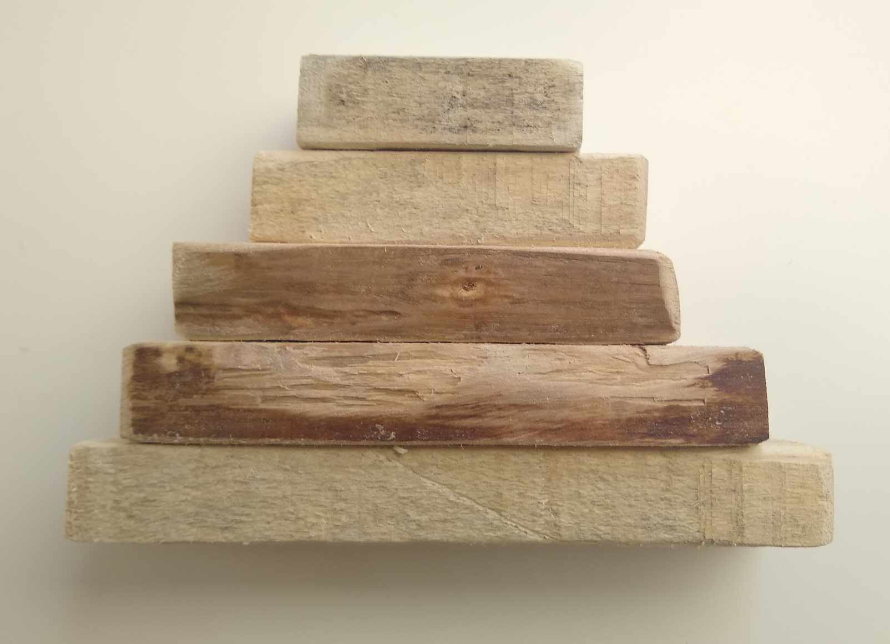

# Activité : Le problème du crêpier psychorigide

Nature : Branchée/débranchée.

Matériel : Jeu de cinq planches de bois de taille différente, un crayon et une feuille de brouillon.

Prérequis : [Piles](./Piles.md), [Files](./Files.md).

À faire : Par deux.

## I. Objectif

L'objectif est d'élaborer un algorithme jouant sur les structures linéaires de données *LIFO* et *FIFO* afin de répondre au problème du crêpier psychorigide.

## II. Installation

Placez les crêpes les unes au dessus des autres dans l'ordre que vous voulez.

Il s'agit du tas de crêpes :

## IV. Règles du jeu

Le crêpier psychorigide est, comme son nom l'indique, psychorigide.

Il souhaite que son tas de crêpe soit présentée de manière pyramidale. C'est-à-dire, d'ordre de taille de crêpe croissant comme ci-dessous :

Pour l'aider, vous n'avez qu'une seule opération possible : 

`Placer la spatule entre deux crêpes dans le tas et retourner toutes celles situées au-dessus de la spatule.`

## V. Travail à faire

Par groupe de deux, répondre aux questions suivantes :

a) Trouver en manipulant, et écrire un algorithme en français permettant de trier le tas de crêpe d'ordre de taille croissant en utilisant uniquement l'opération de la spatule.

b) Par quelle structure linéaire de données le tas de crêpe peut être représenté en machine ?

c) Quelle structure linéaire de données est appropriée afin de réaliser efficacement l'opération de la spatule ?

d) Écrire en Python, une fonction `taille(tas_de_crepes : Pile)->int` prenant en paramètre un tas de crêpes quelconque et renvoie sa taille.

e) Écrire en Python, une fonction `maxi_crepe(tas_de_crepes : Pile, borne : int)->int` prenant en paramètre un tas de crêpes et un entier et renvoie l'indice $i$ de la plus grande crêpe avec $0<=i<=borne$. Nous considérerons que la crêpe située au sommet du tas est d'indice $0$.

f) Écrire en Python, une fonction `retourner(tas_de_crepes : Pile, borne : int)->None` prenant en paramètre un tas de crêpes et un entier et retourne le sous-tas de crêpes du sommet jusqu'à la borne. Cette fonction ne renvoie rien, elle modifie donc en place le tas de crêpes.

g) Écrire en Python, une fonction `tri_crepe(tas_de_crepes : Pile)->None` prenant en paramètre un tas de crêpes et trie le tas de crêpes dans l'ordre croissant de taille. Cette fonction ne renvoie rien, elle modifie donc en place le tas de crêpes.

_______________

[Sommaire](./../../README.md)

___________

<a property="dct:title" rel="cc:attributionURL" href="https://github.com/boddaert/nsi">Cours NSI</a> by <a rel="cc:attributionURL dct:creator" property="cc:attributionName" href="https://github.com/boddaert">Théo Boddaert</a> is licensed under <a href="https://creativecommons.org/licenses/by/4.0/?ref=chooser-v1" target="_blank" rel="license noopener noreferrer" style="display:inline-block;">CC BY 4.0</a>    
 