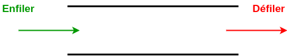

# Files

## I. Définitions

> [!IMPORTANT]
> Une *structure de données linéaire* est une structure de données dans laquelle chaque élément possède une place et dont tous les éléments (sauf le dernier) a un successeur.

> [!IMPORTANT]
> Les *files* sont des structures linéaires de données mutables dans lesquelles les insertions se font d'un côté et les suppressions de l'autre côté de la file.

Nous parlons de structure FIFO (*First In First Out*) pour premier entré, premier sorti en français.



## II. Définition de la file

### a) Type abstrait

La structure d'une file est identique à celle des listes récursives (cf [Listes récursives](./Listes_récursives.md)) en incluant la contrainte que les insertions ne sont possibles que d'un côté et les suppressions de l'autre côté de la liste récursive.

### b) Opérations primitives

Les opérations primitives de la file sont :

- Créer une file vide.

- Vérifier si une file est vide.

- Enfiler un élément à la fin de la file.

- Défiler le sommet de la file.

## III. Implémentation en Python

### a) Classe File

Les files sont implémentées en Python à l'aide de la classe `ListeR`.

La classe `File` contient les opérations primitives définies plus haut dans le chapitre :


```python
from liste import ListeR

class File:
    def __init__(self):
        self.__file = ListeR()
    
    def est_vide(self):
        pass

    def enfile(self, elt : int):
        pass

    def defile(self):
        pass
```

Avec :

- Le constructeur permettant de soit créer une file vide.

- `est_vide()` permettant de vérifier si la file est vide.

- `enfile()` qui prend en paramètre un élément et enfile l'élément à la fin de la file.

- `defile()` permettant de défiler l'élément du sommet de la file et renvoie l'élément défilé.

#### <ins>Application 1</ins>

Compléter les méthodes `est_vide()`, `enfile()` et `defile()` de la classe `File`.

### b) Utilisation de la classe 

```python
>>> f = File()
>>> f.est_vide()
True
>>> f.enfile(2)
>>> f.est_vide()
False
>>> f.enfile(3)
>>> f.defile()
2
```

#### <ins>Application 2</ins>

Sans utiliser l'ordinateur, dessiner à quoi ressemble la file après chaque séquence suivante :

1. Séquence 1
```python
f = File()
f.enfile(2)
f.defile()
f.enfile(5)
```

2. Séquence 2
```python
f = File()
f.enfile(3)
f.enfile(2)
f.defile()
```

3. Séquence 3
```python
f = File()
f.enfile(5)
f.enfile(4)
f.defile()
f.enfile(2)
f.defile()
```
_________

[Exercices](./Exercices/Exercices_files.md)

_______________

[Sommaire](./../../README.md)

___________

<p xmlns:cc="http://creativecommons.org/ns#" xmlns:dct="http://purl.org/dc/terms/"><a property="dct:title" rel="cc:attributionURL" href="https://github.com/boddaert/nsi">Cours NSI</a> by <a rel="cc:attributionURL dct:creator" property="cc:attributionName" href="https://github.com/boddaert">Théo Boddaert</a> is licensed under <a href="https://creativecommons.org/licenses/by/4.0/?ref=chooser-v1" target="_blank" rel="license noopener noreferrer" style="display:inline-block;">CC BY 4.0</a>    </p> 