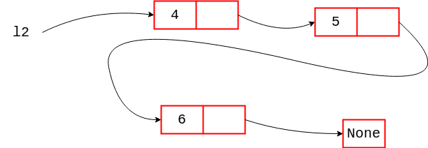

# Listes récursives

## I. Définitions

> [!IMPORTANT]
> Une *structure de données linéaire* est une structure de données dans laquelle chaque élément possède une place et dont tous les éléments (sauf le dernier) a un successeur.

> [!IMPORTANT]
> Une *liste récursive* est une structure de données linéaire utilisant la récursivité. Il s'agit d'une structure mutable, nous pouvons y ajouter ou supprimer des éléments.

> [!WARNING]
> En Python, les listes se définissent avec les crochets `[]`, il s'agit dans ce chapitre d'un autre type de liste.

## II. Définition de la liste récursive

### a) Type abstrait

> [!IMPORTANT]
> Une liste récursive est soit :
>
> - Vide.
> - Un couple constitué :
>     + D'une *tête* représentant le premier élément de la liste récursive.
>     + D'un *reste* : une liste récursive représentant le reste de la liste récursive.

> [!NOTE]
> Il s'agit bien d'une définition récursive puisque le reste est lui-même une liste récursive.

### b) Notation

La liste récursive se note entre parenthèse sous la forme : $(tête, reste)$.

La liste vide se note $\emptyset$.

> [!TIP]
> Par exemple :
>
> La liste constituée d'un unique élément $3$ s'écrit : $(3,(\emptyset))$.
>
> La liste constituée de l'élément $5$ puis $2$ s'écrit : $(5,(2,(\emptyset)))$.

#### <ins>Application 1</ins>

Traduire les listes itératives suivantes en listes récursives :

1. $[1]$

2. $[1,2]$

3. $[1,2,3]$

#### <ins>Application 2</ins>

Traduire les listes récursives suivantes en listes itératives :

1. $(4,(5,(\emptyset)))$

2. $(6,(7,(8,(9,(\emptyset)))))$

#### <ins>Application 3</ins>

Donner la tête des listes récursives suivantes :

1. $(4,(5,(\emptyset)))$

2. $(6,(7,(8,(9,(\emptyset)))))$

#### <ins>Application 4</ins>

Donner le reste des listes récursives suivantes :

1. $(4,(5,(\emptyset)))$

2. $(6,(7,(8,(9,(\emptyset)))))$

### c) Opérations primitives

> [!IMPORTANT]
> Les *opérations primitives* sont celles qui constituent le strict minimum pour la définition d'une structure de données.

Les opérations primitives de la liste récursive sont :

- Créer une liste récursive vide.

- Créer une liste récursive avec une tête et un reste.

- Vérifier si une liste récursive est vide.

- Récupérer la tête de liste récursive.

- Récupérer le reste d'une liste récursive.

### d) Opérations avancées

Voici ci-dessous une liste non exhaustive d'*opérations avancées* pour la liste récursive :

- Récupérer la longueur de la liste récursive.

- Vérifier si un élément est présent ou non dans la liste récursive.

- Récupérer l'élément d'indice $i$ dans la liste récursive.

- Ajouter un élément à l'indice $i$ récursive.

- Supprimer un élément à l'indice $i$ récursive.

- Concaténer deux listes récursives.

## III. Implémentation en Python

### a) Classe ListeR

Les listes récursives sont implémentées en Python à l'aide de la programmation orientée objet.

La classe `ListeR` contient les opérations primitives définies plus haut dans le chapitre :

```python
class ListeR:
    def __init__(self, *args):
        if len(args) == 0 :
            self.__tete = None
            self.__reste = None
        elif len(args) == 2 :
            if isinstance(args[1], ListeR):
                self.__tete = args[0]
                self.__reste = args[1]

    def est_vide(self):
        pass

    def tete(self):
        pass

    def reste(self):
        pass
```

Avec :

- Un constructeur permettant de soit créer une liste vide soit une liste récursive constituée d'une tête et d'un reste.

- `est_vide()` permettant de vérifier si la liste récursive est vide.

- `tete()` permettant de récupérer la tête de la liste récursive.

- `reste()` permettant de récupérer le reste de la liste récursive.

> `*args` est un paramètre représentant une liste d'arguments.

#### <ins>Application 5</ins>

Compléter les méthodes `est_vide()`, `tete()` et `reste()` de la classe `ListeR`.

### b) Utilisation de la classe

```python
>>> l = ListeR()
>>> l.est_vide()
True
>>> l = ListeR(5,ListeR())
>>> l.est_vide()
False
>>> l.tete()
5
>>> l.reste()
<__main__.ListeR object at 0x7f53bffa0400>
```

#### <ins>Application 6</ins>

En utilisant la classe `ListeR`, créer et stocker dans les variables `l1` et `l2` les listes récursives de l'application $2$.

#### <ins>Application 7</ins>

En utilisant les méthodes `tete()` et `reste()`, vérifier vos réponses à l'application $3$ et $4$.

#### <ins>Application 8</ins>

a) Sans utiliser l'ordinateur, donner le résultat des instructions suivantes :

1. Instruction 1
```python
>>> l1.reste().tete()
```

2. Instruction 2
```python
>>> l2.reste().reste().tete()
```

b) Vérifier vos résultats à l'aide de la console Python.

#### <ins>Application 9</ins>

a) Écrire l'instruction permettant de retirer $4$ de `l1`.

b) Écrire l'instruction permettant d'ajouter en tête de `l1` l'élément $8$.

## IV. Représentation en mémoire

Les listes peuvent être représentées en mémoire de deux manière différentes selon la définition de la structure.

Elles peuvent être en **représentation contiguë** ou en **représentation chaînée**.

### a) Représentation contiguë

Lorsque la liste est représentée contiguëllement, elle est stockée en mémoire sous forme de tableau de $N$ cellules.

Dans cette représentation, les cellules sont placées côte à côte les unes à la suite des autres :


Les éléments sont stockés dans les cellules, l'élément d'indice $i$ se trouve donc à la $i-ème$ cellule.

**Avantages :**

- Les cellules possèdent une place $i$, est donc très rapide d'accèder à l'élément d'indice $i$.

**Inconvénients :**

- La taille $N$ d'une liste représentée sous forme de tableau doit être donné lors de la création de la liste, ainsi, le nombre d'élément de la liste ne doit pas dépassé le nombre de cellule.

- Lors d'un ajout ou d'une supression d'élément, le décalage des éléments suivants doit être réalisé.

### b) Représentation chaînée

Lorsque la liste est représentée sous forme chaînée, chaque élément est contenu dans une cellule indépendante des autres.

Dans cette représentation, la cellule possède une information supplémentaire : la référence vers la cellule suivante :



La liste est donc définie sur la référence de la première cellule.

La référence de la dernière cellule est `None`.

**Avantages :**

- L'ajout et la suppression ne nécessite pas de décalage des éléments suivants, il suffit d'ajouter ou supprimer une cellule dans la chaîne et de modifier les références.

- Par conséquent, le nombre de cellule ne doit plus être défini lors de la création de la liste récursive.

**Inconvévients :**

- L'accès à un élément d'indice $i$ nécessite alors de parcourir toute la liste depuis la première cellule.

_________

[Exercices](./Exercices/Exercices_listes_récursives.md)

_______________

[Sommaire](./../../README.md)

___________

<p xmlns:cc="http://creativecommons.org/ns#" xmlns:dct="http://purl.org/dc/terms/"><a property="dct:title" rel="cc:attributionURL" href="https://github.com/boddaert/nsi">Cours NSI</a> by <a rel="cc:attributionURL dct:creator" property="cc:attributionName" href="https://github.com/boddaert">Théo Boddaert</a> is licensed under <a href="https://creativecommons.org/licenses/by/4.0/?ref=chooser-v1" target="_blank" rel="license noopener noreferrer" style="display:inline-block;">CC BY 4.0</a>    </p> 