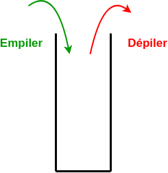

# Piles

## I. Définitions

> [!IMPORTANT]
> Une *structure de données linéaire* est une structure de données dans laquelle chaque élément possède une place et dont tous les éléments (sauf le dernier) a un successeur.

> [!IMPORTANT]
> Les *piles* sont des structures linéaires de données mutables dans lesquelles les insertions et les suppressions ne se font qu'au sommet de la pile.

Nous parlons de structure LIFO (*Last In First Out*) pour dernier entré, premier sorti en français.



## II. Définition de la pile

### a) Type abstrait

La structure d'une pile est identique à celle des listes récursives (cf [Listes récursives](./Listes_récursives.md)) en incluant la contrainte que les insertions/suppressions ne sont possibles que sur la tête de la liste récursive.

### b) Opérations primitives

Les opérations primitives de la pile sont :

- Créer une pile vide.

- Vérifier si une pile est vide.

- Empiler un élément au sommet de la pile.

- Dépiler le sommet de la pile.

## III. Implémentation en Python

### a) Classe Pile

Les piles sont implémentées en Python à l'aide de la classe `ListeR`.

La classe `Pile` contient les opérations primitives définies plus haut dans le chapitre :

```python
from liste import ListeR

class Pile:
    def __init__(self):
        self.__pile = ListeR()
    
    def est_vide(self):
        pass

    def empile(self, elt : int):
        pass

    def depile(self):
        pass
```

Avec :

- Le constructeur permettant de soit créer une pile vide.

- `est_vide()` permettant de vérifier si la pile est vide.

- `empile()` qui prend en paramètre un élément et empile l'élément au sommet de la pile.

- `depile()` permettant de dépiler le sommet de la pile et renvoie l'élément dépilé.

>[!WARNING]
> Nous considèrerons que le sommet de la pile est le premier élément de la liste récursive.

#### <ins>Application 1</ins>

Compléter les méthodes `est_vide()`, `empile()` et `depile()` de la classe `Pile`.

### b) Utilisation de la classe 

```python
>>> p = Pile()
>>> p.est_vide()
True
>>> p.empile(2)
>>> p.est_vide()
False
>>> p.depile()
2
```

#### <ins>Application 2</ins>

Sans utiliser l'ordinateur, dessiner à quoi ressemble la pile après chaque séquence suivante :

1. Séquence 1
```python
p = Pile()
p.empile(5)
p.depile()
p.empile(3)
```

2. Séquence 2
```python
p = Pile()
p.empile(5)
P.empile(6)
p.depile()
```

3. Séquence 3
```python
p = Pile()
p.empile(5)
p.empile(4)
p.depile()
p.empile(2)
p.depile()
```

_________

[Exercices](./Exercices/Exercices_piles.md)

_______________

[Sommaire](./../../README.md)

___________

<p xmlns:cc="http://creativecommons.org/ns#" xmlns:dct="http://purl.org/dc/terms/"><a property="dct:title" rel="cc:attributionURL" href="https://github.com/boddaert/nsi">Cours NSI</a> by <a rel="cc:attributionURL dct:creator" property="cc:attributionName" href="https://github.com/boddaert">Théo Boddaert</a> is licensed under <a href="https://creativecommons.org/licenses/by/4.0/?ref=chooser-v1" target="_blank" rel="license noopener noreferrer" style="display:inline-block;">CC BY 4.0</a>    </p> 