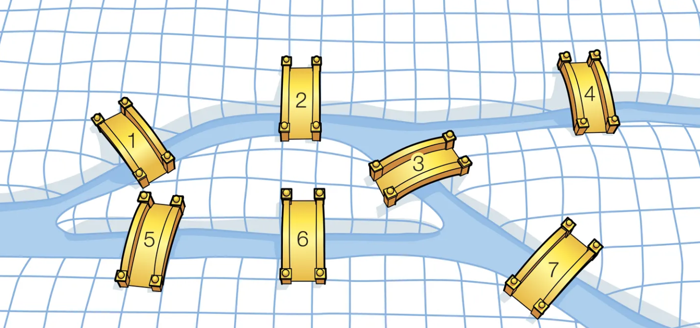

# Activité : Problème des sept ponts de Königsberg

Nature : Débranchée.

Matériel : Aucun.

Prérequis : [Graphes](./Graphes.md)

À faire : Seul.

## I. Objectif

L'objectif est de résoudre le problème des sept ponts de Königsberg à l'aide des graphes.

## II. Enoncé

Au $XVIII^e$ siècle, un problème se discutait beaucoup parmi les habitants de la ville de Königsberg. La ville, construite autour de la rivière Pegel, possédait alors sept ponts. La question était de savoir s'il était possible de se promener dans la ville en traversant chacun des ponts une et une seule fois, dans un ordre quelconque.

## III. Travail à faire

a) Répondre au problème posé ci-dessus.

b) Afin de comprendre pourquoi, modéliser sous forme de graphe le problème des sept ponts de Königsberg.

c) Sur le graphe obtenu, donner le degré de chaque sommet.

d) Effacer le minimum d'arête du graphe pour que la promenade posée par l'énoncé devienne possible.

e) Sur le graphe obtenu, redonner le degré de chaque sommet.

Euler est le mathématicien qui a résolu le problème. Etant pionnier dans la théorie des graphes, on lui donna son nom aux chaînes/chemins qui parcourt tous les sommets du graphe en ne passant qu'une et qu'une seule fois sur toutes les arêtes/arcs d'un graphe.

f) Expliquer le théorème d'Euler : "Un graphe admet un chemin eulérien si et seulement si ses sommets sont de degré pair sauf au plus deux."

g) Donner sur papier au moins deux autres exemples de graphes admettant un chemin eulérien.

h) Donner sur papier au moins deux autres exemples de graphes n'admettant pas de chemin eulérien.

i) Écrire une fonction `admet_chemin_eulerien(g : dict)->bool` qui prend en paramètre un graphe représenté par une liste d'adjacence et renvoie $True$ si `g` admet un chemin eulérien, $False$ sinon.

____________________

[Sommaire](./../../README.md)

___________

<a property="dct:title" rel="cc:attributionURL" href="https://github.com/boddaert/nsi">Cours NSI</a> by <a rel="cc:attributionURL dct:creator" property="cc:attributionName" href="https://github.com/boddaert">Théo Boddaert</a> is licensed under <a href="https://creativecommons.org/licenses/by/4.0/?ref=chooser-v1" target="_blank" rel="license noopener noreferrer" style="display:inline-block;">CC BY 4.0</a>    
 