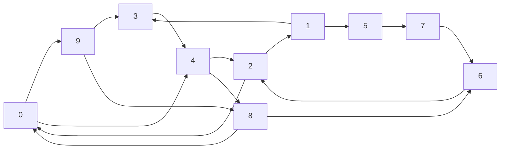

# Exercices

$G =$

## Exercice 1

Écrire une fonction `parcours_largeur_d_abord(g : dict, s : int)->None` qui prend en paramètre un graphe `g` représenté par liste d'adjacence et un sommet de départ et affiche les sommets du graphe dans l'ordre de traitement du parcours en largeur d'abord.

## Exercice 2

Écrire une fonction `parcours_profondeur_d_abord(g : dict, s : int)->None` qui prend en paramètre un graphe `g` représenté par liste d'adjacence et un sommet de départ et affiche les sommets du graphe dans l'ordre de traitement du parcours en profondeur d'abord.

## Exercice 3

> Cet exercice répond au problème de connexité d'un graphe et permet de répondre si un graphe est connexe ou non.

> [!IMPORTANT]
> Un graphe est dit *connexe* si, à partir de chaque sommet, il existe un chemin le reliant à tous les autres sommets du graphe.

a) Dessiner un graphe non connexe d'ordre $5$.

b) À l'issue d'un parcours sur un graphe non connexe, qu'observe t-on dans la liste `est_visite` ?

c) Écrire une fonction `est_connexe(g : dict)->bool` qui prend en paramètre un graphe `g` et renvoie $True$ s'il est connexe, $False$ sinon.

## Exercice 4

> Cet exercice répond au problème de coloration d'un graphe et permet de connaître le nombre chromatique d'un graphe.

> [!IMPORTANT]
> Le *nombre chromatique* d'un graphe est le nombre minimal de couleurs nécessaire à colorier les sommets d'un graphe en respectant la contrainte suivante : chaque sommet ne peut être colorié de la même couleur qu'un sommet voisin.

> [!NOTE]
> La coloration de graphe est un problème utilisé dans les télécommunications : Certains réseaux de télécommunication sont composés d'émetteurs émettant chacun sur une fréquence particulière.
>
> Lorsque deux émetteurs sont trop proches, on ne peut leur allouer la même fréquence à cause des interférences (sauf si éventuellement une montagne les sépare).
>
> Il faut donc modéliser le réseau de télécommunication sous forme de graphe et colorier le graphe de telle façon à trouver le nombre chromatique.

a) Dessiner sur feuille le graphe de Peterson : 

b) Colorier les sommets du graphe et trouver son nombre chromatique.

c) Colorier les sommets du graphe [G](#graphe_g) et trouver son nombre chromatique.

d) Écrire, en français, un algorithme glouton permettant de colorier (avec un nombre de couleurs minimal satisfaisant) un graphe.

## Exercice 5

> Cet exercice répond au problème de plus court chemin dans un graphe non pondéré.

> [!IMPORTANT]
> La *distance* entre deux sommets est le minimum des longueurs des chemins reliant ces deux sommets.

La stratégie est :

1. De parcourir en largeur d'abord le graphe.

2. Et d'ajouter $1$ à la distance à chaque fois que nous passons à un niveau suivant de voisinage.

a) Dessiner sur feuille le graphe [G](#graphe_g).

b) Appliquer, à la main sur le graphe [G](#graphe_g), l'algorithme du parcours en largeur et en numérotant la distance du sommet $0$ à tous les autres sommets.

## Exercice 6

> Cet exercice répond au problème de présence d'un cycle dans un graphe et permet de répondre si un cycle est présent dans un graphe ou non.

La stratégie est :

1. Tous les sommets (non visités) sont coloriés en blanc.

1. Parcourir le graphe avec un parcours en profondeur.

2. Colorier les sommets dans une certaine couleur :

    1. Lorsque nous visitons un sommet, nous le colorons en gris.
    
    2. Si, lors du parcours, nous rencontrons un sommet colorié en gris, nous avons un cycle. S'il n'y a plus de voisins, nous colorons le sommet en noir.

a) Dessiner sur feuille le graphe [G](#graphe_g).

b) Appliquer à la main sur papier l'algorithme de présence d'un cycle sur le graphe [G](#graphe_g).

## Exercice 7 (Difficile)

a) Écrire l'instruction permettant de représenter sous forme de liste d'adjacence le graphe de Peterson.

b) Écrire une fonction `colorie(g : dict)->dict` qui prend en paramètre un graphe `g` **non orienté** représenté par une liste d'adjacence et renvoie un dictionnaire associant chaque sommet à une couleur différente de celle de ses voisins d'après l'algorithme glouton trouvé à l'exercice $4$.

## Exercice 8 (Difficile)

Écrire une fonction `distance(g : dict, depart : int, arrivee : int)->int` qui prend en paramètre un graphe `g` **non pondéré** représenté par une liste d'adjacence, deux sommets et renvoie la distance entre `depart` et `arrivee`.

## Exercice 9 (Difficile)

Écrire une fonction `cycle_present(g : dict)->bool` qui prend en paramètre un graphe `g` représenté par une liste d'adjacence et renvoie $True$ s'il admet un cycle, $False$ sinon.

____________

[Sommaire](./../../../README.md)

___________

<a property="dct:title" rel="cc:attributionURL" href="https://github.com/boddaert/nsi">Cours NSI</a> by <a rel="cc:attributionURL dct:creator" property="cc:attributionName" href="https://github.com/boddaert">Théo Boddaert</a> is licensed under <a href="https://creativecommons.org/licenses/by/4.0/?ref=chooser-v1" target="_blank" rel="license noopener noreferrer" style="display:inline-block;">CC BY 4.0</a>    
 