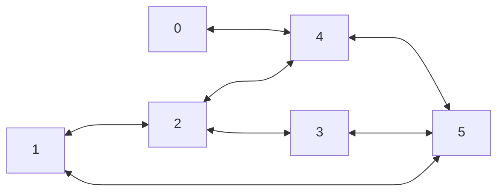
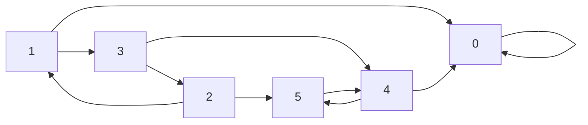

# Graphes

## I. Définitions

> [!IMPORTANT]
Une *structure relationnelle de données* est une structure dans laquelle les données sont en relations entre elles.

> [!IMPORTANT]
> Un *graphe* est une structure relationnelle de données. C'est est un ensemble de nœuds appelés *sommets* reliés entre eux ou non par des liens.

> [!IMPORTANT]
> L'*ordre* d'un graphe est son nombre de sommets.

#### <ins>Application 1</ins>

Donner des exemples informatiques ou de la vie quotidienne de structures pouvant se présenter sous la forme d'un graphe.

## II. Graphes non orientés

### a) Type abstrait

> [!IMPORTANT]
> Un graphe *non orienté* est un graphe dont les liens sont empruntables dans les deux sens et sont appelés *arêtes*.

> [!IMPORTANT]
> Un graphe non orienté est un couple constitué :
>
> - D'un ensemble finis de sommets.
>
> - D'un ensemble finis d'arêtes.

### b) Notation

Les graphes non orientés sont notés entre paranthèses sous la forme d'un couple $(V,E)$ avec :

- $V$ l'ensemble finis de sommets.

- $E$ l'ensemble de $V\times V$ symétrique d'arêtes.

> [!TIP]
> Par exemple, le graphe non orienté $GNO = ((0, 1, 2, 3, 4, 5), ((0,1), (0,2), (0,3), (0,4), (3,4), (2,3), (2,5), (4,1)))$ avec :
>
> - $V = (0, 1, 2, 3, 4, 5)$ 
>
> - $E = ((0,1), (0,2), (0,3), (0,4), (3,4), (2,3), (2,5), (4,1))$ 

### c) Représentation sagitalle

Les graphes non orientés peuvent être représenté sagitallement, c'est-à-dire sous la forme d'un dessin.

> [!TIP]
> Par exemple, la représentation sagitalle du graphe $GNO$ est :
> ```mermaid
>     flowchart LR
>         0 <---> 1
>         0 <---> 2
>         0 <---> 3
>         0 <---> 4
>         3 <---> 4
>         2 <---> 3
>         2 <---> 5
>         4 <---> 1
> ```

#### <ins>Application 2</ins>

Donner la représentation sagitalle du graphe non orienté $G1 = ((A, B, C, D, E, F, G), ((A,D), (A,F), (B,F), (B,G), (C,D), (D,E), (E,F), (E,G), (F,G)))$

#### <ins>Application 3</ins>

Donner le type abstrait du graphe $G2$ suivant d'après sa représentation sagitalle :



### d) Propriétés

> [!IMPORTANT]
> Deux sommets sont *adjacents* (ou *voisins*) s'il existe une arête entre eux.

> [!IMPORTANT]
> Le *degré d'un sommet* est le nombre d'arêtes reliées à ce sommet.

> [!IMPORTANT]
> Une *chaîne* est une suite de sommets voisins consécutifs.

> [!IMPORTANT]
> La *longueur d'une chaîne* est le nombre de sommets composant la chaîne.

> [!IMPORTANT]
> Un *cycle* est une chaîne dont le premier et dernier sommet sont identiques.

#### <ins>Application 4</ins>

a) Sur le graphe $G1$, donner les sommets adjacents du sommet $F$.

b) En déduire le degré du sommet $F$.

c) Donner une chaîne du graphe $G2$ de longueur $4$.

d) Donner un cycle du graphe $G2$ de longueur $4$.

## III. Graphes orientés

### a) Type abstrait

> [!IMPORTANT]
> Un graphe *orienté* est un graphe dont les liens sont empruntables uniquement dans un seul sens (et sont alors représentés d'une flèche) et sont appelés *arcs*.

> [!IMPORTANT]
> Un graphe orienté est un couple constitué :
>
> - D'un ensemble finis de sommets.
>
> - D'un ensemble finis d'arcs.

### b) Notation

Les graphes orientés sont notés entre parenthèses sous la forme d'un couple $(V,E)$ où :

- $V$ est l'ensemble finis de sommets.

- $E$ est un ensemble finis de $V\times V$ avec le premier $V$ représentant le sommet de départ de l'arc et le second représentant le sommet d'arrivée de l'arc.

> [!TIP]
> Par exemple, le graphe orienté $GO = ((0, 1, 2, 3, 4, 5, 6), ((0,1), (1,0), (0,2), (2,0), (3,1), (3,4), (4,3), (1,4), (0,5), (5,6), (6,5)))$ avec :
>
> - $V=(0, 1, 2, 3, 4, 5, 6)$ 
>
> - $E=((0,1), (1,0), (0,2), (2,0), (3,1), (3,4), (4,3), (1,4), (0,5), (5,6), (6,5))$ 

### c) Représentation sagitalle

Les graphes orientés peuvent être représenté sagitallement, c'est-à-dire sous la forme d'un dessin.

> [!TIP]
> Par exemple, la représentation sagitalle du graphe $GO$ est :
> ```mermaid
>     flowchart LR
>         0 --> 1
>         1 --> 0
>         0 --> 2
>         2 --> 0
>         3 --> 1
>         3 --> 4
>         4 --> 3
>         1 --> 4
>         0 --> 5
>         5 --> 6
>         6 --> 5
> ```

#### <ins>Application 5</ins>

Donner la représentation sagitalle du graphe orienté $G3 = ((A, B, C, D, E, F, G), ((A,F), (A,G), (B,C), (C,D), (C,E), (C,F), (D,G), (D,F), (E,G)))$.

#### <ins>Application 6</ins>

Donner le type abstrait du graphe $G4$ suivant d'après sa représentation sagitalle.



### d) Propriétés

> [!IMPORTANT]
> Le sommet $j$ est *adjacent* (ou *voisin*) du sommet $i$ s'il existe un arc dont l'extrémité initiale est $i$ et l'extrémité finale est $j$.

> [!IMPORTANT]
> $j$ est alors *successeur* de $i$, et $i$ prédécesseur de $j$.

> [!IMPORTANT]
> Le *degré entrant d'un sommet* est le nombre de prédécesseurs de ce sommet.

> [!IMPORTANT]
> Le *degré sortant d'un sommet* est le nombre de succésseurs de ce sommet.

> [!IMPORTANT]
> Un *chemin* est une suite de sommets voisins consécutifs.

> [!IMPORTANT]
> La *longueur d'un chemin* est le nombre de sommets composant le chemin.

> [!IMPORTANT]
> Un *cycle* est une chaîne dont le premier et dernier sommet sont identiques.

#### <ins>Application 7</ins>

a) Sur le graphe $G3$, donner les sommets adjacents du sommet $C$.

b) En déduire le degré entrant et sortant du sommet $C$.

c) Donner un chemin du graphe $G4$ de longueur $4$.

d) Donner un cycle du graphe $G4$ de longueur $4$.

## IV. Graphes pondérés (hors programme)

### a) Type abstrait

> [!IMPORTANT]
> Un graphe *pondéré* (ou *valué*) est un graphe dont les liens possèdent une valeur appelée *poids*.

> [!IMPORTANT]
> Un graphe pondéré est un couple constitué :
>
> - D'un ensemble finis de sommets.
>
> - D'un ensemble finis d'arêtes/d'arcs valués.

### b) Notation

Les graphes pondérés sont notés entre parenthèses sous la forme d'un couple $(V,E)$ où :

- $V$ est l'ensemble finis de sommets.

- $E$ est un ensemble finis de $V\times V \times p$ avec $p$ le poids du lien.

> [!TIP]
> Par exemple, le graphe pondéré $GP = ((0, 1, 2, 3, 4, 5), ((0,1,3), (0,2,6), (0,3,9), (0,4,1), (3,4,5), (2,3,7), (2,5,4), (4,1,2)))$ avec :
>
> - $V=(0, 1, 2, 3, 4, 5)$ 
>
> - et $E=((0,1,3), (0,2,6), (0,3,9), (0,4,1), (3,4,5), (2,3,7), (2,5,4), (4,1,2))$ 

### c) Représentation sagitalle

Les graphes pondérés peuvent être représenté sagitallement, c'est-à-dire sous forme de dessin.

> [!TIP]
> Par exemple, la représentation sagitalle du graphe pondéré $GP$ est :
> ```mermaid
>     flowchart LR
>         0 --3--- 1
>         0 --6--- 2
>         0 --9--- 3
>         0 --1--- 4
>         3 --5--- 4
>         2 --7--- 3
>         2 --4--- 5
>         4 --2--- 1
> ```

## V. Représentations en machine

Les graphes peuvent être représentés par **matrice d'adjacence** ou par **liste d'adjacence** en machine.

### a) Matrice d'adjacence

> [!IMPORTANT]
> Une *matrice d'adjacence* est un tableau à deux dimensions $n \times n$ pour un graphe d'ordre $n$.

> [!WARNING]
> Avec $i$ le numéro de ligne et $j$ le numéro de colone, nous indiquons d'un $1$ si le sommet $j$ est adjacent du sommet $i$ et d'un $0$ sinon.

> [!TIP]
> Par exemple le graphe orienté $G$ :
>
> ```mermaid
>     flowchart LR
>         0 --> 1
>         1 --> 0
>         0 --> 2
>         2 --> 0
>         3 --> 1
>         3 --> 4
>         4 --> 3
>         1 --> 4
> ```
>
> Est représenté en machine par la matrice d'adjacence suivante :
>
> $$ 
> G =
> \begin{pmatrix}
> 0 & 1 & 1 & 0 & 0 \\
> 1 & 0 & 0 & 0 & 1 \\
> 1 & 0 & 0 & 0 & 0 \\
> 0 & 0 & 0 & 0 & 1 \\
> 0 & 0 & 0 & 1 & 0 
> \end{pmatrix}
> $$

#### <ins>Application 8</ins>

Donner sur papier la matrice d'adjacence du graphe $G2$.

### b) Implémentation des matrices d'adjacence

L'implémentation des matrices d'adjacence en Python se fait naturellement par une liste de listes.

> [!TIP]
> Par exemple :
> ```python
> G = [[0, 1, 1, 0, 0],
>     [1, 0, 0, 0, 1],
>     [1, 0, 0, 0, 0],
>     [0, 0, 0, 0, 1],
>     [0, 0, 0, 1, 0]]
> ```

Le résultat de l'instruction `G[i][j]` indique alors si le sommet $j$ est adjacent du sommet $i$.

> [!TIP]
> Par exemple :
> ```python
> >>> G[0][1]
> 1
> >>> G[2][3]
> 0
> ```

#### <ins>Application 9</ins>

Implémenter en Python la matrice d'adjacence du graphe $G2$.

### c) Liste d'adjacence

> [!IMPORTANT]
> Une *liste d'adjacence* est une liste de $n$ listes dans lesquelles il y a les voisins de $i$.

> [!TIP]
> Par exemple le graphe non orienté $G$ :
>
> ```mermaid
>     flowchart LR
>         0 --- 1
>         2 --- 0
>         3 --- 1
>         4 --- 3
>         1 --- 4
> ```
>
> Est représenté en machine par la liste d'adjacence suivante :
>
> - $0 : 1, 2$
> - $1 : 0, 3, 4$
> - $2 : 0$
> - $3 : 1, 4$
> - $4 : 1, 3$

#### <ins>Application 10</ins>

Donner sur papier la liste d'adjacence du graphe $G4$.

### d) Implémentation des listes d'adjacence

L'implémentation des listes d'adjacence en Python se fait naturellement par un dictionnaire de listes.

> [!TIP]
> Par exemple :
> ```python
> G = {0 : [1, 2],
>     1 : [0, 3, 4],
>     2 : [0],
>     3 : [1, 4],
>     4 : [1, 3]}
> ```

L'instruction `G[i]` renvoie alors les sommets adjacents du sommet $i$.

> [!TIP]
> Par exemple :
> ```python
> >>> G[1]
> [0, 3, 4]
> >>> G[2]
> [0]
> ```

#### <ins>Application 11</ins>

Implémenter en Python la liste d'adjacence du graphe $G4$.

______________

[Exercices](./Exercices/Exercices_graphes.md)

______________

[Sommaire](./../../README.md)

___________

<p xmlns:cc="http://creativecommons.org/ns#" xmlns:dct="http://purl.org/dc/terms/"><a property="dct:title" rel="cc:attributionURL" href="https://github.com/boddaert/nsi">Cours NSI</a> by <a rel="cc:attributionURL dct:creator" property="cc:attributionName" href="https://github.com/boddaert">Théo Boddaert</a> is licensed under <a href="https://creativecommons.org/licenses/by/4.0/?ref=chooser-v1" target="_blank" rel="license noopener noreferrer" style="display:inline-block;">CC BY 4.0</a>    </p> 