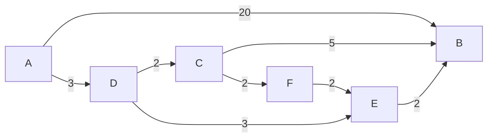

# Activité : Vacances à la plage

Nature : Débranchée

Matériel : Aucun

Prérequis : Graphes

Groupe : Par deux

## I. Objectif

L'objectif de cette activité est d'appliquer l'algorithme de Dijkstra sur un graphe afin de répondre au problème de chemin de poids minimal.

## II. Enoncé

Depuis Valenciennes, vous décidez de passer vos vacances à la plage à Boulogne-sur-mer. Pour y aller, vous repérez le montant des péages de chaque autoroute et les notez dans le tableau ci-dessous :

| Ville de départ | Ville de destination | Montant du péage |
| :---: | :---: | :---: |
| Valenciennes | Cambrai | $0$ |
| Valenciennes | Douai | $15$ |
| Valenciennes | Lille | $10$ |
| Douai | Arras | $15$ |
| Douai | Lens | $17$ |
| Arras | Béthune | $13$ |
| Lens | Béthune | $22$ |
| Lille | Lens | $10$ |
| Lille | Dunkerque | $50$ |
| Béthune | Saint-Omer | $31$ |
| Dunkerque | Calais | $2$ |
| Saint-Omer | Calais | $19$ |
| Saint-Omer | Boulogne-sur-Mer | $14$ |
| Calais | Boulogne-sur-Mer | $4$ |

Vous remarquez que cela ressemble fortement à un graphe orienté pondéré et décidez d'utiliser un algorithme permettant de trouver le chemin de poids minimal afin de dépenser le moins d'argent possible dans les péages.

## III. Algorithme de Dijkstra

L'algorithme de Dijkstra se présente sous la forme d'un tableau des distances.

A chaque étapes, nous notons la distance des voisins du sommet où l'on se trouve et sélectionnons la plus petite.

Il ne faut pas bien sûr oublier d'additionner les poids des arcs au fur et à mesure de notre avancée.

Si nous remarquons que nous pouvons visiter un sommet avec une distance plus petite que celle déjà notée, nous devons mettre à jour la distance.

Soit $G$ le graphe pondéré suivant :

Appliquer l'algorithme de Dijkstra à partir du sommet $A$ donne le tableau suivant :

| / | $dA$ | $dB$ | $dC$ | $dD$ | $dE$ | $dF$ |
| :---: | :---: | :---: | :---: | :---: | :---: | :---: |
| / | $0^*$ | $+\infty$ | $+\infty$ | $+\infty$ | $+\infty$ | $+\infty$ |
| $A$ | / | $20$ | $+\infty$ | $3^*$ | $+\infty$ |$+\infty$ |$+\infty$ |
| $D$ | / | $20$ | $5^*$ | / | $6$ | $+\infty$ |
| $C$ | / | $10$ | / | / | $6^*$ | $7$ |
| $E$ | / | $8$ | / | / | / | $7^*$ |
| $F$ | / | $8^*$ | / | / | / | / |

## VI. Travail à faire

a) A quoi correspond la première colonne du tableau d'exemple ?

b) A quoi correspondent toutes les autres colonnes du tableau ?

c) Pourquoi sur la première ligne, la distance vers $A$ est de $0$ et la distance vers les autres sommets est de $+\infty$ ?

d) A l'aide du tableau, donner le chemin de poids minimal du sommet $A$ au sommet $B$ et sa valeur.

e) Reprendre la carte et le tableau du montant des péages donnés dans l'énoncé et dessiner le graphe correspondant.

f) Appliquer l'algorithme de Dijkstra sur ce graphe à partir du sommet représentant la ville de Valenciennes et faire le tableau.

g) En déduire, le chemin de poids minimal du sommet de Valenciennes au sommet de Boulogne-sur-mer.

___________________

[Sommaire](./../README.md)
