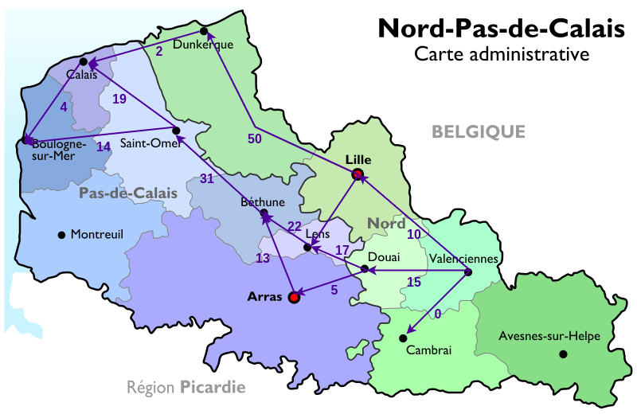
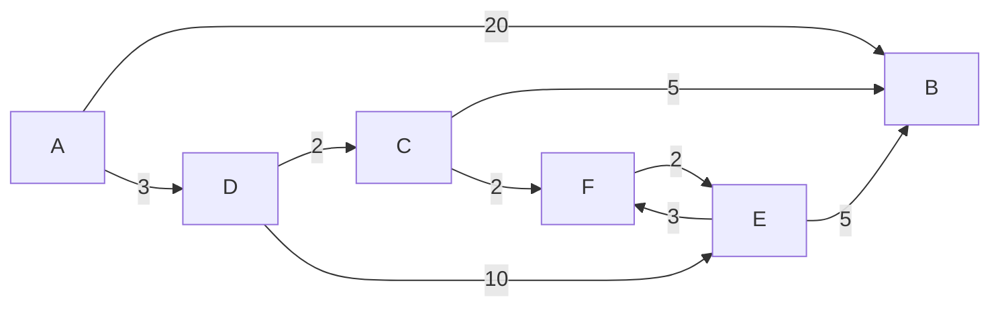

# Activité : Vacances à la plage

Nature : Débranchée

Matériel : Aucun

Prérequis : Graphes

Groupe : Par deux

## I. Objectif

L'objectif de cette activité est d'appliquer l'algorithme de Dijkstra sur un graphe afin de répondre au problème de chemin de poids minimal.

## II. Enoncé

Depuis Valenciennes, vous décidez de passer vos vacances à la plage à Boulogne-sur-mer. Pour y aller, vous repérez le montant des péages de chaque autoroute et les notez sur la carte ci-dessous :

Vous remarquez que cela ressemble fortement à un graphe pondéré et décidez d'utiliser un algorithme permettant de trouver le chemin de poids minimal.

## III. Algorithme de Dijkstra

L'algorithme de Dijkstra se présente sous la forme d'un tableau des distances.

A chaque étapes, nous notons la distance des voisins du sommet où l'on se trouve et sélectionnons la plus petite.

Il ne faut pas bien sûr oublier d'additionner les poids des arcs au fur et à mesure de notre avancée.

Si nous remarquons que nous pouvons visiter un sommet avec une distance plus petite que celle déjà notée, nous devons mettre à jour la distance.

Soit $G$ le graphe pondéré suivant :

Appliquer l'algorithme de Dijkstra à partir du sommet $1$ donne le tableau suivant :

| / | $dA$ | $dB$ | $dC$ | $dD$ | $dE$ | $dF$ |
| :---: | :---: | :---: | :---: | :---: | :---: | :---: |
| / | $0^*$ | $+\infty$ | $+\infty$ | $+\infty$ | $+\infty$ | $+\infty$ |
| $A$ | / | $20$ | $+\infty$ | $3^*$ | $+\infty$ |$+\infty$ |$+\infty$ |
| $D$ | / | $20$ | $5$ | 