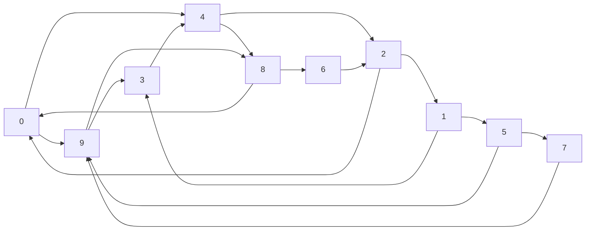

# Exercices

$G =$

## Exercice 1

Ecrire une fonction `parcours_largeur_d_abord(g : dict, s : int)->None` qui prend en paramètre un graphe `g` représenté par liste d'adjacence et un sommet de départ et affiche les sommets du graphe dans l'ordre de traitement du parcours en largeur d'abord.

## Exercice 2

Ecrire une fonction `parcours_profondeur_d_abord(g : dict, s : int)->None` qui prend en paramètre un graphe `g` représenté par liste d'adjacence et un sommet de départ et affiche les sommets du graphe dans l'ordre de traitement du parcours en profondeur d'abord.

## Exercice 3

Cet exercice répond au problème de connexité d'un graphe et permet de répondre si un graphe est connexe ou non.

Un graphe est dit *connexe* si, à partir de chaque sommet, il existe un chemin le reliant à tous les autres sommets du graphe.

a) Dessiner un graphe non connexe d'ordre $5$.

b) A l'issue d'un parcours sur un graphe non connexe, qu'observe t-on dans la liste `est_visite` ?

c) Ecrire une fonction `est_connexe(g : dict)->bool` qui prend en paramètre un graphe `g` et renvoie $True$ s'il est connexe, $False$ sinon.

## Exercice 4

Cet exercice répond au problème de coloration d'un graphe et permet de connaître le nombre chromatique d'un graphe.

Le *nombre chromatique* d'un graphe est le nombre minimal de couleurs nécessaire à colorier les sommets d'un graphe en respectant la contrainte suivante : chaque sommet ne peut être colorié de la même couleur qu'un sommet voisin.

a) Trouver le nombre chromatique du graphe $G$.

b) Trouver le nombre chromatique du graphe de Peterson :

c) Ecrire en Français, un algorithme glouton permettant de colorier (avec le moins de couleur possible) un graphe.

## Exercice 5

Cet exercice répond au problème de plus court chemin dans un graphe non pondéré.

La stratégie est de parcourir en largeur d'abord le graphe et d'ajouter $1$ à la distance à chaque fois que nous passons à un niveau suivant.

a) 

## Exercice 5

Cet exercice répond au problème de présence d'un cycle dans un graphe et permet de répondre si un cycle est présent dans un graphe ou non.

La stratégie est de parcourir le graphe avec un parcours en profondeur et en coloriant les sommets.

Tous les sommets non visités sont blancs.

Lorsque nous visitons un sommet, nous le colorons en gris. Si, lors du parcours, nous rencontrons un sommet colorié en gris, nous avons un cycle. S'il n'y a plus de voisins, nous colorons le sommet en noir.

Appliquer l'algorithme de présence d'un cycle sur le graphe $G$.

## Exercice 6 (Difficile)

Ecrire une fonction `colorie(g : dict)->dict` qui prend en paramètre un graphe `g` représenté par liste d'adjacence et renvoie un dictionnaire associant chaque sommet à une couleur.

## Exercice 7 (Difficile)

Ecrire une fonction `cycle_present(g : dict)->bool` qui prend en paramètre un graphe `g` représenté par liste d'adjacence et renvoie $True$ s'il admet un cycle, $False$ sinon.

____________

[Sommaire](./../../README.md)