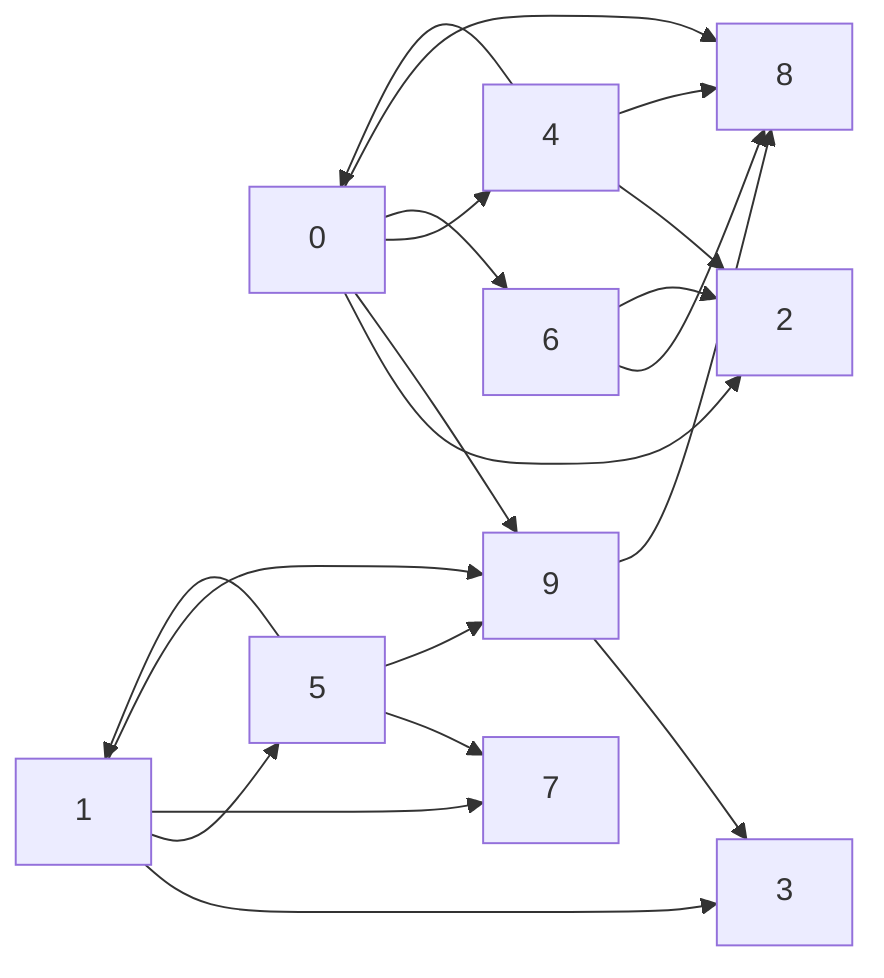

# Exercices 

## Exercice 1

$G =$

a) En considérant la représentation sagitalle du graphe $G$ ci-dessus, répondre aux questions suivantes :

1. Le graphe $G$ est-il non orienté, orienté, pondéré ?

2. Donner l'ordre du graphe $G$.

3. Donner les sommets adjacents du sommet $1$, $4$, $9$.

4. Donner le degré entrant et sortant du sommet $4$.

5. Donner un chemin possible du graphe $G$ de longueur $6$.

6. Donner un cycle possible du graphe $G$.

b) Donner sur papier la matrice d'adjacence du graphe $G$ puis l'implémenter en Python en le nommant `G_matrice`.

c) Avec `G_matrice`, écrire l'instruction permettant d'indiquer si le sommet $9$ est adjacent du sommet $5$.

d) Donner sur papier la liste d'adjacence du graphe $G$ puis l'implémenter en Python en le nommant `G_liste`.

e) Avec `G_liste`, écrire l'instruction permettant d'indiquer si le sommet $0$ est adjacent du sommet $6$.

**Pour chacune des fonctions écrites ci-après, tester-les en utilisant `G_matrice` et `G_liste`.**

## Exercice 2

a) Ecrire une fonction `ordre_graphe_matrice(g : list)->int` qui prend en paramètre un graphe `g` représenté par matrice d'adjacence et renvoie son ordre.

b) Ecrire une fonction `ordre_graphe_liste(g : dict)->int` qui prend en paramètre un graphe `g` représenté par liste d'adjacence et renvoie son ordre.

## Exercice 3

a) Ecrire une fonction `est_adjacent_matrice(g : list, i : int, j : int)->bool` qui prend en paramètre un graphe `g` représenté par matrice d'adjacence, deux sommets `i` et `j` et renvoie $True$ si `j` est un sommet adjacent du sommet `i`, $False$ sinon.

b) Ecrire une fonction `est_adjacent_liste(g : list, i : int, j : int)->bool` qui prend en paramètre un graphe `g` représenté par liste d'adjacence, deux sommets `i` et `j` et renvoie $True$ si `j` est un sommet adjacent du sommet `i`, $False$ sinon.

## Exercice 4

a) Ecrire une fonction `voisins_matrice(g : list, i : int)->list` qui prend en paramètre un graphe `g` représenté par matrice d'adjacence, un sommet et renvoie la liste des sommets adjacents du sommet `i`.

b) Ecrire une fonction `voisins_liste(g : dict, i : int)->list` qui prend en paramètre un graphe `g` représenté par liste d'adjacence, un sommet et renvoie la liste des sommets adjacents du sommet `i`.

## Exercice 5

En fonction des programmes donnés en réponse aux exercices trois et cinq, donner les avantages et les inconvénients de représenter son graphe par matrice d'adacence ou par liste d'adjacence.

## Exercice 6

Ecrire une fonction `est_chemin(g : dict, chemin : list)->bool` qui prend en paramètre un graphe `g` représenté par une liste d'adjacence et une liste et renvoie $True$ si `chemin` est un chemin de `g`, $False$ sinon.

## Exercice 7

Ecrire une fonction `degre_sortant(g : dict, i : int)->int` qui prend en paramètre un graphe `g` représenté par une liste d'adjacence et un sommet et renvoie le degré sortant de `i`.

## Exercice 8 (Difficile)

Un graphe est dit *complet* si chaque sommet du graphe est adjacent de tous les autres sommets.

a) Dessiner un graphe complet d'ordre 5.

b) Ecrire une fonction `est_complet(g : dict)->bool` qui prend en paramètre un graphe `g` et renvoie $True$ s'il est complet, $False$ sinon.

__________________

[Sommaire](./../../README.md)