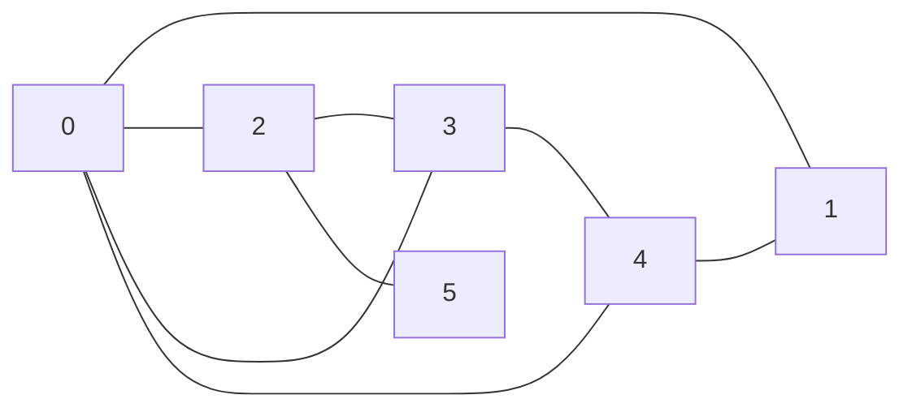
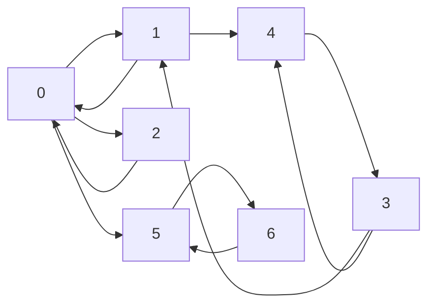

# Graphes

## I. Définitions

Une *structure relationnelle de données* est une structure dans laquelle les données sont en relations entre elles.

Un *graphe* est une structure relationnelle de données.

Un *graphe* est un ensemble de noeuds appelés *sommets* reliés entre eux ou non par des liens.

L'*ordre* d'un graphe est son nombre de sommets.

##### Application 1

Donner des exemples informatiques ou de la vie quotidienne de structures pouvant se présenter sous la forme d'un graphe.

## II. Graphes non orientés

### a) Définition

Dans un graphe dit *non orienté*, les liens sont empruntables dans les deux sens et sont appelés *arêtes*.

### b) Type abstrait

Un graphe non orienté $G$ est un couple $(V,E)$ où $V$ est un ensemble finis de sommets et $E$ est un ensemble finis de $V\times V$ symétrique d'arêtes.

### c) Représentation sagitalle

Par exemple, le graphe non orienté $G$ avec 

- $V=(0, 1, 2, 3, 4, 5)$ 

- et $E=((0,1), (0,2), (0,3), (0,4), (3,4), (2,3), (2,5), (4,1))$ 

peut être représenté sagitallement :



### d) Propriétés

Deux sommets sont *adjacents* (ou *voisins*) s'il existe une arête entre eux.

Le *degré d'un sommet* est le nombre de voisins de ce sommet.

Une *chaîne* est une suite de sommets voisins consécutifs.

La *longueur d'une chaîne* est le nombre de sommets composant la chaîne.

Un *cycle* est une chaîne dont le premier et dernier sommet sont identiques.

## III. Graphes orientés

### a) Définition

Dans un graphe dit *orienté*, les liens sont empruntables uniquement dans un seul sens (et sont alors représentés d'une flèche) et sont appelés *arcs*.

### b) Type abstrait

Un graphe orienté $G$ est un couple $(V,E)$ où $V$ est un ensemble finis de sommets et $E$ est un ensemble finis de $V\times V$ avec le premier $V$ représentant l'extrémité initiale de l'arc et le second représentant l'extrémité finale de l'arc.

### c) Représentation sagitalle

Par exemple, le graphe orienté $G$ avec 

- $V=(0, 1, 2, 3, 4, 5, 6)$ 

- et $E=((0,1), (1,0), (0,2), (2,0), (3,1), (3,4), (4,3), (1,4), (0,5), (5,6), (6,5))$ 

peut être représenté sagitallement :



### d) Propriétés

Le sommet $v$ est *adjacent* (ou *voisin*) du sommet $u$ s'il existe un arc dont l'extrémité initiale est $u$ et l'extrémité finale est $v$.

$v$ est alors *successeur* de $u$, et $u$ prédécesseur de $v$.

Le *degré entrant d'un sommet* est le nombre de prédécesseurs de ce sommet.

Le *degré sortant d'un sommet* est le nombre de succésseurs de ce sommet.

Un *chemin* est une suite de sommets voisins consécutifs.

La *longueur d'un chemin* est le nombre de sommets composant le chemin.

Un *cycle* est une chaîne dont le premier et dernier sommet sont identiques.

## IV. Graphes pondérés

### a) Définition

Dans un graphe est dit *pondéré* (ou *valué*) si une valeur appelée *poids* est attribuée aux liens.

### b) Type abstrait

Un graphe pondéré $G$ est un couple $(V,E)$ où $V$ est un ensemble finis de sommets et $E$ est un ensemble finis de $V\times V \times p$ avec $p$ le poids du lien.

### c) Représentation sagitalle

Par exemple, le graphe orienté $G$ avec 

- $V=(0, 1, 2, 3, 4, 5)$ 

- et $E=((0,1), (3,1), (3,4), (1,4), (0,5), (5,6), (2,5))$ 

peut être représenté sagitallement :

```mermaid
    flowchart LR
        0-- 3 --1
        3-- 8 --1
        3-- 2 --4
        1-- 7 --4
        0-- 6 --5
        5-- 3 --6
        2-- 9 --5
```


## VI. Représentations en machine

## Connexité
## VII. Algorithmes