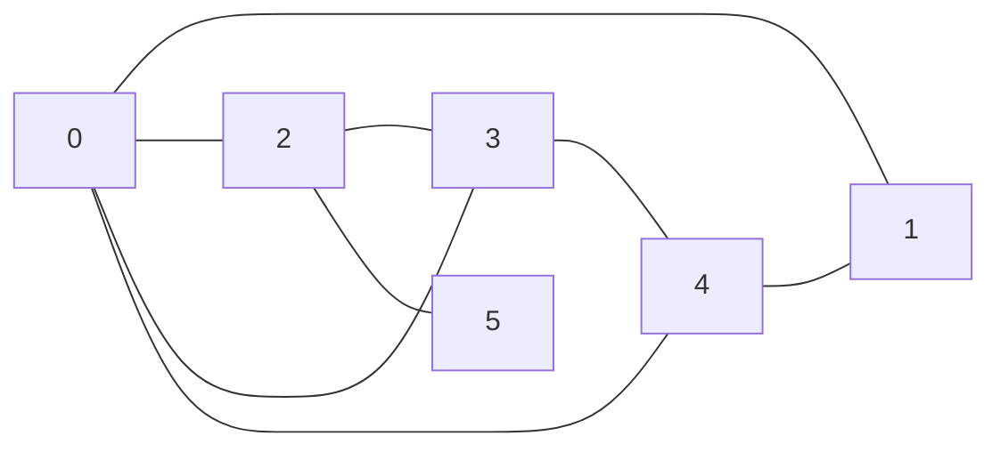
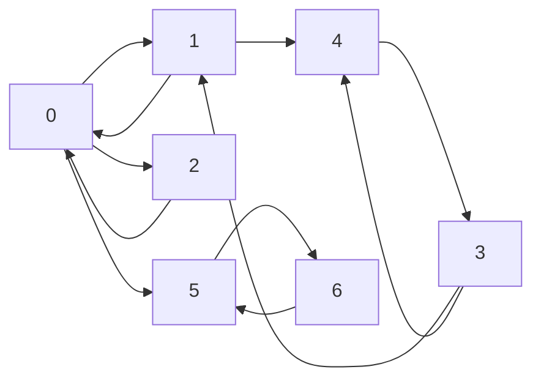

# Graphes

## I. Définitions

Une *structure relationnelle de données* est une structure dans laquelle les données sont en relations entre elles.

Un *graphe* est une structure relationnelle de données.

Un *graphe* est un ensemble de noeuds appelés *sommets* reliés entre eux ou non par des liens.

##### Application 1

Donner des exemples informatiques ou de la vie quotidienne de structures pouvant se présenter sous la forme d'un graphe.

## II. Graphes non orientés

### a) Définition

Dans un graphe dit *non orienté*, les liens fonctionnent dans les deux sens et sont appelés *arêtes*.

### b) Type abstrait

Un graphe non orienté $G$ est un couple $(V,E)$ où $V$ est un ensemble finis de sommets et $E$ est un ensemble finis de $V\times V$ symétrique d'arêtes.

### c) Représentation sagitalle

Par exemple, le graphe non orienté $G$ avec 

- $V=(0, 1, 2, 3, 4, 5)$ 

- et $E=((0,1), (0,2), (0,3), (0,4), (3,4), (2,3), (2,5), (4,1))$ 

peut être représenté sagitallement :

## III. Graphes orientés

### a) Définition

Dans un graphe dit *orienté*, les liens fonctionnent dans un unique sens (et sont alors représentés d'une flèche) et sont appelés *arcs*.

### b) Type abstrait

Un graphe orienté $G$ est un couple $(V,E)$ où $V$ est un ensemble finis de sommets et $E$ est un ensemble finis de $V\times V$ avec le premier $V$ représentant l'extrimité initiale de l'arc et le second représentant l'extrimité finale de l'arc.

### c) Représentation sagitalle

Par exemple, le graphe orienté $G$ avec 

- $V=(0, 1, 2, 3, 4, 5, 6)$ 

- et $E=((0,1), (1,0), (0,2), (2,0), (3,1), (3,4), (4,3), (1,4), (0,5), (5,6), (6,5))$ 

peut être représenté sagitallement :

## IV. Graphes pondérés

## V. Propriétés

## VI. Représentations en machine

## VII. Algorithmes