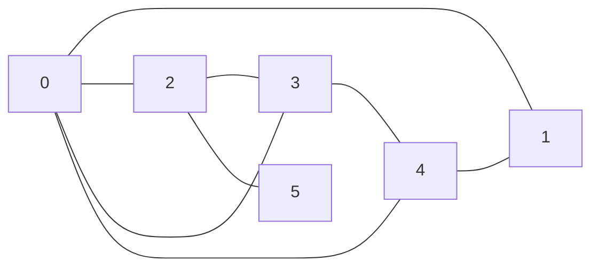
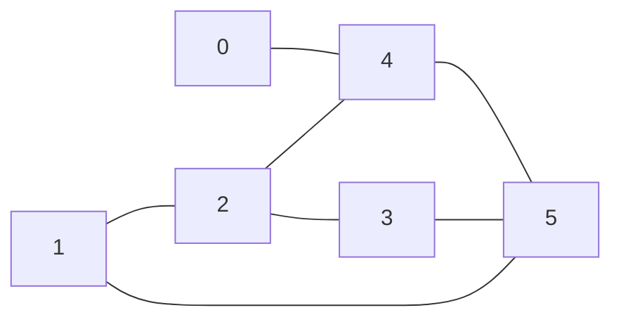
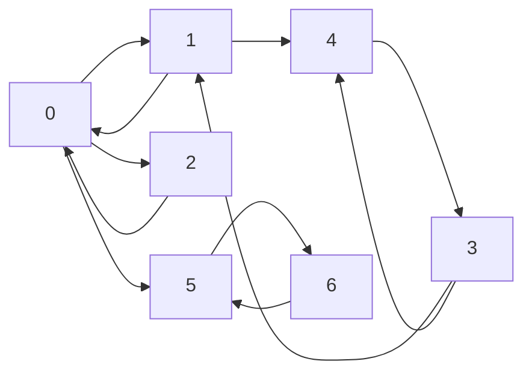
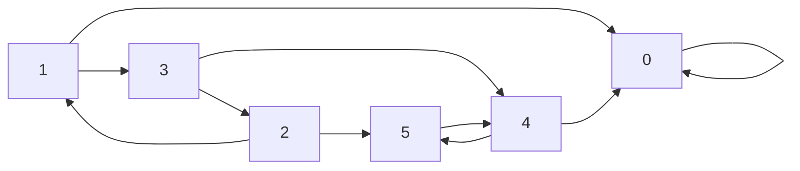
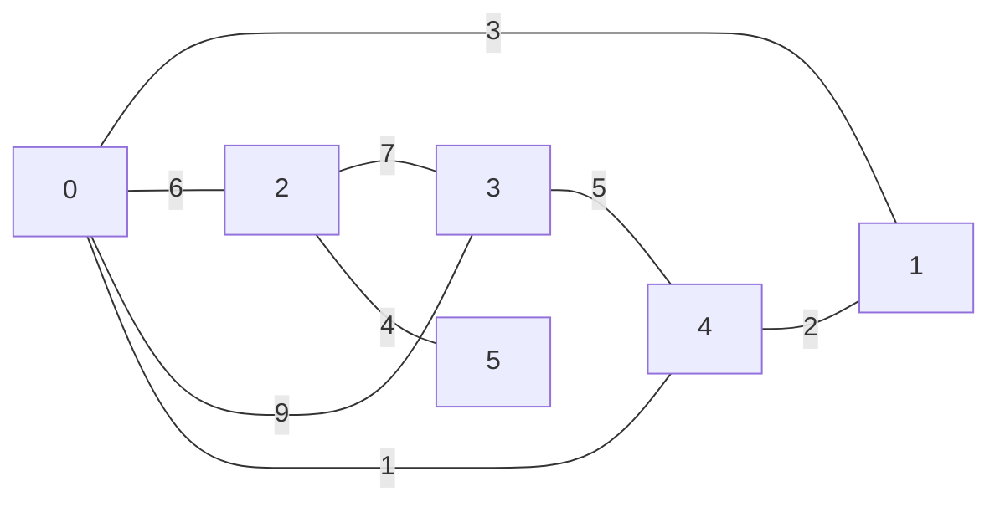
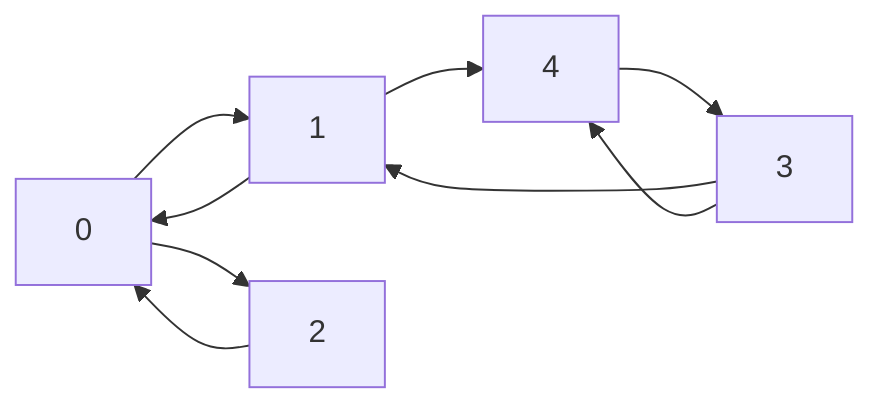
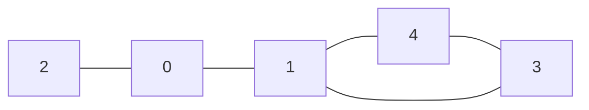

# Graphes

## I. Définitions

Une *structure relationnelle de données* est une structure dans laquelle les données sont en relations entre elles.

Un *graphe* est une structure relationnelle de données.

Un *graphe* est un ensemble de noeuds appelés *sommets* reliés entre eux ou non par des liens.

L'*ordre* d'un graphe est son nombre de sommets.

##### Application 1

Donner des exemples informatiques ou de la vie quotidienne de structures pouvant se présenter sous la forme d'un graphe.

## II. Graphes non orientés

### a) Définition

Dans un graphe dit *non orienté*, les liens sont empruntables dans les deux sens et sont appelés *arêtes*.

### b) Type abstrait

Un graphe non orienté $G$ est un couple $(V,E)$ où $V$ est un ensemble finis de sommets et $E$ est un ensemble finis de $V\times V$ symétrique d'arêtes.

### c) Représentation sagitalle

Par exemple, le graphe non orienté $G$ avec 

- $V = (0, 1, 2, 3, 4, 5)$ 

- $E = ((0,1), (0,2), (0,3), (0,4), (3,4), (2,3), (2,5), (4,1))$ 

peut être représenté sagitallement :



##### Application 2

Donner la représentation sagitalle du graphe non orienté $G1$ suivant :

- $V = (A, B, C, D, E, F, G)$

- $E = ((A,D), (A,F), (B,F), (B,G), (C,D), (D,E), (E,F), (E,G), (F,G))$

##### Application 3

Donner le type abstrait du graphe $G2$ d'après sa représentation sagitalle suivante :



### d) Propriétés

Deux sommets sont *adjacents* (ou *voisins*) s'il existe une arête entre eux.

Le *degré d'un sommet* est le nombre d'arêtes reliées à ce sommet.

Une *chaîne* est une suite de sommets voisins consécutifs.

La *longueur d'une chaîne* est le nombre de sommets composant la chaîne.

Un *cycle* est une chaîne dont le premier et dernier sommet sont identiques.

##### Application 4

a) Sur le graphe $G1$, donner les sommets adjacents du sommet $F$.

b) En déduire le degré du sommet $F$.

c) Donner une chaîne du graphe $G2$ de longueur $4$.

d) Donner un cycle du graphe $G2$ de longueur $4$.

## III. Graphes orientés

### a) Définition

Dans un graphe dit *orienté*, les liens sont empruntables uniquement dans un seul sens (et sont alors représentés d'une flèche) et sont appelés *arcs*.

### b) Type abstrait

Un graphe orienté $G$ est un couple $(V,E)$ où $V$ est un ensemble finis de sommets et $E$ est un ensemble finis de $V\times V$ avec le premier $V$ représentant l'extrémité initiale de l'arc et le second représentant l'extrémité finale de l'arc.

### c) Représentation sagitalle

Par exemple, le graphe orienté $G$ avec 

- $V=(0, 1, 2, 3, 4, 5, 6)$ 

- $E=((0,1), (1,0), (0,2), (2,0), (3,1), (3,4), (4,3), (1,4), (0,5), (5,6), (6,5))$ 

peut être représenté sagitallement :



##### Application 5

Donner la représentation sagitalle du graphe orienté $G3$ suivant :

- $V = (A, B, C, D, E, F, G)$

- $E = ((A,F), (A,G), (B,C), (C,D), (C,E), (C,F), (D,G), (D,F), (E,G))$

##### Application 6

Donner le type abstrait du graphe $G4$ d'après sa représentation sagitalle suivante :



### d) Propriétés

Le sommet $j$ est *adjacent* (ou *voisin*) du sommet $i$ s'il existe un arc dont l'extrémité initiale est $i$ et l'extrémité finale est $j$.

$j$ est alors *successeur* de $i$, et $i$ prédécesseur de $j$.

Le *degré entrant d'un sommet* est le nombre de prédécesseurs de ce sommet.

Le *degré sortant d'un sommet* est le nombre de succésseurs de ce sommet.

Un *chemin* est une suite de sommets voisins consécutifs.

La *longueur d'un chemin* est le nombre de sommets composant le chemin.

Un *cycle* est une chaîne dont le premier et dernier sommet sont identiques.

##### Application 7

a) Sur le graphe $G3$, donner les sommets adjacents du sommet $C$.

b) En déduire le degré entrant et sortant du sommet $C$.

c) Donner un chemin du graphe $G4$ de longueur $4$.

d) Donner un cycle du graphe $G4$ de longueur $4$.

## IV. Graphes pondérés

### a) Définition

Un graphe est dit *pondéré* (ou *valué*) si une valeur appelée *poids* est attribuée aux liens.

### b) Type abstrait

Un graphe pondéré $G$ est un couple $(V,E)$ où $V$ est un ensemble finis de sommets et $E$ est un ensemble finis de $V\times V \times p$ avec $p$ le poids du lien.

### c) Représentation sagitalle

Par exemple, le graphe pondéré $G$ avec 

- $V=(0, 1, 2, 3, 4, 5)$ 

- et $E=((0,1,3), (0,2,6), (0,3,9), (0,4,1), (3,4,5), (2,3,7), (2,5,4), (4,1,2))$ 

peut être représenté sagitallement :



## V. Représentations en machine

Les graphes peuvent être représentés par matrice d'adjacence ou par liste d'adjacence en machine.

### a) Matrice d'adjacence

Une *matrice d'adjacence* est un tableau à deux dimensions $n \times n$ pour un graphe d'ordre $n$.

Avec $i$ le numéro de ligne et $j$ le numéro de colone, nous indiquons d'un $1$ si le sommet $j$ est adjacent du sommet $i$ et d'un $0$ sinon.

Par exemple le graphe orienté $G$ suivant :



Est représenté en machine par la matrice d'adjacence suivante :

$$ 
G =
\begin{pmatrix}
0 & 1 & 1 & 0 & 0 \\
1 & 0 & 0 & 0 & 1 \\
1 & 0 & 0 & 0 & 0 \\
0 & 0 & 0 & 0 & 1 \\
0 & 0 & 0 & 1 & 0 
\end{pmatrix}
$$

### b) Implémentation des matrices d'adjacence

L'implémentation en Python se fait simplement par une liste de listes :

```python
G = [[0, 1, 1, 0, 0],
    [1, 0, 0, 0, 1],
    [1, 0, 0, 0, 0],
    [0, 0, 0, 0, 1],
    [0, 0, 0, 1, 0]]
```

Le résultat de `G[i][j]` indique alors si le sommet $j$ est adjacent du sommet $i$ :

```python
>>> G[0][1]
1
>>> G[2][3]
0
```

##### Application 8

a) Donner sur papier la matrice d'adjacence du graphe $G2$.

b) Implémenter en Python la matrice d'adjacence du graphe $G2$.

### c) Liste d'adjacence

Une *liste d'adjacence* est une liste de $n$ listes dans lesquelles il y a les voisins de $i$.

Par exemple le graphe non orienté $G$ suivant :



Est représenté en machine par la liste d'adjacence suivante :

- $0 : 1, 2$
- $1 : 0, 3, 4$
- $2 : 0$
- $3 : 1, 4$
- $4 : 1, 3$

### d) Implémentation des listes d'adjacence

L'implémentation en Python se fait simplement par un dictionnaire de listes :

```python
G = {0 : [1, 2],
    1 : [0, 3, 4],
    2 : [0],
    3 : [1, 4],
    4 : [1, 3]}
```

Le résultat de `G[i]` indique alors les sommets adjacents du sommet $i$ :

```python
>>> G[1]
[0, 3, 4]
>>> G[2]
[0]
```

##### Application 9

a) Donner sur papier la liste d'adjacence du graphe $G4$.

b) Implémenter en Python la liste d'adjacence du graphe $G4$.

______________

[Feuille d'exercices](./Exercices/Exercices_graphes.md)

______________

[Sommaire](./../README.md)