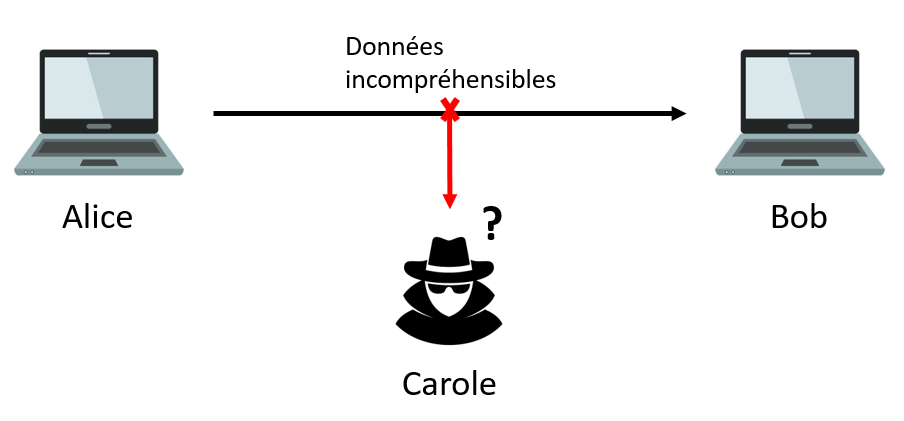
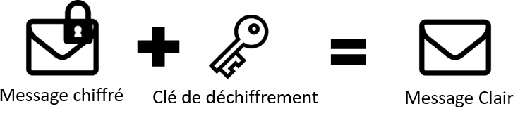
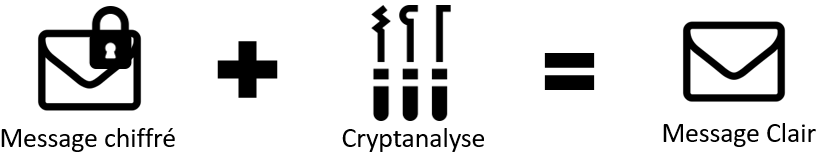

# Sécurisation des communications

## Introduction

***-> Qu'est-ce qu'une communication ?***

<u>C'est le fait d'échanger des informations entre deux entités à travers un support.</u>

En communication verbale, les entités sont les interlocuteurs et discutent à travers le son.

Lorsque l'on parle de communication informatique, les informations échangées sont des données que s'échangent deux machines via câbles ou ondes :


***-> Pourquoi sécuriser ?***

Une troisième entité Carole (entité *C*) peut intercepter les données que s'échangent Alice et Bob :


***-> Comment sécuriser ?***

Deux idées ont été proposées :

- La première, celle qui n'a pas été retenue, était de protéger physiquement le support (trop coûteux financièrement et en temps).

- La seconde, celle qui a été retenue, est de rendre incompréhensibles (ou inintelligibles) les données échangées.

## I. Généralités

### a) Missions

La sécurisation d'une communication doit accomplir trois missions :

- **La confidentialité** : Rendre l'accès aux données uniquement à ceux qui sont autorisés.

- **L'intégrité** : S'assurer que les données n'ont pas été modifiées entre l'émission et la réception de celles-ci.

- **L'authenticité** : S'assurer que les données proviennent bien de l'entité *A*.

### b) Idée

L'idée est de rendre incompréhensible les données qu'Alice envoie à Bob : 



Ainsi, Carole ne peut pas utiliser les données qu'elle intercepte.

Seulement, il faut que Bob puisse comprendre les données envoyées par Alice.

Pour réussir un tel stratagème, nous allons nous servir de la Cryptologie.

### b) Définitions

**Cryptologie** : Science du chiffrement.

**Message clair** : Un message dont les données sont compréhensibles.

**Message chiffré** : Un message dont les données sont incompréhensibles.

**Chiffrer** : Transformer un message clair en un message chiffré à l'aide d'une clé de chiffrement :


**Déchiffrer** : Transformer un message chiffré en un message clair à l'aide d'une clé de déchiffrement :



**Décrypter** : Transformer un message chiffré en un message clair à l'aide de la cryptanalyse :



**Cryptanalyse** : Ensemble de méthodes permettant de retrouver le message clair sans posséder la clé de déchiffrement.

### c) Principe de Kerkoffs

Un bon système de chiffrement doit être :

- Facilement déchiffrable.

- Difficilement décryptable.

-----

#### Application 1

Décrypter les messages suivants :

- ꓭOꓭ ꓤՈOᒋNOꓭ

- slt alice, jv b1 et toi tfk ?

Sont-ils de bons systèmes de chiffrements ?

-----------

## II. Un peu d'histoire

- Les premières méthodes de chiffrement remontent à l'Antiquité. Utilisées à des fins militaires, les Perses, les Carthaginois ou encore les Chinois chiffrèrent leurs ordres. Leurs ennemis ne purent pas connaître les stratégies même s'ils réussissaient à intercepter le message.

- A l'époque Romaine, Jules César chiffra ses messages pour communiquer de manière secrète avec ses correspondants.

- Au Moyen-Age, en 1404, Leon Battista Alberti inventa le chiffrement poly alphabétique. Il est aujourd'hui considéré comme le père occidental de la cryptologie.

- Durant la Seconde Guerre Mondiale, les allemands Nazis chiffrèrent leurs messages à l'aide de la machine de chiffrement Enigma. Un certain Alan Turing réussissa l'exploit de construire une machine permettant de décrypter automatiquement les messages. On estime à deux ans de guerre supplémentaire et 2 millions de victimes évitées par la création de cette machine.

- Depuis les années 60, avec l'apparition de l'informatique, la cryptologie est devenue une science à part entière et permet de sécuriser chaques messages envoyé sur le réseau informatique.

**Quelques lien vidéos :**

Documentaire Arte (1h) : [Alan Turing | Comment les maths ont vaincu Hitler](https://www.youtube.com/watch?v=WdxHjoCQpJU)

Vidéo Youtube (10 min) : [Enigma Machine  - Numberphile](https://www.youtube.com/watch?v=G2_Q9FoD-oQ)

## III. Chiffrements Symétriques

Un chiffrement symétrique est un chiffrement où la clé de chiffrement et de déchiffrement est la même.

Il existe deux familles de chiffrements symétriques : les chiffrements monoalphabétiques et les chiffrements polyalphabétiques.

### a) Chiffrements monoalphabétiques

L'idée est de substituer une lettre par une autre lettre pour chaque lettres de l'alphabet en utilisant un seul alphabet de subsitution.

Un célèbre chiffrement monoalphabétique est le Chiffre de César, il substitue une lettre par une autre lettre décalée dans l'alphabet.

Par exemple, avec une clé de chiffrement de $2$, le message message clair `ATTAQUEZ LE CHATEAU` est chiffré en `CVVCSWGB NG EJCVGCW` :

| Décalage        | 2   | 2   | 2   | 2   | 2   | 2   | 2   | 2   | 2   | 2   | 2   | 2   | 2   | 2   | 2   | 2   | 2   |
| --------------- | --- | --- | --- | --- | --- | --- | --- | --- | --- | --- | --- | --- | --- | --- | --- | --- | --- |
| Message clair   | A   | T   | T   | A   | Q   | U   | E   | Z   | L   | E   | C   | H   | A   | T   | E   | A   | U   |
| Message chiffré | C   | V   | V   | C   | S   | W   | G   | B   | N   | G   | E   | J   | C   | V   | G   | C   | W   |

Puisque la lettre en clair ``A``, après avoir réalisé un décalage de deux, est chiffrée en ``C``.

Pour déchiffrer, il faut réaliser le décalage dans le sens inverse.

### b) Chiffrements polyalphabétiques

L'idée est de substituer une lettre par une autre lettre pour chaque lettres de l'alphabet en utilisant plusieurs alphabets de subsitution.

Un célèbre chiffrement polyalphabétique est le Carré de Vigenère, il utilise le Chiffre de César en variant les alphabets de substitution.

Par exemple, avec une clé de déchiffrement de $2,4,1$, le message clair ``ATTAQUEZ LE CHATEAU`` est chiffré en ``CXUCUVGD MG GICXFCY``:

| Décalage        | 2   | 4   | 1   | 2   | 4   | 1   | 2   | 4   | 1   | 2   | 4   | 1   | 2   | 4   | 1   | 2   | 4   |
| --------------- | --- | --- | --- | --- | --- | --- | --- | --- | --- | --- | --- | --- | --- | --- | --- | --- | --- |
| Message clair   | A   | T   | T   | A   | Q   | U   | E   | Z   | L   | E   | C   | H   | A   | T   | E   | A   | U   |
| Message chiffré | C   | X   | U   | C   | U   | V   | G   | D   | M   | G   | G   | I   | C   | X   | F   | C   | Y   |

On remarque que le carré de Vigenère permet une plus grande incompréhensibilité que le chiffre de César :

- Le premier ``T`` est chiffré en ``X`` alors que le second ``T`` est chiffré en ``U``.

- Le premier ``U`` chiffré donne en clair ``T`` alors que le second ``U`` chiffré donne en clair ``Q``.

Pour déchiffrer, il faut réaliser le décalage dans le sens inverse correspondant à la clé utilisée.

--- 

#### Application 2

##### Communiquer avec le carré de Vigenère

Cette activité se réalise sur feuille.

- Choisir 2 ou 3 nombres entre 1 et 25, ces nombres représenteront votre clé.

- Choisir, parmi la liste ci-dessous, un mot :
  
  - ``ATTAQUEZ``
  
  - ``DEFENDEZ``
  
  - ``REPLIEZ``
  
  - ``ATTENDEZ``
  
  - ``DETRUISEZ``

- Chiffrer, avec la clé de chiffrement que vous avez choisi, le mot en utilisant la méthode de chiffrement de Vigenère.

- Une fois le message chiffré, donner à votre binôme le message et la clé.

- Déchiffrer le message et retrouver le mot.

---

### c) Problème : échange de clé

L'énorme inconvénient du chiffrement symétrique est l'**échange de clé**.

Si Alice souhaite communiquer de manière sécurisée en utilisant un chiffrement symétrique avec Bob, Alice va devoir lui transmettre la clé elle aussi de manière sécurisée.

Alice va devoir utiliser un chiffrement asymétrique pour résoudre ce problème.

## IV. Chiffrements asymétriques

L'idée est de ne pas devoir s'échanger une clé pour commencer la communication.

Pour celà, on va utiliser deux clés :

- La clé privée : l'accès à cette clé est limitée à l'entité la possèdant.

- La clé publique : l'accès à cette clé n'est pas limitée (toutes les entités peuvent y accéder).

### a) Principe

Alice et Bob possèdent ainsi chacun deux clés, et vont pouvoir s'échanger des informations de la manière suivante :

- Alice veut envoyer un message chiffré à Bob.

- Alice va chiffrer les données avec la clé publique de Bob.

- Bob reçoit le message chiffré.

- Bob déchiffre le message avec sa clé privée.

La clé privée est donc utilisée en tant que clé de chiffrement et la clé publique, en tant que clé de déchiffrement.

Ci-dessous, un schéma représentant le principe du chiffrement asymétrique :


### b) Protocole d'échange de clé symétrique

Le chiffrement asymétrique étant coûteux, on l'utilisera généralement pour se transmettre une clé de chiffrement symétrique de manière sécurisée.

> *Actuellement, on utilise le chiffrement asymétrique RSA pour échanger une clé de chiffrement symétrique AES.*

------

#### Application 3

Simulation en classe.

-------

### c) Problème : attaque de l'Homme du milieu

L'**attaque de l'Homme du milieu** est une stratégie d'attaque permettant à Carole de déchiffrer tous les messages qu'Alice envoie à Bob.

- Avant le début de la communication, Bob envoie sa clé publique à Alice.

- Carole intercepte la clé publique de Bob et envoie à Alice sa propre clé publique.

- Lorsqu'Alice voudra chiffrer un message, elle le fera avec la clé publique de Carole.

- Carole intercepte le message envoyé par Alice et le déchiffre avec sa clé privée.

- Carole a ainsi accès à toutes les données du message.

- Pour éviter la suspicion, Carole peut rechiffrer le message avec la clé publique de Bob et l'envoyer à Bob.


------------

#### Application 4

Simulation en classe.

--------------------

## V. Certificats

### a) Principe

Afin de sécuriser complètement les communications, les entités doivent prouver leur identité et leur bienveillance.

Pour celà, ils devront possèder un **certificat**.

Les certificats sont des cartes d'identité numériques dans lequel plusieurs informations y figurent comme :

- Des informations personnelles.

- Une signature.

- Une clé publique.

### b) Autorités de certification

Pour obtenir un certificat, les entités n'ont pas d'autre choix que de demander à une **autorité de certification**.

Les autorités de certification jouent le rôle de tiers de confiance, il peut s'agir d'un gouvernement, d'une grande société. En tout cas, quelqu'un dont, à priori, tout le monde peut avoir confiance.

Ces autorités délivrent les certificats uniquement si les informations transmises sont exactes :


Une fois le certificat obtenu, Bob pourra le transmettre à Alice pour prouver son identité. 

## VI. Protocole HTTPS

Le protocole HTTPS (Hyper Text Transfer Protocol Secure) est la version HTTP sécurisée. Il utilise pour celà le protocole TLS (Transport Layer Security).

### a) Principe de TLS

Il est utilisé lorsqu'un client souhaite se connecter sur un serveur de manière sécurisée :

- Alice (le client) demande une connexion sécurisée à Bob (le serveur).

- Bob, ayant obtenu au préalable son certificat, l'envoie à Alice.

- Alice vérifie l'identité de Bob.

- Si Bob est en effet ce qu'il prétend être, Alice génère une clé de chiffrement symétrique qu'on appelle : clé de session.

- Alice chiffre la clé de session avec la clé publique contenue dans le certificat de Bob et l'envoie à Bob.

- Bob déchiffre avec sa clé privée.

- Alice et Bob possèdent tous les deux une clé de chiffrement symétrique et peuvent communiquer de manière sécurisée.


-----------

#### Application 5

1. Sur Firefox, aller sur : [https://fr.wikipedia.org/wiki/Informatique](https://fr.wikipedia.org/wiki/Informatique).

2. A gauche de la barre d'adresse, cliquer sur le cadenas.

3. Puis sur ``connexion sécurisée`` et sur ``Plus d'informations``.

4. Sur la fenêtre qui vient de s'ouvrir, cliquer sur le bouton ``Afficher le certificat``.

5. Retrouver et noter les informations suivantes :
   
   - Le nom de l'organisation qui a demandé le certificat.
   
   - Le nom de l'autorité qui lui a donné.
   
   - La période de validité du certificat.
   
   - Quelques informations concernant la clé publique.

------

## Exercices

Pour la totalité des exercices, nous utiliserons comme alphabet la constante :

```python
alphabet = "ABCDEFGHIJKLMNOPQRSTUVWXYZ"
```

### Exercice 1 Chiffrer avec César

Ecrire une fonction ``chiffre_cesar(message_clair : str, cle : int)->str`` qui prend en paramètres un message clair et une clé de chiffrement et renvoie le message chiffré selon la méthode du Chiffre de César :

```python
>>> chiffre_cesar("ATTAQUEZLECHATEAU", 2)
'CVVCSWGBNGEJCVGCW'
```

### Exercice 2 Déchiffrer avec César

Ecrire une fonction ``dechiffre_cesar(message_chiffre : str, cle : int)->str`` qui prend en paramètres un message chiffré et une clé de déchiffrement et renvoie le message clair :

```python
>>> dechiffre_cesar('CVVCSWGBNGEJCVGCW', 2)
'ATTAQUEZLECHATEAU'
```

### Exercice 3 Chiffrer avec Vigenère

Ecrire une fonction ``chiffre_vigenere(message_clair : str, cle : tuple)->str`` qui prend en paramètres un message clair et un tuple de clé de chiffrement et renvoie le message chiffré selon la méthode du chiffrement de Vigenère :

```python
>>> chiffre_vigenere("ATTAQUEZLECHATEAU", (2,4,1))
'CXUCUVGDMGGICXFCY'
```

### Exercice 4 Déchiffrer avec Vigenère

Ecrire une fonction ``dechiffre_vigenere(message_chiffre : str, cles : tuple)->str`` qui prend en paramètres un message chiffré et un tuple de clés de déchiffrement et renvoie le message clair :

```python
>>> dechiffre_vigenere('CXUCUVGDMGGICXFCY', (2,4,1))
'ATTAQUEZLECHATEAU'
```

### Exercice 5 Chiffrement XOR

Le chiffrement XOR (Ou Exclusif) est un chiffrement symétrique qui repose sur l'opération logique du XOR.

> *Rappel sur la table de vérité du Ou exclusif :*
> 
> | a XOR b | 0   | 1   |
> | ------- | --- | --- |
> | 0       | 0   | 1   |
> | 1       | 1   | 0   |
> 
> En Python, nous utilisons l'opérateur ``^``:
> 
> ```python
> >>> 0 ^ 1
> 1
> ```

Le principe de ce chiffrement est le suivant :

- Encoder sous forme binaire le message clair et la clé.

- Réaliser un Ou Exclusif bit à bit sur chacun des bits du message et de la clé.

Par exemple, si mon message est `0101` et si ma clé est `1001` alors le message chiffré sera `1100` :

| Message clair   | ``0101`` |
| --------------- | -------- |
| Clé             | ``1001`` |
| Message chiffré | ``1100`` |

De plus, comme il s'agit d'un système de chiffrement symétrique, en réeffectuant l'opération Ou Exclusif entre la clé et le message chiffré, je retrouve bien mon message d'origine ``0101``.

Par la suite, nous utiliserons les positions des lettres dans la variable ``alphabet`` pour obtenir la représentation binaire d'une lettre : 

- La lettre ``A`` a pour représentation binaire ``00000``

- La lettre ``B`` a pour représentation binaire ``00001``

a) En se servant de la fonction ``bin``, écrire une fonction ``repr_bin(mot : str)->list`` qui prend en paramètre une chaîne de caractères et renvoie une liste dont les éléments sont les représentations binaires des lettres du mot (attention à ce que les représentations binaires aient la même taille) :

```python
>>> bin(3)
'ob11'
>>> bin(3)[:2]
'11'
>>> repr_bin('ATTAQUEZ')
['00000', '10011', '10011', '00000', '10000', '10100', '00100', '11001']
>>> repr_bin('NSI')
['01101', '10010', '01000']
```

b) Ecrire une fonction ``xor(x : str, y : str)->str`` qui prend en paramètres deux représentations binaires et renvoie le résultat de l'opération du Ou Exclusif :

```python
>>> xor('0101', '1001')
'1100'
```

c) Ecrire une fonction ``chiffre_xor(message_clair : list, cle : list)->list`` qui prend en paramètres la représentation binaire du message clair et la représentation binaire de la clé et renvoie une liste dont les éléments sont les représentations binaire du message chiffré selon la méthode du chiffrement XOR :

```python
>>> chiffre_xor(repr_bin("ATTAQUEZ"), repr_bin("NSI"))
['01101', '00001', '11011', '01101', '00010', '11100', '01001', '01011']
```

d) Le chiffrement XOR étant un chiffrement symétrique, nous devrions retrouver la représentation binaire du message clair à partir de la clé et de la représentation binaire du message chiffré :

```python
>>> chiffre_xor(['01101', '00001', '11011', '01101', '00010', '11100', '01001', '01011'], repr_bin('NSI'))
['00000', '10011', '10011', '00000', '10000', '10100', '00100', '11001']
```

### Exercice 6 Cryptanalyse sur le Chiffre de César

L'objectif de cet exercice est de découvrir une méthode permettant de décrypter le Chiffre de César.

##### Méthode : Analyse de fréquence

Supposons que le message chiffré envoyé est écrit en langue française et que la lettre qui apparaît le plus souvent dans ce message est `E`.

L'idée est de calculer les occurences de chaques lettres chiffrées et de repérer celle qui en a le plus. Puis, de retrouver le nombre $n$ de décalages nécessaire pour chiffrer cette lettre en `E`, $n$ est alors la clé.

a) Ecrire une fonction `occ(message_chiffre : str)->dict` qui prend en paramètre le message chiffré et renvoie un dictionnaire dans lequel la clé est la lettre et la valeur, son nombre d'occurences :

```python
>>> occ('EQODQF')
{'E' : 1, 'Q' : 2, 'O' : 1, 'D' : 1, 'F' :1}
```

b) Ecrire une fonction `max_occ(occ : dict)->str` qui prend en paramètres le dictionnaire des occurences et renvoie la lettre la plus fréquente :

```python
>>> max_occ(occ('EQODQF'))
'Q'
```

c) Ecrire une fonction `trouve_cle(lettre : str)->int` qui prend en paramètre une lettre et renvoie le nombre de décalages jusqu'à `E` :

```python
>>> trouve_cle('Q')
12
```

d) Ecrire une fonction `decrypter_cesar_analyse_freq(message_chiffre : str)->str` qui prend en paramètre le message chiffré et renvoie le message clair en réutilisant les fonctions précédentes :

```python
>>> decrypter_cesar_analyse_freq('EQODQF')
'SECRET' 
```

e) Dans quel cas l'analyse de fréquence ne fonctionne pas ?

### Exercice 7 Puzzle de Merkle

Pour cet exercice, télécharger et ouvrir le fichier [merkle.py](./src/merkle.py).

Pour cet exercice, ajouter dans la variable ``alphabet`` les entiers de zéro à neuf et l'espace.

Le puzzle de Merkle est une méthode permettant de s'échanger une clé de chiffrement de manière (un peu) sécurisée. Voici son principe :

- Alice génère une grande quantité de messages de la forme ``identifiant:i cle:k`` avec $i$ un entier unique et $k$ un entier aléatoire.

- Alice chiffre chacun de ces messages (Chiffre de César) en utilisant une clé de chiffrement différente.

- Alice envoie l'intégralité de ces messages à Bob.

- Bob choisis aléatoirement un message parmi tous et le décrypte.

- Bob trouve alors un identifiant et une clé et envoie à Alice l'identifiant qu'il a trouvé.

- Alice repère la clé associée à cet identifiant.

- Alice et Bob possèdent tous les deux une clé de chiffrement.

##### Etape 1 Alice

a) Ecrire une fonction ``genere_messages(n : int)->list`` qui prend en paramètre un entier $n$ et renvoie une liste de $n$ messages de la forme ``identifiant:i cle:k`` où $k$ est un entier aléatoire :

```python
>>> messages = genere_messages(10)
>>> messages
['identifiant:0 cle:6799100', 'identifiant:1 cle:689143', 'identifiant:2 cle:66654', 'identifiant:3 cle:633728', 'identifiant:4 cle:656285', 'identifiant:5 cle:267157', 'identifiant:6 cle:96664', 'identifiant:7 cle:319894', 'identifiant:8 cle:23433', 'identifiant:9 cle:702382']
```

b) Ecrire une fonction ``chiffrer_messages(messages : list)->list`` qui prend en paramètres une liste de messages clairs et renvoie une liste de messages chiffrés selon le système du Chiffre de César avec pour chaque message une clé différente :

```python
>>> messages_chiffres = chiffrer_messages(messages)
>>> messages_chiffres
['hcdmsheh:ms9 zbkd956880  ', 'nijsynknfsye64hqjeacd698', '2yz7c2 2v7cumjx5zuqqqpo', '834ci8580ci tp2a4 wttxsy', '2yz7c2 2v7cuojx5zuqpqmsp', 'topy3tqtly3kf:nwpkcghbfh', '723bh747 bhzvo1:3zyvvvt', '834ci8580ci xp2a4 trzyzu', ' vw4: x s4:rpgu2wrjklkk', '723bh747 bhzyo1:3zwprsxr']
```

##### Etape 2 Bob

c) Ecrire une fonction ``choisir_message(messages_chiffres : list)->str`` qui prend en paramètre une liste de messages chiffrés et renvoie un message choisis aléatoirement :

```python
>>> message_choisis = choisir_message(messages_chiffres)
>>> message_choisis
'2yz7c2 2v7cuojx5zuqpqmsp'
```

d) Ecrire une fonction ``decrypter(message_choisis : str)->str`` qui prend en paramètre le message choisis chiffré et renvoie le message en clair (sachant que Bob connaît la forme du message) :

```python
>>> decrypter(message_choisis)
'identifiant:4 cle:656285'
```

##### Etape 3 Simulation

e) Compléter la fonction ``simulation`` afin de correspondre au principe du puzzle de Merkle.

### Exercice 8 Cryptanalyse sur le Carré de Vigenère (Difficile)

Nous savons de source sûre que la clé est constituée de 3 entiers et que la méthode de chiffrement est celui du carré de Vigenère.

Décrypter : ``gjwvkiafmnmfcgcedmfjwvkmyxmfkwhktruqrdarhbcgcedmfkmvyvrmzffivfaqsvfdmhjaqwurmzrklrhqrjzrfmhxxbmzywauguzwazgzgwtfvmflqawanmbewxnkcahwhjtrkmvyvrmzqwagwvrtzrkahjabfabejewbegvrviaktrhilklrewevwegcfwbrflrfbywabejewahfiafmnmxbmzywatgciwzawzggcfmvnfvrsccgcedmflzbmdrjcasvawihhwhjtrkizwvrjbbmarllnfaywagwvrtzrktrktvwznmxnqaqwubjlbjwhkmgwvqwvgdmfguojmflwhlkricvwaggzawjeatywxnkbbmapwckicvwzewvgfmfgvghifhmevcfdmiamhpyhamflnbjbawlrhmeabcgqaltrkznuqawacjwsgvqwaawabfbcsanlbravgwacszywordlrkkrflewahfnrmarnmvdtrjiqwabejewahfmymuvwzrbivdtvjiewvbmdrdmrkmestrhmricvxcgtzvkmrdmfsvfuwhjwafmfwznvmagciwihjwvdmisagwubflrnwhkmalwhjmqwbbmapgbrkdbmacgciwhigcfwvpdwewunaaigcffmcgciwhrlmefmydmzwvgdmgwvvjmavmugzfvmigapdwgmzrkcasvawihhwhjtrkobmdrjvrjbbmahfiafmnmxbmzywagjwhnmemvnfvrsccgcedmfsurfmelwhkmgviaktrkbrfmojmfdmfdqrj``

### Exercice 9 Enigma

Nous allons, dans cet exercice, nous intéresser à la machine Enigma.

Inventée par l'Allemand Athur Scherbius, cette machine électromecanique portable a servi au chiffrement et déchiffrement de l'intégralité des messages échangés par les Allemands nazis pendant la Seconde Guerre mondiale.

a) Pour plus de détails, regarder la vidéo [Enigma Machine - Numberphile](https://www.youtube.com/watch?v=G2_Q9FoD-oQ)

Une clé est constituée :

- des 10 câblages possibles de lettres dans le tableau de connexions.

- de 3 rotors (parmi 5) et de leur position de départ.

- des câblages du réflecteur.

Il y a 158 962 555 217 826 360 000 clés possibles. Et les Allemands avaient une clé différente pour chaque jour. Autrement dit, les Alliés avaient 24h pour espérer trouver la clé permettant de déchiffrer les messages du jour.

Jusqu'à ce qu'Alan Turing créa sa machine.

b) La bibliothèque ``py-enigma`` permet de simuler le fonctionnement d'une machine Enigma en Python.

Pour l'installer :

- Cliquer sur ``Outils`` puis ``Open System shell``

- Ecrire dans la console qui vient de s'afficher la commande ``pip install py-enigma``

c) Télécharger dans votre répertoire commun le fichier [enigma_machine.py](./src/enigma_machine.py)

Pour configurer la position des rotors :

```python
>>> machine.set_display('PIX')
```

Pour afficher la position des rotors :

```python
>>> machine.get_display()
'PIX'
```

Pour chiffrer une lettre :

```python
>>> machine.key_press('A')
'I'
```

d) Quelle est maintenant la position des rotors ?

e) Quelle est maintenant la lettre chiffrée lorsque j'appuie sur ``'A'`` ?

Le déchiffrement se fait de la manière inverse (il faut que la position des rotors soit la même) :

```python
>>> machine.set_display('PIX')
>>> machine.key_press('I')
'A'
```

f) Ecrire une fonction ``chiffre_enigma(message_clair : str, machine : EnigmaMachine, pos_rotors : str)->str`` qui prend en paramètres un message clair, une machine Enigma configurée et la position des rotors. Cette fonction renvoie le message chiffré.

g) Ecrire une fonction ``dechiffre_enigma(message_chiffre : str, machine : EnigmaMachine, pos_rotors : str)->str`` qui prend en paramètres un message chiffré, une machine Enigma configurée et la position des rotors. Cette fonction renvoie le message clair.
